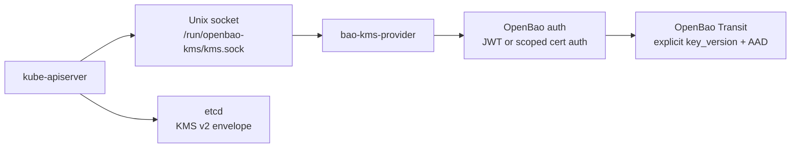

# OpenBao Kubernetes KMS

[](https://github.com/dc-tec/openbao-kubernetes-kms/actions/workflows/ci.yml)
[](https://github.com/dc-tec/openbao-kubernetes-kms/actions/workflows/release.yml)
[](https://dc-tec.github.io/openbao-kubernetes-kms/)
[](LICENSE)

`bao-kms-provider` is a node-local Kubernetes KMS v2 provider backed by
OpenBao Transit. It lets `kube-apiserver` envelope-encrypt selected Kubernetes
API resources in etcd while keeping KMS protocol handling, OpenBao
authentication, Transit key-version selection, and decrypt validation in a
dedicated provider process.

The provider is designed for Kubernetes control planes that want an
OpenBao-native KMS integration without making the API server call OpenBao
Transit directly.

> [!IMPORTANT]
> `bao-kms-provider` is currently a preview release. Use it for labs, staging,
> and evaluation of the deployment model. Do not use preview releases for
> production control planes, and treat only the versions and configurations in
> the compatibility matrix as tested.

## Why It Exists

OpenBao Transit can encrypt and decrypt caller-supplied data. Kubernetes does
not call Transit directly; it talks to a local KMS provider plugin over a Unix
domain socket. `bao-kms-provider` adapts those two contracts and adds the
Kubernetes-specific correctness rules around:

- stable, opaque Kubernetes `key_id` values,
- Transit `associated_data` binding,
- explicit Transit `key_version` on encrypt,
- local validation before Transit decrypt,
- rotation and rollback safety,
- node-local socket ownership and hardening,
- redacted metrics, logs, diagnostics, and reports.

## How It Fits



The provider runs on each control-plane host. It does not depend on the
protected Kubernetes API server to operate, which is required because the API
server may need the KMS plugin during startup to read encrypted resources.

## Current Scope

| Area | Current state |
|---|---|
| Kubernetes API | KMS v2 only. KMS v1 is not implemented. |
| Kubernetes target | Tested against Kubernetes `1.34` and `1.35` Kind node images pinned by digest. Kubernetes `1.36` is the intended next test line once a pinned Kind image is available. Kubernetes `1.29+` KMS v2 clusters may work, but are covered only when listed in `.ci/versions.yaml`. |
| OpenBao target | OpenBao `2.5.4` with Transit. JWT auth is the default preview auth path. |
| Transit key type | `aes256-gcm96` is the supported and recommended default. |
| Authentication | JWT auth by default. PKCS#11 certificate auth is opt-in and covered only when a release publishes matching artifacts and marks the path as tested. SPIFFE/SPIRE is not a supported preview configuration. OpenBao tokens stay in process memory. |
| Deployment models | Hardened systemd unit or kubelet-managed static pod. |
| Release maturity | Preview release line; see the [Support Policy](https://dc-tec.github.io/openbao-kubernetes-kms/reference/support-policy/). |
| Release cadence | Event-driven releases, scheduled validation. |
| Supply chain | Vendored builds, SBOMs, signed checksums, image signatures, provenance attestations, vulnerability scans, and reproducibility reports for public releases. |

Preview support is limited to the tested matrix. Newer or adjacent Kubernetes,
OpenBao, OS, key-type, auth, or deployment combinations are not automatically
covered. See the
[Compatibility](https://dc-tec.github.io/openbao-kubernetes-kms/reference/compatibility/)
matrix for details.

## Security Posture

`bao-kms-provider` is control-plane critical software. If the provider socket,
auth credential, OpenBao endpoint, or Transit key is unavailable,
`kube-apiserver` may be unable to decrypt previously encrypted resources during
startup.

The implementation is built around fail-closed behavior:

- decrypt rejects malformed or unknown `key_id` values before Transit is called,
- decrypt requires valid KMS annotations and AAD reconstruction,
- ciphertext is bound to provider, cluster, OpenBao instance, Transit mount,
  key lineage, and Transit key version,
- Status reads from cached state and does not perform live Transit decrypts,
- the plugin does not create, rotate, export, delete, or back up Transit keys,
- logs and metrics do not expose plaintext, JWTs, OpenBao tokens, full
  ciphertext, raw Transit key material, raw OpenBao paths, or raw key names.

For the full model, start with
[Threat Model](https://dc-tec.github.io/openbao-kubernetes-kms/security/threat-model/),
[Hardening](https://dc-tec.github.io/openbao-kubernetes-kms/security/hardening/),
and
[AAD And Decrypt Validation](https://dc-tec.github.io/openbao-kubernetes-kms/security/aad-and-decrypt-validation/).

## Deployment Models

| Model | Use when | Notes |
|---|---|---|
| systemd | You control the host operating-system lifecycle and can install the provider before kubelet starts. | Preferred when host management and package rollback are available. |
| Static pod | The control plane is kubeadm-style and every node can preload or reliably pull the provider image by digest. | Fits teams already operating hostPath-mounted control-plane static pods. |
| DaemonSet | Not for protecting the same cluster's API server. | DaemonSets depend on the API server they would be required to unlock. |

Start with
[Deployment: Choosing A Model](https://dc-tec.github.io/openbao-kubernetes-kms/deployment/choosing-a-model/)
before installing either deployment form.

## What It Does Not Do

`bao-kms-provider` does not:

- encrypt raw etcd disk blocks or etcd snapshots,
- encrypt PersistentVolumes, node filesystems, pod filesystems, or API traffic,
- manage the lifecycle of the OpenBao Transit key,
- provide a Helm chart that installs into the protected cluster,
- support same-cluster DaemonSet deployment for the protected API server,
- enable decrypt micro-batching in the current release line,
- support production use while the release line remains preview.

## Start Here

The user documentation is published on GitHub Pages:

1. [Overview](https://dc-tec.github.io/openbao-kubernetes-kms/getting-started/overview/)
2. [OpenBao Setup](https://dc-tec.github.io/openbao-kubernetes-kms/getting-started/openbao-setup/)
3. [Install](https://dc-tec.github.io/openbao-kubernetes-kms/getting-started/install/)
4. [Deployment: Choosing A Model](https://dc-tec.github.io/openbao-kubernetes-kms/deployment/choosing-a-model/)
5. [Kubernetes EncryptionConfiguration](https://dc-tec.github.io/openbao-kubernetes-kms/getting-started/kubernetes-encryption-config/)
6. [First Encrypt](https://dc-tec.github.io/openbao-kubernetes-kms/getting-started/first-encrypt/)

Release artifact verification is documented in
[Getting Started: Install](https://dc-tec.github.io/openbao-kubernetes-kms/getting-started/install/#verify-release-artifacts).

## Build And Test

The repository commits `vendor/` and CI uses `GOFLAGS=-mod=vendor`.

```sh
make ci-core
make build
bin/bao-kms-provider version
```

Public releases produce JWT-only auth artifacts by default.
Certificate auth variants are separate opt-in build tags:

```sh
make build-certauth-pkcs11
```

PKCS#11 cert-auth artifacts are separate host CGO builds via
`make release-artifact-certauth-pkcs11-host`.

SPIFFE certificate-source code remains in tree for local verification, but
`auth.cert.source: spiffe` is not a supported preview user configuration.

Selected E2E entrypoints:

```sh
make test-e2e-openbao-ci
make test-e2e-provider-certauth-sources-openbao-ci
make test-e2e-provider-ha-openbao-ci
make test-e2e-kind-smoke
```

Build a local container image:

```sh
make image
```

Build release binaries, packages, and bundles locally:

```sh
make release-distribution
```

Local kubeadm VM validation is intentionally outside public CI because it
restarts API servers and validation VMs, and intentionally stops OpenBao in the
test environment. Maintainer notes live with the harness code under
`hack/harvester/`.

## Release Verification

Tagged releases publish GitHub Release assets and a GHCR image. Public release
verification materials include:

- SHA-256 checksums,
- keyless checksum signature bundle,
- SBOMs for published binaries and images,
- image signatures,
- GitHub build-provenance attestations,
- release artifact attestation verification output,
- vulnerability scan summary,
- reproducibility report,
- `provenance-index.json`,
- release notes.

Release policy is documented in
[Reference: Release Policy](https://dc-tec.github.io/openbao-kubernetes-kms/reference/release-policy/).

## Upstream References

- [Kubernetes: Using a KMS provider for data encryption](https://kubernetes.io/docs/tasks/administer-cluster/kms-provider/)
- [Kubernetes: Encrypting confidential data at rest](https://kubernetes.io/docs/tasks/administer-cluster/encrypt-data/)
- [Kubernetes: Static Pods](https://kubernetes.io/docs/tasks/configure-pod-container/static-pod/)
- [OpenBao Transit API](https://openbao.org/api-docs/secret/transit/)
- [OpenBao JWT/OIDC auth API](https://openbao.org/api-docs/auth/jwt/)
- [OpenBao TLS certificates auth method](https://openbao.org/docs/auth/cert/)
- [SPIFFE Workload API](https://spiffe.io/docs/latest/spiffe-specs/spiffe_workload_api/)

## License

Apache License 2.0. See [LICENSE](LICENSE).
