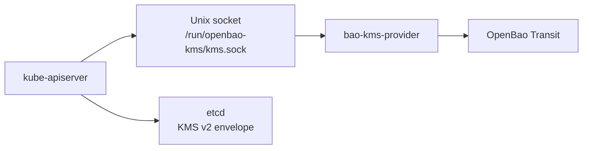

# OpenBao Kubernetes KMS

[](https://github.com/dc-tec/openbao-kubernetes-kms/actions/workflows/ci.yml)
[](https://github.com/dc-tec/openbao-kubernetes-kms/actions/workflows/release.yml)
[](https://dc-tec.github.io/openbao-kubernetes-kms/)
[](LICENSE)

`bao-kms-provider` is a node-local Kubernetes Key Management Service (KMS) v2
provider backed by OpenBao Transit. It lets `kube-apiserver` envelope-encrypt
selected Kubernetes API resources in etcd without calling OpenBao directly.

> [!IMPORTANT]
> `bao-kms-provider` is currently a preview release. Use it for labs, staging,
> and evaluation of the deployment model. Do not use preview releases for
> production control planes, and treat only the versions and configurations in
> the [compatibility matrix](https://dc-tec.github.io/openbao-kubernetes-kms/reference/compatibility/)
> as tested.

## Architecture



The provider runs on each control-plane host and is part of the API server boot
path. See the [architecture overview](https://dc-tec.github.io/openbao-kubernetes-kms/architecture/overview/)
for the data flows, trust boundaries, and failure model.

## Documentation

The [documentation site](https://dc-tec.github.io/openbao-kubernetes-kms/)
contains the project contract and operator guidance:

- [Start Here](https://dc-tec.github.io/openbao-kubernetes-kms/getting-started/)
  for setup and first-use verification.
- [Deployment](https://dc-tec.github.io/openbao-kubernetes-kms/deployment/)
  for systemd and static-pod models.
- [Operations](https://dc-tec.github.io/openbao-kubernetes-kms/operations/)
  for rotation, recovery, upgrades, and troubleshooting.
- [Reference](https://dc-tec.github.io/openbao-kubernetes-kms/reference/)
  for configuration, compatibility, protocol behavior, and release policy.
- [Security](https://dc-tec.github.io/openbao-kubernetes-kms/security/)
  for the threat model, hardening requirements, and authentication boundaries.

## Development

The repository commits `vendor/` and CI uses `GOFLAGS=-mod=vendor`.

```sh
make ci-core
```

For repository layout, focused tests, and contribution rules, see
[Contributing](CONTRIBUTING.md) and the
[development documentation](https://dc-tec.github.io/openbao-kubernetes-kms/development/).

## Security

Use GitHub private vulnerability reporting for security issues. See
[Security Policy](SECURITY.md) before sharing logs, ciphertext, credentials, or
other sensitive material.

## License

Apache License 2.0. See [LICENSE](LICENSE).
