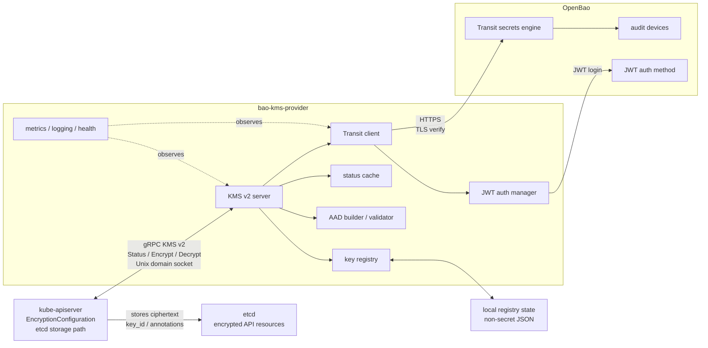
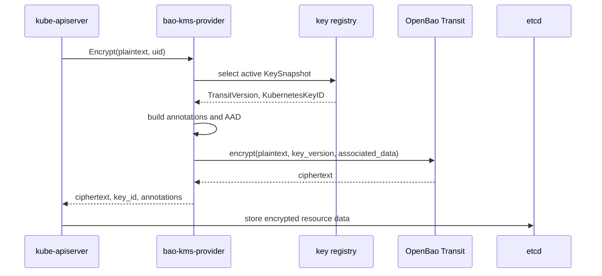
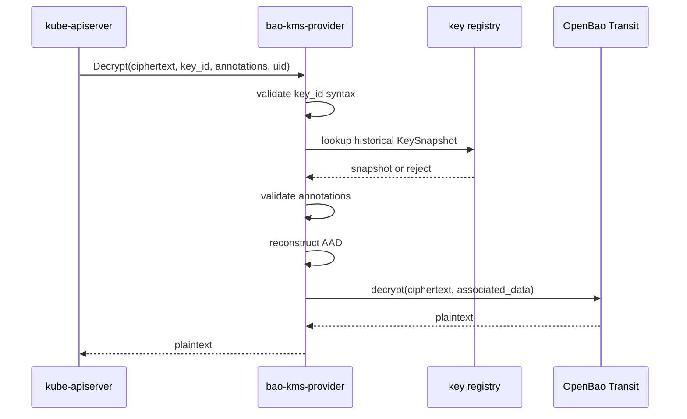
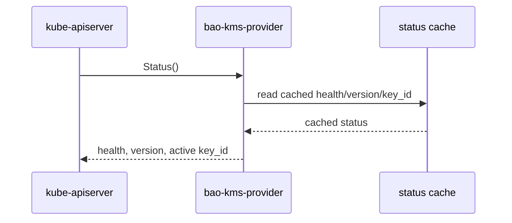
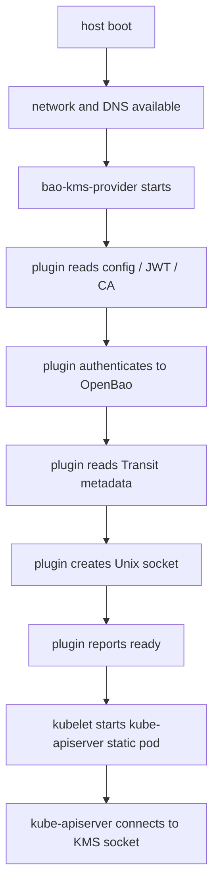
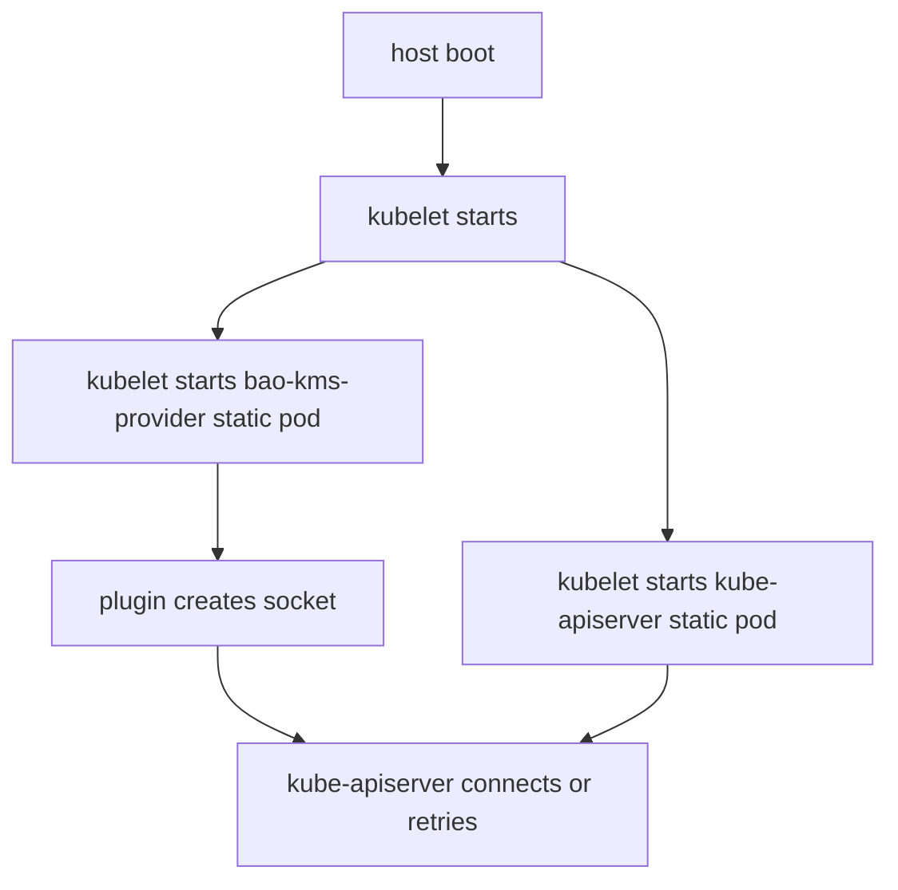

# Overview

This page is the maintainer-facing description of how `bao-kms-provider` is shaped. For the upstream protocol and Transit primer that this design rests on, see [Background](/architecture/background/). For existing Vault Transit KMS plugin work that informed this design, see [Related Work](/architecture/related-work/).

## Purpose

The provider adapts Kubernetes KMS v2 to OpenBao Transit. Kubernetes talks to a local KMS plugin over gRPC. The plugin talks to OpenBao Transit over HTTPS.

```text
kube-apiserver
  -> Unix domain socket
  -> bao-kms-provider
  -> OpenBao Transit
  -> bao-kms-provider
  -> kube-apiserver
  -> encrypted Kubernetes API resource data in etcd
```

The provider participates in Kubernetes envelope encryption for selected API resources. It does not encrypt raw etcd disk blocks or any workload storage outside the Kubernetes API resource persistence path.

## Component Diagram



## Components

### kube-apiserver

`kube-apiserver` is configured with an `EncryptionConfiguration` that contains a KMS v2 provider entry. The provider name and endpoint participate in the encryption format and remain stable after encryption begins.

### bao-kms-provider

The plugin process:

- serves the Kubernetes KMS v2 gRPC API over a Unix domain socket,
- maintains the active key snapshot,
- persists non-secret registry state,
- returns cached KMS Status,
- validates decrypt `key_id` and annotations,
- constructs Transit associated data when enabled,
- authenticates to OpenBao,
- calls Transit encrypt and decrypt,
- exposes local health and metrics endpoints,
- produces structured redacted logs.

### OpenBao

OpenBao provides:

- JWT authentication,
- short-lived OpenBao tokens,
- Transit key metadata,
- Transit encrypt and decrypt operations,
- audit records for cryptographic operations.

OpenBao must be available independently of the protected Kubernetes API server. Running OpenBao inside the protected cluster creates a bootstrap dependency during API server recovery.

## Data Flow

### Encrypt



Encrypt does not use implicit Transit latest-version behavior. The plugin passes the explicit Transit `key_version` from the active snapshot.

### Decrypt



Decrypt does not brute-force unknown keys or try every historical key. Unknown `key_id` values fail before Transit is called.

### Status



Status reads from cached state populated by background probes; it does not perform a live Transit encrypt or decrypt on every call. Kubernetes polls Status regularly, and the Status `key_id` drives rotation behavior.

## Trust Boundaries

The provider sits across these boundaries:

- Kubernetes API server to local plugin socket.
- Plugin host process to OpenBao HTTPS endpoint.
- OpenBao policy boundary for Transit operations.
- Local host filesystem boundary for configuration, JWT file, CA bundle, socket, and registry state.
- etcd persistence boundary for ciphertext and KMS annotations.

The plugin sees plaintext material passing through KMS calls. Treat it as a control-plane critical component. For the full asset and threat catalog see [Threat Model](/security/threat-model/).

## Internal Active Key Model

```go
type KeySnapshot struct {
    ProviderName            string
    ClusterID               string
    OpenBaoInstanceID       string
    TransitMountID          string
    TransitKeyLineageID     string
    TransitVersion          int
    TransitVersionCreatedAt time.Time
    CreatedAt               time.Time
    KubernetesKeyID         string
    State                   SnapshotState // active, pending, retired, rejected, disaster_recovery
    AADMode                 AADMode       // aad.required
}
```

The fields are non-secret identity and Transit metadata used to derive Kubernetes `key_id` values and reconstruct AAD. The active snapshot is computed by a background key watcher, not during hot-path Status calls. The implementation prefers deriving historical `key_id` values from stable configuration plus Transit metadata. A small local key registry state file with strict permissions persists rotation decisions across restart; see [Reference: Key ID And AAD: Local Registry State](/reference/key-id-and-aad/#local-registry-state).

## Implementation Guardrails

The implementation encodes design boundaries as local and CI checks before feature work begins.

ast-grep owns structural Go and architecture rules:

- no broad dynamic types in production code,
- no runtime panics,
- no root contexts in runtime packages,
- no Viper imports outside the configuration boundary,
- no environment reads outside the configuration boundary,
- no concrete OpenBao or Transit client imports from `internal/kmsv2`.

Semgrep owns security and dangerous-API rules:

- no disabled TLS verification,
- no default HTTP client or package-level HTTP helpers,
- no `http.NewRequest` without context,
- no runtime subprocess execution,
- no sensitive log field names.

For the supporting policy see [Development: Code Quality](/development/code-quality/).

## Startup Sequence

`bao-kms-provider` performs one successful bootstrap status probe before binding the Unix socket. Startup fails closed rather than exposing a socket without a fresh active snapshot.

Recommended systemd sequence:



Recommended static-pod sequence:



Static-pod ordering must be tested because kubelet does not provide a strong dependency graph between static pods. The API server may start before the provider socket exists and must retry while the provider completes bootstrap. See [Deployment: Choosing A Model](/deployment/choosing-a-model/) for the model selection rationale and [Deployment: Static Pod Deployment](/deployment/static-pod/) for the manifest and bootstrap risks.

## Multi-Control-Plane Operation

Each control-plane node runs its own local plugin instance.

All instances share:

- the same provider name,
- the same cluster ID,
- the same OpenBao instance ID,
- the same Transit mount ID,
- the same Transit key lineage ID,
- the same Transit key,
- the same AAD policy,
- the same `key_id` derivation algorithm.

Instances may have different JWTs and OpenBao client tokens.

Each instance also owns its own local registry state file. The content should converge to the same active `key_id`, while pending or recovered snapshots can differ temporarily during failover or rotation recovery.

Promotion of a new Transit key version is stable across all control-plane nodes. If one node promotes early and another does not, API server behavior can become inconsistent. The activation delay and stable observation count reduce this risk; operational monitoring still checks for `key_id` convergence. See [Architecture: Rotation Model](/architecture/rotation-model/).

## OpenBao Placement

Recommended placement is an external management plane or otherwise independent OpenBao deployment that does not depend on the protected Kubernetes API server.

Running OpenBao inside the same protected cluster is strongly discouraged for this use case. If the API server requires the KMS plugin to start and the plugin requires OpenBao, then OpenBao must be reachable before the protected API server is healthy. A same-cluster OpenBao deployment introduces a circular dependency.

## Source References

- [Kubernetes KMS provider documentation](https://kubernetes.io/docs/tasks/administer-cluster/kms-provider/)
- [Kubernetes encryption at rest documentation](https://kubernetes.io/docs/tasks/administer-cluster/encrypt-data/)
- [OpenBao Transit API](https://openbao.org/api-docs/secret/transit/)
- [Kubernetes static Pods](https://kubernetes.io/docs/tasks/configure-pod-container/static-pod/)
