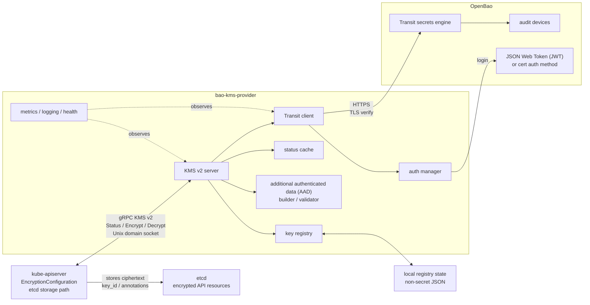
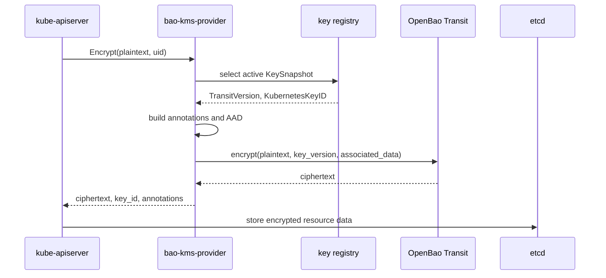
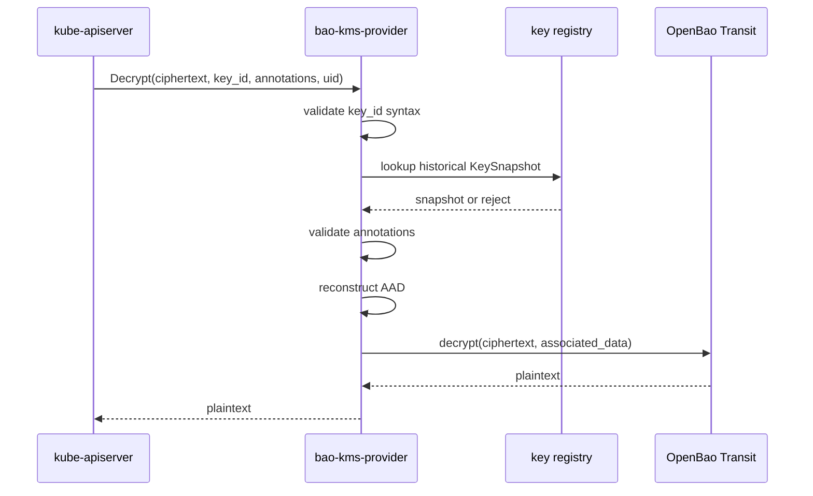
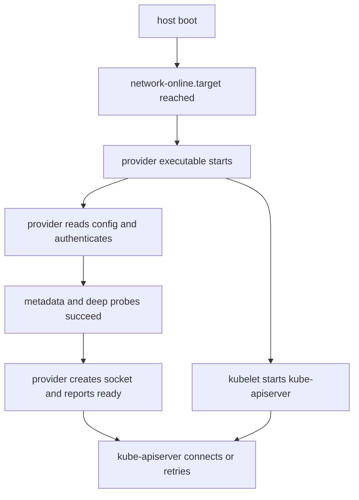
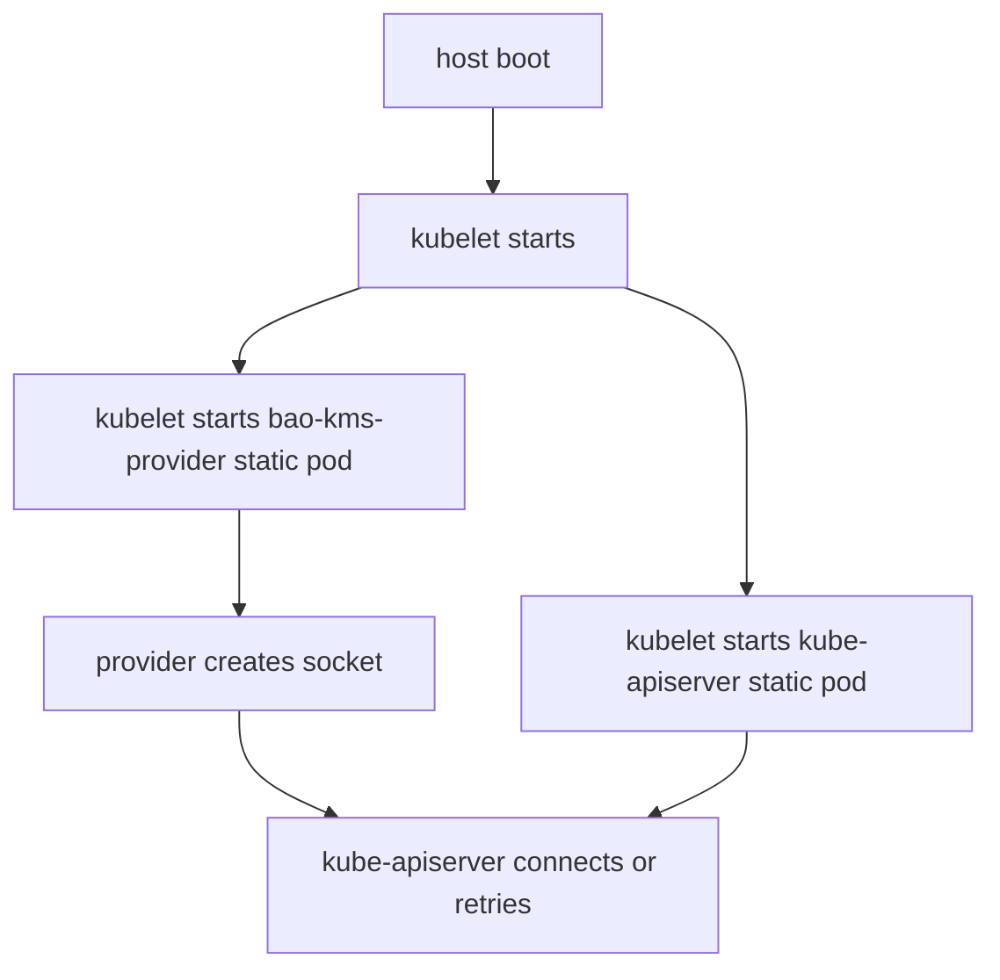

`bao-kms-provider` adapts Kubernetes KMS v2 to OpenBao Transit. The API server
calls it over gRPC on a local Unix socket, and it calls Transit over HTTPS.
For the upstream behavior this relies on, see [Background](/docs/architecture/background/).


```mermaid
flowchart LR
    API["kube-apiserver<br/>EncryptionConfiguration<br/>etcd storage path"]
    Etcd["etcd<br/>encrypted API resources"]
    StateFile["local registry state<br/>non-secret JSON"]

    subgraph Plugin["bao-kms-provider"]
        KMS["KMS v2 server"]
        Registry["key registry"]
        AAD["additional authenticated data (AAD)<br/>builder / validator"]
        AuthManager["auth manager"]
        TransitClient["Transit client"]
        StatusCache["status cache"]
        Observability["metrics / logging / health"]
    end

    subgraph Bao["OpenBao"]
        BaoAuth["JSON Web Token (JWT)<br/>or cert auth method"]
        Transit["Transit secrets engine"]
        Audit["audit devices"]
    end

    API <-->|gRPC KMS v2<br/>Status / Encrypt / Decrypt<br/>Unix domain socket| KMS
    API -->|stores ciphertext<br/>key_id / annotations| Etcd
    KMS --> Registry
    KMS --> AAD
    KMS --> StatusCache
    KMS --> TransitClient
    Registry <--> StateFile
    TransitClient --> AuthManager
    AuthManager -->|login| BaoAuth
    TransitClient -->|HTTPS<br/>TLS verify| Transit
    Transit --> Audit
    Observability -.->|observes| KMS
    Observability -.->|observes| TransitClient
```

The provider serves KMS v2, keeps the active key snapshot and its registry
state, answers Status from a cache that background probes fill, validates
decrypt requests, builds the AAD, logs in to OpenBao, and exposes health,
metrics, and redacted logs. It sees plaintext in flight, so treat it as
control-plane critical; see [Security: Threat model](/docs/security/threat-model/).

OpenBao must run outside the protected cluster. The API server needs the
provider to start, and the provider needs OpenBao, so an OpenBao inside the
same cluster would be a circular dependency during recovery.

## Encrypt


```mermaid
sequenceDiagram
    participant API as kube-apiserver
    participant Plugin as bao-kms-provider
    participant Registry as key registry
    participant Transit as OpenBao Transit
    participant Etcd as etcd

    API->>Plugin: Encrypt(plaintext, uid)
    Plugin->>Registry: select active KeySnapshot
    Registry-->>Plugin: TransitVersion, KubernetesKeyID
    Plugin->>Plugin: build annotations and AAD
    Plugin->>Transit: encrypt(plaintext, key_version, associated_data)
    Transit-->>Plugin: ciphertext
    Plugin-->>API: ciphertext, key_id, annotations
    API->>Etcd: store encrypted resource data
```

Encrypt always passes the active snapshot's explicit `key_version`, never the
implicit latest.

## Decrypt


```mermaid
sequenceDiagram
    participant API as kube-apiserver
    participant Plugin as bao-kms-provider
    participant Registry as key registry
    participant Transit as OpenBao Transit

    API->>Plugin: Decrypt(ciphertext, key_id, annotations, uid)
    Plugin->>Plugin: validate key_id syntax
    Plugin->>Registry: lookup historical KeySnapshot
    Registry-->>Plugin: snapshot or reject
    Plugin->>Plugin: validate annotations
    Plugin->>Plugin: reconstruct AAD
    Plugin->>Transit: decrypt(ciphertext, associated_data)
    Transit-->>Plugin: plaintext
    Plugin-->>API: plaintext
```

Decrypt never tries other keys or versions. A well-formed unknown `key_id` can
trigger one rate-limited metadata lookup for the configured key; if it is still
unknown, it fails before Transit is called.

## Status

Status reads health, version, and the active `key_id` from a cache. The cache
turns healthy only after both a metadata probe and an encrypt-and-decrypt deep
probe succeed, and neither clears the other's failure.

## Key snapshots

```go
type KeySnapshot struct {
    ProviderName            string
    ClusterID               string
    OpenBaoInstanceID       string
    TransitMountID          string
    TransitKeyLineageID     string
    TransitVersion          int
    TransitVersionCreatedAt time.Time
    CreatedAt               time.Time
    KubernetesKeyID         string
    State                   SnapshotState // active, pending, retired, rejected, removed
    AADMode                 AADMode       // aad.required
}
```

Snapshots hold only non-secret identity and Transit metadata, enough to derive
each `key_id` and rebuild its AAD. A background watcher computes the active
snapshot outside the Status path, and the local registry keeps rotation
decisions across restarts; see
[Reference: Key ID and AAD](/docs/reference/key-id-and-aad/#local-registry-state).

## Startup

The provider binds its socket only after its initial metadata and deep probes
succeed. A later backend or authentication failure can still make it unready;
use `/ready` to check the cached health state.

With systemd, `Before=kubelet.service` and `Type=exec` order process execution
before kubelet when both units start in the same transaction. They do not make
kubelet wait for provider readiness or require kubelet to start the provider.
After the executable starts, provider bootstrap and API server startup can
proceed concurrently. The API server must retry until the KMS path is ready:


```mermaid
flowchart TD
    A["host boot"]
    B["network-online.target reached"]
    C["provider executable starts"]
    D["provider reads config and authenticates"]
    E["metadata and deep probes succeed"]
    F["provider creates socket and reports ready"]
    G["kubelet starts kube-apiserver"]
    H["kube-apiserver connects or retries"]

    A --> B --> C
    C --> D --> E --> F --> H
    C --> G --> H
```

`network-online.target` does not prove that DNS or OpenBao is reachable.
The provider retries bootstrap within its configured grace period. A failed
bootstrap exits and follows the unit's restart policy. The unit does not stop
kubelet when the provider exits, restarts, or becomes unready.

With static pods, kubelet starts both pods without ordering them, so the API
server retries until the socket appears. Test this ordering on your platform:


```mermaid
flowchart TD
    A["host boot"]
    B["kubelet starts"]
    C["kubelet starts bao-kms-provider static pod"]
    D["kubelet starts kube-apiserver static pod"]
    E["provider creates socket"]
    F["kube-apiserver connects or retries"]

    A --> B
    B --> C --> E --> F
    B --> D --> F
```

## Multiple control-plane nodes

Every control-plane node runs its own provider with identical identity values,
Transit key, and AAD rules; only auth credentials and tokens differ. Each keeps
its own registry state. The active `key_id` converges across nodes, while
pending snapshots can differ briefly during rotation. The activation delay and
stable observation count make early promotion on one node unlikely, and
monitoring compares `openbao_kms_status_key_id_hash` across nodes; see
[Rotation model](/docs/architecture/rotation-model/).
