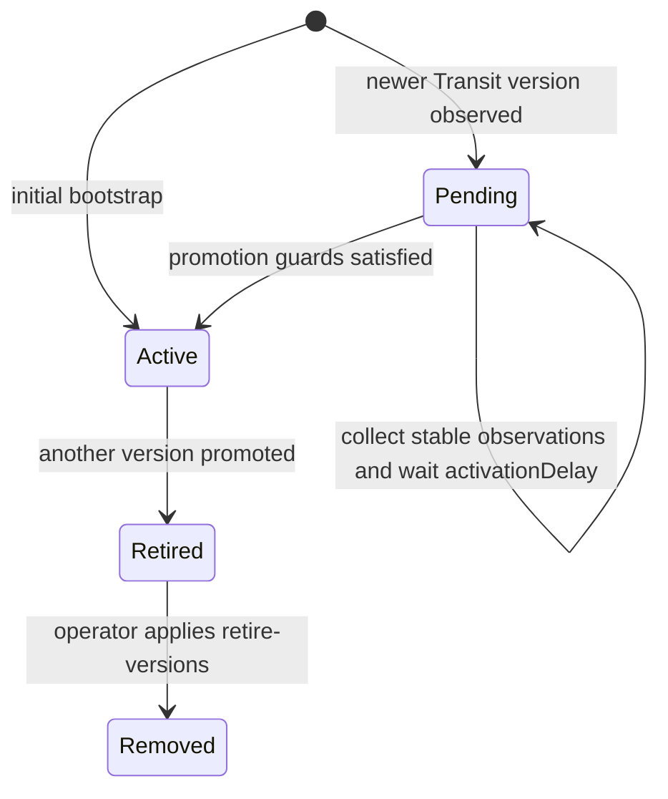
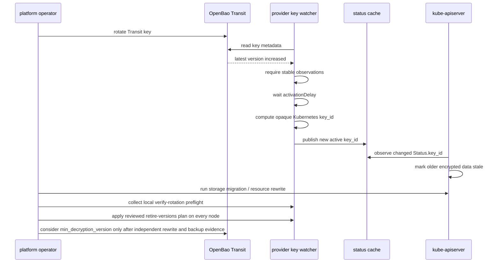

# Rotation Model

This maintainer-facing description defines the rotation state machine and its invariants. For the operator runbook, see [Operations: Rotation](/operations/rotation/).

## Principles

Rotation is driven by OpenBao Transit key versions and Kubernetes KMS v2 `key_id`.

The provider does not rotate the Transit key. Rotation is a platform operation, and Kubernetes data migration is an operator-controlled operation. This split keeps the provider's permission surface narrow. Key-management decisions remain in the platform's existing change-control path.

Kubernetes recommends rotating KEKs at least every 90 days and explains that KMS v2 uses `key_id` changes to determine when data may be stale.

## State Machine

These states describe individual snapshots. The previous active snapshot stays
active while a newer snapshot is pending. A retired snapshot remains available
for decrypt. A removed snapshot is a persistent record excluded from decrypt.
Validation failures make status unhealthy; they do not persist a `rejected`
transition.

End-to-end flow:

## Avoiding Key ID Flip-Flop

The provider must not flip-flop between `key_id` values during rotation. Recommended controls:

- require a stable observation count (`rotation.requireStableObservationCount`),
- require an activation delay (`rotation.activationDelay`),
- reject apparent version rollback unless disaster-recovery mode is explicitly enabled,
- keep old snapshots in the registry for decrypt,
- do not promote a key while OpenBao metadata is stale or inconsistent,
- do not promote when Transit metadata read fails,
- retain complete intermediate Transit version metadata as decrypt-only
  historical snapshots if a node observes `latest_version` jump over one or
  more versions,
- fail closed when an observed `latest_version` jump is missing intermediate
  Transit version creation metadata,
- do not promote based on an encrypt response.

The flip-flop guard is critical because Kubernetes treats Status `key_id` changes as a signal that older data is stale. A flip-flop would oscillate the staleness signal and confuse the API server's storage migration tracking.

## `min_encryption_version`

`min_encryption_version` can be used as a guard after rotation to prevent encryption with older versions. It is managed by platform automation; the provider only observes it.

## `min_decryption_version`

`min_decryption_version` is dangerous. Raising it too early can make existing Kubernetes data undecryptable. Raise it only after:

- every configured resource has been rewritten,
- old `key_id` references are no longer observed,
- backups are aligned with retained Transit versions,
- disaster recovery drills have passed,
- OpenBao and etcd backup retention implications are understood.

The current preview implementation does not prove those conditions. It validates
local registry state and Transit metadata, then leaves rewrite proof,
backup-retention proof, and `min_decryption_version` decisions to operator
change control.

Runtime status probes validate `min_decryption_version` and
`min_available_version` against every retained active, retired, and
historical snapshot in the local registry. If any retained historical version is
blocked, Status becomes unhealthy instead of advertising a decrypt registry that
OpenBao can no longer serve. `min_encryption_version` is checked against the
active version only.

### Operator-Controlled Retirement

The provider does not infer retirement from OpenBao minimum versions. Those
settings cannot prove that Kubernetes objects or retained backups no longer
need an old key. The operator uses `retire-versions` after collecting that proof.

The command changes eligible `retired` snapshots to `removed` in a new hashed
state generation. It preserves their identities and observation metadata as
removal records. It excludes them from decrypt lookup and Transit usability
checks. Normal state transitions must preserve every previously decryptable
active or retired key and every removal record. They cannot authorize removal
or reintroduce a removed identity.

Retirement requires no pending rotation, an active version equal to OpenBao's
latest version, and valid live metadata for all retained decryptable versions.
The command defaults to a read-only plan. Applying a plan requires its exact
state hash and exclusive access to the state writer lock. `serve` acquires the
same lock before bootstrap can write state.

This is a local transition. Operators apply it on every control-plane node
before raising a shared OpenBao minimum. The provider does not scan ciphertext,
coordinate cluster-wide retirement, change OpenBao settings, or provide an
automatic reversal. Restoring an older state/checkpoint pair is a separate
disaster-recovery operation and requires matching backup and Transit evidence.

The operator runbook for raising `min_decryption_version` lives at [Operations: Rotation: min_decryption_version](/operations/rotation/#min_decryption_version).

## Transit Rewrap

OpenBao Transit `rewrap` can upgrade Transit ciphertexts to a newer key version without exposing plaintext to the caller.

For Kubernetes KMS v2, rewrap remains outside the hot path because Kubernetes owns stale-data detection through `key_id` changes plus resource rewrites. Rewrap is useful for non-Kubernetes Transit consumers and for one-off operational migrations, but it does not replace Kubernetes storage migration in this design.

## Cross-Node Convergence

Each control-plane node runs its own provider instance and maintains its own
snapshot. The activation delay and stable observation count reduce the chance
that nodes promote the new version at materially different times, but they do
not eliminate it. Operators verify cross-node convergence by comparing the
`openbao_kms_status_key_id_hash` metric across nodes during and after rotation.
See [Operations: Rotation: Observe
Promotion](/operations/rotation/#observe-promotion).
