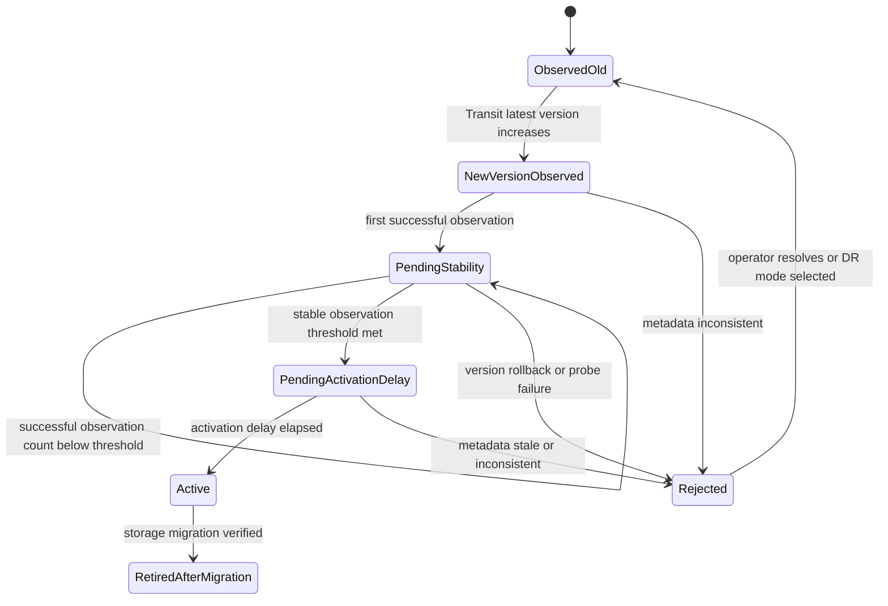
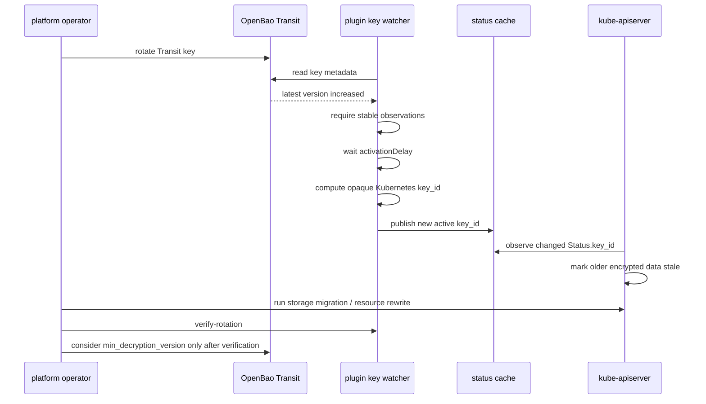

# Rotation Model

This page is the maintainer-facing description of the rotation state machine and invariants. For the operator runbook see [Operations: Rotation](/operations/rotation/).

## Principles

Rotation is driven by OpenBao Transit key versions and Kubernetes KMS v2 `key_id`.

The plugin does not rotate the Transit key. Rotation is a platform operation and Kubernetes data migration is an operator-controlled operation. This split keeps the plugin's permission surface narrow and keeps key-management decisions inside the platform's existing change-control path.

Kubernetes recommends rotating KEKs at least every 90 days and explains that KMS v2 uses `key_id` changes to determine when data may be stale.

## State Machine

End-to-end flow:

## Avoiding Key ID Flip-Flop

The plugin must not flip-flop between `key_id` values during rotation. Recommended controls:

- require a stable observation count (`rotation.requireStableObservationCount`),
- require an activation delay (`rotation.activationDelay`),
- reject apparent version rollback unless disaster-recovery mode is explicitly enabled,
- keep old snapshots in the registry for decrypt,
- do not promote a key while OpenBao metadata is stale or inconsistent,
- do not promote when Transit metadata read fails,
- do not promote based on an encrypt response.

The flip-flop guard is critical because Kubernetes treats Status `key_id` changes as a signal that older data is stale. A flip-flop would oscillate the staleness signal and confuse the API server's storage migration tracking.

## `min_encryption_version`

`min_encryption_version` can be used as a guard after rotation to prevent encryption with older versions. It is managed by platform automation; the plugin only observes it.

## `min_decryption_version`

`min_decryption_version` is dangerous. Raising it too early can make existing Kubernetes data undecryptable. It should only be raised after:

- every configured resource has been rewritten,
- old `key_id` references are no longer observed,
- backups are aligned with retained Transit versions,
- disaster recovery drills have passed,
- OpenBao and etcd backup retention implications are understood.

The operator runbook for raising `min_decryption_version` lives at [Operations: Rotation: min_decryption_version](/operations/rotation/#min_decryption_version).

## Transit Rewrap

OpenBao Transit `rewrap` can upgrade Transit ciphertexts to a newer key version without exposing plaintext to the caller.

For Kubernetes KMS v2, rewrap remains outside the hot path because Kubernetes owns stale-data detection through `key_id` changes plus resource rewrites. Rewrap is useful for non-Kubernetes Transit consumers and for one-off operational migrations, but it does not replace Kubernetes storage migration in this design.

## Cross-Node Convergence

Each control-plane node runs its own plugin and maintains its own snapshot. The activation delay and stable observation count reduce the chance that nodes promote the new version at materially different times, but they do not eliminate it. Operators verify cross-node convergence by comparing the `openbao_kms_status_key_id_hash` metric across nodes during and after rotation; see [Operations: Rotation: Observe Promotion](/operations/rotation/#observe-promotion).
