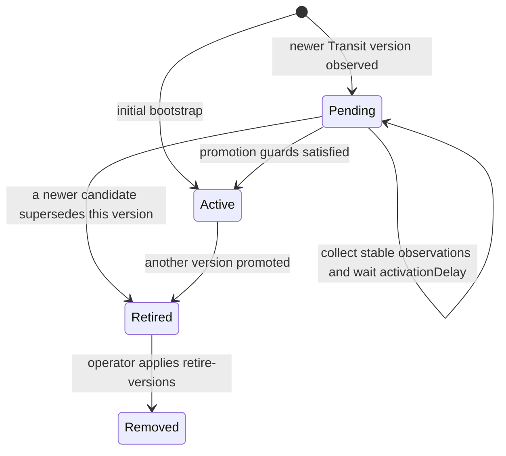
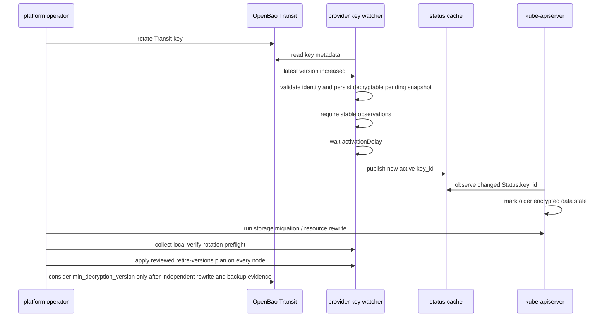

The platform rotates the Transit key; the provider only observes the new
version and decides when to promote it; operators rewrite Kubernetes data and
retire old versions. Keeping rotation out of the provider keeps its permissions
narrow. For the procedure, see [Operate: Rotation](/docs/operate/rotation/).

## States

```mermaid
stateDiagram-v2
    [*] --> Active: initial bootstrap
    [*] --> Pending: newer Transit version observed
    Pending --> Pending: collect stable observations and wait activationDelay
    Pending --> Active: promotion guards satisfied
    Pending --> Retired: a newer candidate supersedes this version
    Active --> Retired: another version promoted
    Retired --> Removed: operator applies retire-versions
```

The states belong to individual snapshots. The previous active snapshot keeps
encrypting while a newer one is pending. Validated pending and retired
snapshots decrypt; only the active one encrypts; removed snapshots stay as
records and never decrypt. A validation failure makes Status unhealthy without
recording a `rejected` state.

```mermaid
sequenceDiagram
    participant Operator as platform operator
    participant Bao as OpenBao Transit
    participant Watcher as provider key watcher
    participant Status as status cache
    participant API as kube-apiserver

    Operator->>Bao: rotate Transit key
    Watcher->>Bao: read key metadata
    Bao-->>Watcher: latest version increased
    Watcher->>Watcher: validate identity and persist decryptable pending snapshot
    Watcher->>Watcher: require stable observations
    Watcher->>Watcher: wait activationDelay
    Watcher->>Status: publish new active key_id
    API->>Status: observe changed Status.key_id
    API->>API: mark older encrypted data stale
    Operator->>API: run storage migration / resource rewrite
    Operator->>Watcher: collect local verify-rotation preflight
    Operator->>Watcher: apply reviewed retire-versions plan on every node
    Operator->>Bao: consider min_decryption_version only after independent rewrite and backup evidence
```

## No flip-flop

A `key_id` change tells Kubernetes that older data is stale, so an
oscillating `key_id` would corrupt its migration tracking. The provider
therefore:

- promotes only after `rotation.requireStableObservationCount` observations and
  `rotation.activationDelay`,
- never promotes on stale, inconsistent, or failed metadata reads, or on an
  encrypt response,
- rejects a `latest_version` that moves backwards; with
  `rejectVersionRollback` off, every retained identity still needs valid
  metadata,
- keeps skipped versions as decrypt-only snapshots when `latest_version`
  jumps, and fails closed if their creation metadata is missing,
- keeps every old snapshot for decryption.

## Minimum versions

The provider observes minimum versions and never sets them.

- If `min_encryption_version` blocks the old active version before promotion,
  Status turns unhealthy and Encrypt stops while observation continues. Health
  returns after promotion and a successful deep probe.
- Status probes check `min_decryption_version` and `min_available_version`
  against every retained snapshot. If one would be blocked, Status turns
  unhealthy rather than advertising keys OpenBao can no longer decrypt.

Raising `min_decryption_version` too early makes data unreadable, and nothing
in OpenBao or the provider can prove that no object or backup still needs a
version. That proof stays with operator change control.

## Operator-controlled retirement

For the same reason, the provider never infers retirement from OpenBao
minimums. The operator runs `retire-versions` after collecting the proof. The
command turns eligible `retired` snapshots into `removed` records in a new
hashed state generation, keeps their identities, and excludes them from
decryption and Transit usability checks. Normal transitions must keep every
decryptable identity and every removal record; they can neither remove nor
revive an identity.

Retirement needs no pending rotation, an active version equal to Transit's
latest, valid metadata for every retained version, the reviewed state hash,
and the state writer lock that `serve` also takes. It is a local transition:
operators run it on every node before raising the shared OpenBao minimum. The
provider does not scan ciphertext, coordinate nodes, change OpenBao, or offer
an undo.

## Convergence and discovery

Each node promotes on its own. The observation count and delay make nodes
promote at nearly the same time but cannot guarantee it, so operators compare
`openbao_kms_status_key_id_hash` across nodes.

A node can decrypt a peer's new ciphertext before promoting locally. An
unknown, well-formed `key_id` triggers one metadata lookup, which reads only the
configured mount and key; request annotations never choose a backend or an
identity. Lookups are shared by concurrent requests, limited to one per
`status.probeInterval` per process including failures, and bounded by the
Decrypt deadline. They never count as observations, start the activation delay,
or promote. Status and Encrypt never trigger them.

A lookup saves a validated identity before decryption uses it. Missing or
changed metadata fails validation and keeps the previous state. A pending
identity stays retained when a newer candidate supersedes it, and a metadata
rollback that would drop it fails validation, because another node might
already have encrypted with it.
