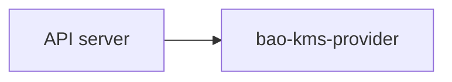

The published documentation is a Hugo site built from the Markdown files under
`docs/` and the site assets under `website/`. For writing guidance, see
[Docs style guide](/contribute/docs-style-guide/).

## Source layout

```text
docs/
  _index.md           documentation landing page (/docs/)
  get-started/        model choice, OpenBao setup, install, enable, verify
  configure/          auth and policy variants, monitoring
  operate/            rotation, upgrade, recovery, troubleshooting
  reference/          CLI, config, protocol, metrics, compatibility
  security/           threat model, hardening, auth, decrypt validation
  architecture/       design rationale and tradeoffs
  contribute/         contributor guides, published at /contribute/
website/
  content/            homepage and the legacy redirect adapter
  data/               navigation, version line, and redirect ledger
  layouts/            Hugo templates and shortcodes
  assets/             CSS and JavaScript sources
  static/             brand assets and vendored Mermaid
  scripts/            rendered-site checks
hugo.toml             site configuration, theme strings, and module mounts
```

The live docs must describe the current project. Older plans and design notes
remain available through repository history.

The theme follows the OpenBao Operator documentation site. Layouts read
project-specific copy from `[params]` in `hugo.toml` so the same templates can
move into a shared theme module later. Keep new project strings in `hugo.toml`
instead of hardcoding them in templates.

## Hugo mounts

`hugo.toml` mounts `docs/` at `content/docs/`, so every page renders under
`/docs/`. The mount excludes internal planning material (`adr/`,
`workstreams/`, `research-notes.md`). `docs/contribute/` mounts separately at
`content/contribute/`, so contributor guides render under `/contribute/` with
their own section navigation, like the OpenBao Operator site.

To add a new top-level docs section:

1. Create `docs/<section>/_index.md` with front matter.
2. Add the section and its pages to `website/data/navigation.yaml`.
3. Add the section to the link grid in `docs/_index.md`.

## Navigation

`website/data/navigation.yaml` defines the sidebar. The `primary` list holds
the documentation sections, and the `secondary` list holds global guides such
as Contribute. Items with a `step` field form the Previous and Next path of
their group. Items that share a step are alternatives, such as the systemd and
static-pod pages: the path leads from the step before them to each alternative
and from each alternative to the step after them. Section landing pages list
their child pages by `weight` unless they set `hideChildren: true`.

## Retired routes

`website/data/redirects.yaml` lists retired routes and their canonical targets.
The content adapter in `website/content/_content.gotmpl` publishes a redirect
page for each entry. When a page moves, add a ledger entry for the old route in
the same change.

## Local builds

The Makefile runs a pinned Hugo version through `go run`, so a global Hugo
install is not required.

```sh
make docs-deps    # install pinned Hugo into GOBIN once
make docs-build   # build into public/ and check the rendered site
make docs-serve   # serve on http://localhost:1313/openbao-kubernetes-kms/
```

The Hugo version is pinned in `.hugo-version` and `.ci/versions.yaml`. Update
both pins when a layout, shortcode, or build behavior depends on a newer Hugo
release.

## Checks

Run both docs checks before merging documentation changes:

```sh
make docs-check
make docs-build
```

`make docs-check` scans tracked first-party prose for configured text and
typography issues. `make docs-build` fails on any Hugo warning, then runs
`website/scripts/check-rendered-site.py`. The check rejects broken internal
links and fragments, duplicate element IDs, encoding damage, malformed
Kubernetes YAML in code blocks, and published pages that are missing from the
navigation.

## Templates

`website/layouts/` contains the Hugo templates used by the site:

```text
website/layouts/
  home.html                     homepage
  404.html                      not-found page
  index.json                    search index
  _default/baseof.html          page shell
  _default/single.html          content page
  _default/list.html            section landing page
  _default/redirect.html        retired-route redirect
  _markup/render-link.html      site and repository link rewriting
  _markup/render-codeblock.html copyable code blocks
  _markup/render-codeblock-mermaid.html
  partials/                     header, sidebar, TOC, search, footer
  shortcodes/                   callout, command, checklist
```

Fenced code blocks render as copyable blocks. Keep commands in plain Markdown
fences: `test/deployment/systemd-install.sh` extracts and runs the fenced
blocks that follow its marker comments in the install guide.

Shortcodes:

- `callout` with `type` set to `note`, `warning`, or `tip`, and an optional
  `title`.
- `checklist` with an optional `title`.
- `command` with optional `title` and `label` for a titled command block.

## Mermaid

Mermaid diagrams render from fenced markdown blocks:

````markdown

````

The renderer is `website/layouts/_markup/render-codeblock-mermaid.html`, with
initialization in `website/assets/js/mermaid-init.js`. Mermaid itself is
vendored at `website/static/vendor/mermaid/mermaid.min.js`, so the published
site does not depend on a CDN.

## Publishing

GitHub Pages serves the generated site from the `gh-pages` branch. The
`Docs Pages` workflow runs on pushes to `main`, builds the site with the same
`make docs-check` and `make docs-build` targets used locally, and publishes the
rendered `public/` directory to `gh-pages`.

Configure the repository Pages source as:

```text
Deploy from a branch
Branch: gh-pages
Folder: / (root)
```

The workflow creates `gh-pages` on first publish. Later publishes update that
branch with normal commits.

Local builds write rendered output to `public/`. That directory is generated
and gitignored.
