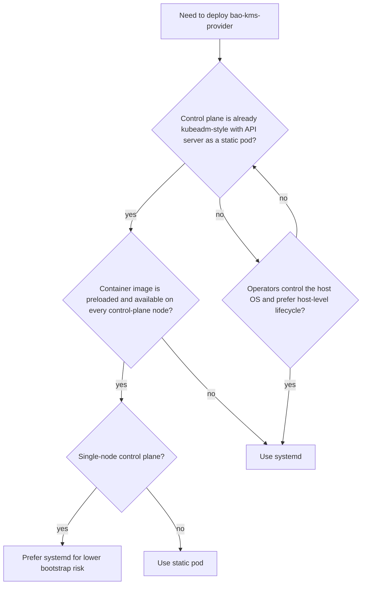

# Choosing A Model

`bao-kms-provider` supports two production deployment models: a hardened systemd unit on the control-plane host, and a static pod managed by the kubelet. The choice depends on the control-plane lifecycle model, bootstrap dependencies, host hardening, upgrade process, and operator familiarity. This page lays out the comparison so the choice is made deliberately before the per-model pages.

A normal Kubernetes Deployment or DaemonSet running inside the protected cluster is not supported for protecting that same cluster's API server. The reasoning is in the [DaemonSet Is Not Supported](#daemonset-is-not-supported) section below.

## At A Glance

| Property | systemd | Static pod |
|---|---|---|
| Lifecycle managed by | systemd | kubelet |
| Bootstrap dependency | systemd, host filesystem | kubelet, container runtime, local image, host filesystem |
| Starts before | kubelet (configurable through `Before=`) | API server (kubelet starts both static pods together) |
| Hardening surface | systemd directives (NoNewPrivileges, ProtectSystem, capability bounds, ...) | Pod `securityContext`, distroless non-root image |
| File mounts | systemd `ReadWritePaths` and `ReadOnlyPaths` | hostPath volumes |
| Identity | host user (`openbao-kms`) | container UID `65532:65532`, joined to host socket group |
| Upgrade unit | distro package or binary replacement | container image digest pin |
| Air-gap recovery | binary on host | preloaded image digest on host |
| Fits which control-plane style | host-binary control planes, kubeadm with extra tooling | kubeadm-style control planes managing the API server as a static pod |

## When systemd Is The Right Choice

Use systemd when:

- the control-plane host is managed at the operating-system layer (configuration management, OS images, OS-native lifecycle),
- starting the provider before kubelet is preferable so the socket is ready by the time the static-pod API server comes up,
- container runtime availability is not a precondition for KMS health,
- host-level sandboxing through systemd directives fits the existing hardening posture,
- package upgrades and restarts can be coordinated with control-plane maintenance windows.

## When Static Pod Is The Right Choice

Use a static pod when:

- the control plane is already kubeadm-style with all components running as static pods,
- operators want a Kubernetes-native manifest on each control-plane node,
- container images are preloaded or reliably available on each node,
- hostPath-mounted configuration and JWT files are acceptable,
- OpenBao is reachable independently of the protected API server.

## Bootstrap Risk Comparison

Both models put the provider on the API server boot path. The bootstrap risks differ.

systemd risks:

- `network-online.target` can be misleading if DNS, routing, or OpenBao load balancers are not truly reachable,
- host hardening directives vary by distribution and systemd version, and a too-aggressive sandbox can hide misconfiguration as opaque failures,
- restarting the unit during API server startup or a Transit rotation may cause transient API server errors.

Static pod risks:

- the provider depends on kubelet and the container runtime; if either is unavailable, the provider does not start,
- start-up ordering with the API server is not a hard dependency graph; both static pods come up under kubelet at roughly the same time,
- container image availability matters during disaster recovery; broken pull paths block plugin start,
- host networking is often required to avoid CNI bootstrap dependencies during early boot,
- socket file permissions and group ownership must be validated on the host since the container UID is opaque to host tools.

## DaemonSet Is Not Supported

A standard Kubernetes DaemonSet running in the protected cluster is not a supported deployment model for protecting that same cluster's API server. DaemonSets depend on the Kubernetes API server and controller machinery. If the API server cannot start without the KMS plugin, the DaemonSet that would start the plugin cannot itself be relied on.

A DaemonSet is acceptable for a different cluster (for example, a management cluster running the provider against its own OpenBao), or for non-boot-path diagnostics.

## Decision Tree

## Read Next

1. [systemd Deployment](/deployment/systemd/) for the unit file, directory setup, and start procedure.
2. [Static Pod Deployment](/deployment/static-pod/) for the manifest, image preload, and host preparation.
3. [Linux Identity Model](/deployment/linux-identity-model/) for the user, group, and permission model both deployments share.
