# Technical design: OpenBao-native Kubernetes KMS v2 provider for OpenBao Transit

## 1. Executive summary

This document proposes an OpenBao-native Kubernetes KMS v2 provider plugin that enables Kubernetes API server encryption-at-rest for etcd-backed API resources by using the OpenBao Transit secrets engine as the remote key-encryption service.

The intended architecture is:

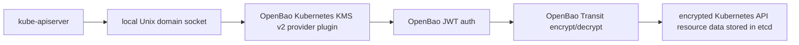

The plugin does not encrypt etcd disk blocks, application volumes, node filesystems, or arbitrary Kubernetes traffic. It participates in Kubernetes envelope encryption for selected API resources before persistence to etcd. Kubernetes documentation describes this feature as encryption of API resource data at rest, and explicitly distinguishes it from encrypting container-level filesystems or volumes.

The design is KMS v2-first. Kubernetes KMS v2 is stable as of Kubernetes v1.29, while KMS v1 has been deprecated since v1.28 and disabled by default as of v1.29. The v0.1 validation target for this project is the Kubernetes 1.34 release line, with exact patch version and test image digest pinned in CI.

The primary differentiators from existing Vault Transit KMS plugins are:

* OpenBao-native naming, configuration, documentation, and client behavior.
* KMS v2 only by default.
* Strict key_id correctness.
* Explicit OpenBao Transit key_version use on every encrypt.
* Strict decrypt-side key_id and annotation validation.
* Optional Transit associated_data / AAD binding.
* Cheap cached KMS Status.
* Background OpenBao health and key metadata probes.
* JWT-first authentication to reduce Kubernetes API circular dependency.
* Production-oriented systemd and static pod deployment models.
* Strong bootstrap, rotation, recovery, and failure-mode documentation.
* Dedicated doctor, verify-key, benchmark, and rotation helper commands.
* Explicit observability and security review surface.

This is a design, not a production-readiness claim. A production-grade implementation would require conformance testing against supported Kubernetes releases, OpenBao HA and recovery tests, load testing of API server startup decrypt storms, and failure-mode validation.

---

## 2. Problem statement

Kubernetes can encrypt selected API resource payloads before writing them to etcd. For KMS-backed envelope encryption, the Kubernetes API server does not call OpenBao Transit directly. Instead, the API server talks to a local KMS provider plugin over gRPC on a Unix domain socket, and the plugin talks to the external KMS. Kubernetes documentation describes the KMS plugin as a gRPC server on the same host as the API server, with the API server communicating over a Unix domain socket.

OpenBao Transit can encrypt and decrypt caller-supplied data, but OpenBao does not itself implement the Kubernetes KMS gRPC protocol. OpenBao Transit therefore needs a Kubernetes-aware adapter.

The adapter becomes part of the control-plane boot path. If the plugin, socket, authentication material, OpenBao service, Transit key, or network path is unavailable, the Kubernetes API server may be unable to decrypt previously encrypted resources. Kubernetes documentation notes that API server startup can involve thousands of decrypt operations, so this plugin must be treated as critical infrastructure.

The design problem is therefore not just “call Transit from Kubernetes.” The problem is to design a KMS v2 implementation that is correct under rotation, secure under bootstrap and recovery pressure, observable during failures, and operationally defensible.

---

## 3. Goals and non-goals

### 3.1 Hard requirements

| Area | Requirement |
| --- | --- |
| Kubernetes API | Implement Kubernetes KMS v2 as the primary and default API. |
| Kubernetes version | Target Kubernetes 1.34 release line for v0.1 validation; add newer lines only after exact-pinned release-gate coverage. |
| Transport | Expose gRPC over a local Unix domain socket. |
| OpenBao integration | Use OpenBao Transit encrypt/decrypt APIs over HTTPS. |
| Authentication | Support OpenBao JWT auth from a host-mounted JWT file as the default authentication mode. |
| Key management | Never create, delete, rotate, export, or back up Transit keys from the plugin by default. |
| Key versioning | Encrypt using an explicit OpenBao Transit key_version selected from a cached active key snapshot. |
| KMS key_id | Return opaque, stable, non-secret, never-reused Kubernetes key_id values. |
| Decrypt validation | Reject unknown, malformed, stale-disallowed, or annotation-inconsistent key_id values. |
| Status behavior | Serve KMS Status from cached health and key metadata, not from a live Transit encrypt/decrypt on every call. |
| Observability | Expose Prometheus metrics, structured JSON logs, and local health endpoints. |
| Deployment | Support both hardened systemd and static pod deployment models. |
| Recovery | Document bootstrap, rotation, key loss, OpenBao restore, etcd restore, and emergency recovery paths. |
| Implementation quality | Use strict typed Go with package-boundary checks, ast-grep structural rules, Semgrep security rules, and no broad dynamic types in production code. |

### 3.2 Recommended defaults

| Area | Default |
| --- | --- |
| KMS API | KMS v2 only. |
| Transit key type | aes256-gcm96. |
| Transit isolation | One named Transit key per Kubernetes cluster or trust domain. |
| Transit key creation | External platform automation, OpenTofu, OpenBao operator, or admin workflow. |
| Transit key export | Disabled. |
| Transit plaintext backup | Disabled. |
| Transit key deletion | Disabled. |
| Transit upsert | Disabled at the Transit mount level where feasible. |
| Transit AAD | Enabled unless compatibility testing requires disabling. |
| Auth token storage | Memory only. |
| Socket path | /run/openbao-kms/kms.sock. |
| Decrypt batching | Included in v0.1, disabled by default until benchmarked. |
| Runtime hardening | systemd for hardened production mode where practical; static pod for kubeadm-compatible Kubernetes-native deployments. |

### 3.3 Optional enhancements

* Certificate authentication as a non-default alternative.
* OpenBao namespace support.
* Advanced decrypt micro-batching tuning using Transit batch_input.
* OpenBao policy generator.
* OpenTofu module.
* OpenBao Operator integration.
* Distro-specific deployment guides for kubeadm, RKE2, Talos, OKD, and similar platforms.
* Legacy KMS v1 compatibility as a separate build, branch, or binary.

### 3.4 Non-goals

* Encrypting arbitrary etcd disk blocks.
* Encrypting Kubernetes node filesystems or application volumes.
* Replacing Kubernetes storage migration tooling.
* Creating or managing OpenBao Transit keys from the hot-path plugin.
* Using OpenBao Transit datakey generation for the primary design.
* Using convergent encryption for Kubernetes API resource encryption.
* Depending on a DaemonSet in the protected cluster to protect that same cluster’s API server.
* Claiming production readiness before conformance, HA, recovery, and load testing.

---

## 4. Background: Kubernetes etcd encryption and KMS v2

Kubernetes encryption-at-rest is configured through an EncryptionConfiguration file passed to kube-apiserver using --encryption-provider-config. If the first configured provider for a resource is identity, Kubernetes stores the resource without encryption.

Kubernetes supports envelope encryption through KMS providers. In the KMS model, Kubernetes uses a data encryption key or seed internally, and the remote KMS protects the material used to unwrap or derive encryption keys. The KMS plugin runs on the same host as the API server and exposes a gRPC endpoint over a Unix domain socket.

KMS v2 is the correct default for this design. Kubernetes documentation states that KMS v2 is stable as of Kubernetes v1.29, that KMS v1 was deprecated in v1.28, and that KMS v1 is disabled by default as of v1.29.

Important KMS v2 protocol behavior:

* Status returns plugin version, health, and key_id.
* The API server polls Status approximately once per minute when healthy and more frequently when unhealthy.
* Status should be optimized because it is polled continually.
* Encrypt receives plaintext and a UID, and returns ciphertext, key_id, and optional annotations.
* Decrypt receives ciphertext, key_id, annotations, and a UID.
* The plugin must verify that key_id is one it understands.
* API server startup may trigger thousands of decrypt requests.
* Kubernetes recommends target latency under 100 ms for encrypt and under 10 ms for decrypt.

KMS v2 key_id semantics are central to correctness. Kubernetes treats the key_id from Status as authoritative. If EncryptResponse.key_id does not match the currently observed Status.key_id, the API server discards the result and treats the plugin as unhealthy. The key_id is public and may appear in logs. It must be stable, must not flip-flop, and must never be reused.

KMS v2 annotations are plaintext metadata stored in etcd with the encrypted object. Annotation keys should be fully qualified domain names, and the total annotation size is bounded. This design uses annotations only for non-secret metadata needed to validate and reconstruct AAD.

Kubernetes storage encryption applies on write. Existing resources are not automatically rewritten merely because the encryption configuration changed. Kubernetes documentation shows the standard rewrite pattern using kubectl get ... -o json | kubectl replace -f -.

For initial enablement, Kubernetes documentation recommends including identity: {} as the last provider until all resources have been encrypted. After migration, the identity fallback should be removed to prevent plaintext fallback.

---

## 5. Background: OpenBao Transit

OpenBao Transit provides cryptographic operations as a service. It encrypts, decrypts, signs, verifies, generates data keys, and supports key derivation and convergent encryption, but does not store caller-supplied plaintext or ciphertext data.

Transit ciphertexts include a version prefix such as vault:v1:..., where the version identifies the Transit key version used for encryption. OpenBao does not store the encrypted data; the caller stores the ciphertext.

Transit supports key versioning. New encrypt operations use the active key version unless a specific key_version is requested. Older versions can remain available for decrypt. OpenBao also exposes min_encryption_version and min_decryption_version, which can restrict which key versions may be used.

The Transit key API exposes metadata including the key type, whether it is derived, whether it is exportable, whether plaintext backup is allowed, min_decryption_version, min_encryption_version, and per-version creation timestamps.

Transit encryption supports:

* base64-encoded plaintext,
* optional associated_data for AEAD modes,
* optional explicit key_version,
* optional batch_input.

Transit decryption supports:

* ciphertext,
* optional matching associated_data,
* optional batch_input.

OpenBao Transit supports key types including aes256-gcm96, chacha20-poly1305, and xchacha20-poly1305. aes256-gcm96 is the recommended default compatibility choice for this design. xchacha20-poly1305 may be useful as an optional hardened non-FIPS mode, but it should not be the only supported key type.

Transit keys can be rotated. After rotation, new encrypt operations use the new key version, while existing ciphertexts can be rewrapped or decrypted if old versions remain available.

Transit key deletion is catastrophic for this use case. OpenBao documentation warns that deleting a Transit key makes decrypting ciphertext impossible and requires deletion_allowed to be set.

---

## 6. Existing FalcoSuessgott/vault-kubernetes-kms analysis

The FalcoSuessgott/vault-kubernetes-kms project is a useful proof point that Kubernetes KMS plugins can integrate with Vault Transit. Its current README describes it as a plugin for encrypting Kubernetes etcd objects with HashiCorp Vault Transit and says it is intended to run as a static pod on every control-plane node. It also documents that the plugin must be running before the API server starts, and that Vault should reside outside the protected cluster if the plugin is deployed as a static pod.

The project currently advertises support for Vault token and AppRole authentication, KMS v1 and KMS v2, automatic token renewal, and Prometheus metrics. The repository release page shows recent development activity, with a v1.1.0 release in April 2026 adding userpass authentication and dependency updates.

However, this OpenBao-native design should not clone that implementation.

Key differences identified from the current repository:

| Area | Existing project behavior | Desired OpenBao-native behavior |
| --- | --- | --- |
| KMS API | Registers KMS v1 and KMS v2 unless disabled. | KMS v2 only by default; KMS v1, if supported, separate legacy mode. |
| Auth | Supports token, AppRole, and userpass in code; no JWT-first design. | JWT-first with file reload, short OpenBao tokens, and re-login/renewal. |
| Client identity | Uses HashiCorp Vault API client and Vault naming. | OpenBao-native naming, docs, and client integration. |
| Status | KMS v2 Status calls health logic that performs real encrypt/decrypt work. | Cheap cached Status; background probes perform OpenBao checks. |
| Encrypt key version | Encrypt writes plaintext to Transit and then reads latest key version. | Encrypt passes explicit Transit key_version from active KeySnapshot. |
| key_id | Uses Transit latest_version string as the KMS key ID. | Opaque scoped key ID; no raw Transit version or key topology leakage. |
| Decrypt validation | Current KMS v2 wrapper does not pass request key_id or annotations into internal decrypt logic. | Decrypt validates request key_id, annotations, and required v0.1 AAD. |
| Annotations | KMS v2 encrypt response does not populate annotations. | Use KMS v2 annotations for non-secret metadata and AAD reconstruction. |
| Socket safety | Has a force-socket-overwrite path that removes an existing socket path when enabled. | Remove only verified dead Unix sockets; fail closed on unsafe paths. |
| Recovery docs | Troubleshooting docs refer rollback to Kubernetes docs. | Detailed disaster recovery and bootstrap playbooks. |

The existing project’s documentation also appears internally inconsistent on maturity: the README describes the project as stable and production-grade, while a documentation page still says the project is in an early stage and not recommended for production. This does not make the project unusable, but it reinforces the need for an independent OpenBao-native design and test plan.

---

## 7. Proposed architecture

### 7.1 Component diagram

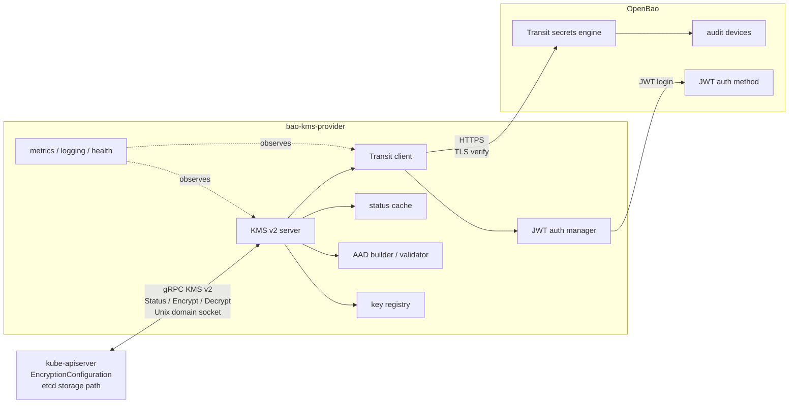

### 7.2 Data flow

#### Encrypt

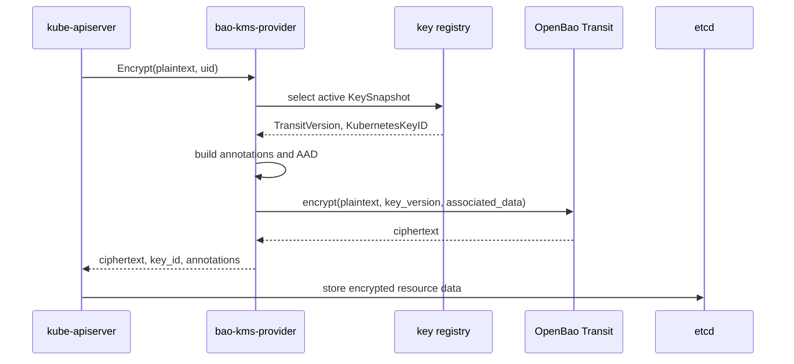

#### Decrypt

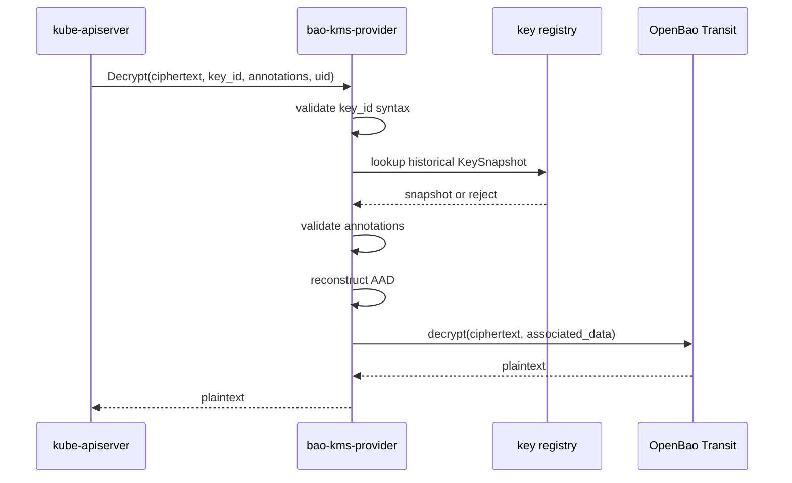

#### Status

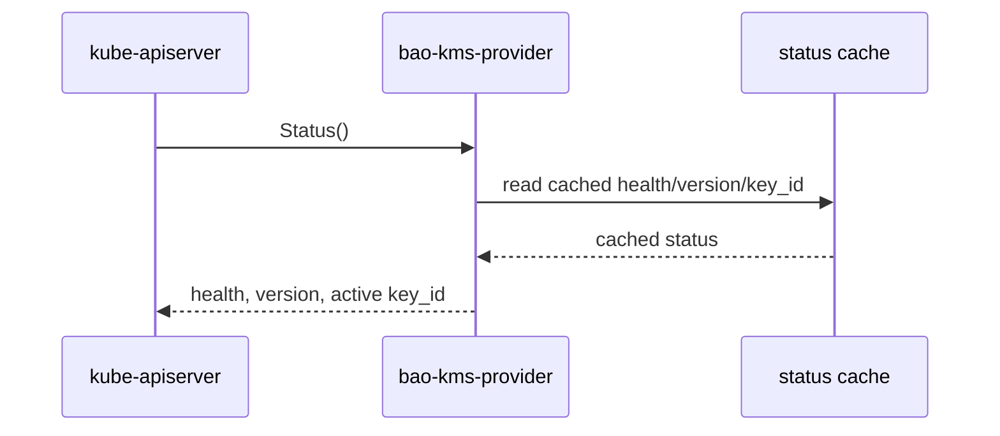

Status must not perform a live Transit encrypt/decrypt on every request. Kubernetes polls Status regularly, and the Status.key_id drives rotation behavior.

### 7.3 Internal active key model

```go
type KeySnapshot struct {
    KubernetesKeyID string
    TransitMountHash string
    TransitKeyHash string
    TransitVersion int
    TransitVersionCreatedAt time.Time
    CreatedAt time.Time
    State string // Active, Pending, Retired, Rejected, DisasterRecovery
}
```

The active snapshot is computed by a background key watcher, not during hot-path Status.

### 7.4 Implementation guardrails

The implementation should encode the design boundaries as local and CI checks before feature work begins.

ast-grep owns structural Go and architecture rules:

* no broad dynamic types in production code,
* no runtime panics,
* no root contexts in runtime packages,
* no Viper imports outside the config boundary,
* no environment reads outside the config boundary,
* no concrete OpenBao or Transit client imports from `internal/kmsv2`.

Semgrep owns security and dangerous API-usage rules:

* no disabled TLS verification,
* no default HTTP client or package-level HTTP helpers,
* no `http.NewRequest` without context,
* no runtime subprocess execution,
* no sensitive log field names.

The supporting policy is captured in [Code Quality](code-quality.md) and [ADR 0011](adr/0011-strict-typed-idiomatic-go.md).

### 7.5 OpenBao placement

Recommended placement is an external management plane or otherwise independent OpenBao deployment that does not depend on the protected Kubernetes API server.

Running OpenBao inside the same protected cluster is strongly discouraged for this use case. If the API server requires the KMS plugin to start and the plugin requires OpenBao, then OpenBao must be reachable before the protected API server is healthy. A same-cluster OpenBao deployment can therefore introduce a circular dependency.

---

## 8. Runtime deployment options: systemd vs static pod

### 8.1 Recommendation

The project should support both:

| Deployment mode | Recommendation |
| --- | --- |
| systemd service | Hardened production default where host-level lifecycle management is available. |
| static pod | Supported kubeadm-compatible mode when the control plane is already static-pod based. |
| DaemonSet in protected cluster | Unsupported or explicitly not recommended for protecting that same cluster’s API server. |

This is not a universal statement that systemd is “more secure” or static pods are “less secure.” The correct choice depends on the control-plane lifecycle model, bootstrap dependencies, host hardening, upgrade process, and operator familiarity.

### 8.2 systemd deployment

Systemd has several operational advantages for this plugin:

* It can start before kubelet or before a locally managed API server.
* It can express ordering and restart policy outside Kubernetes.
* It avoids container runtime dependency.
* It can use host-level sandboxing.
* It can mount only the required configuration, JWT, CA, and runtime socket paths.
* Package upgrades and restarts can be coordinated with control-plane maintenance windows.

Systemd caveats:

* kubeadm usually manages the API server as a static pod through kubelet, so ordering must be carefully tested.
* network-online.target can be misleading if DNS, routing, or OpenBao load balancers are not truly reachable.
* Host hardening directives vary by distribution and systemd version.
* Restarting the plugin during API server startup or rotation may cause transient API server errors.
* Package upgrades must not blindly restart all control-plane KMS plugins simultaneously.

### 8.3 Static pod deployment

Static pods are managed directly by kubelet without requiring the Kubernetes API server. Kubernetes documentation states that static pods are managed by kubelet on a specific node and that kubelet can run them without observing them through the API server. Static pods cannot reference Kubernetes API objects such as ServiceAccounts, ConfigMaps, or Secrets.

Static pods are appropriate when:

* kubeadm-style control-plane components are already static pods,
* operators want a Kubernetes-native manifest on each control-plane node,
* container images are preloaded or reliably available,
* hostPath-mounted config and JWT files are acceptable,
* OpenBao is reachable independently of the protected API server.

Static pod caveats:

* Startup ordering with the API server is not a hard dependency graph.
* The plugin depends on kubelet and the container runtime.
* It must not rely on a ServiceAccount token, ConfigMap, or Secret from the protected API.
* Image availability matters during disaster recovery.
* Host networking may be required to avoid CNI bootstrap dependencies.
* Socket file permissions and group ownership must be validated on the host.

### 8.4 DaemonSet deployment

A normal DaemonSet in the protected cluster should not be used to protect that same cluster’s API server. DaemonSets depend on the Kubernetes API server and controller machinery. If the API server cannot start without the KMS plugin, the DaemonSet cannot be relied on to start the KMS plugin.

A DaemonSet can be useful only for a different cluster, a management cluster, or non-boot-path diagnostics.

---

## 9. Authentication design: JWT-first

### 9.1 Rationale

OpenBao JWT auth is preferred over OpenBao Kubernetes auth for this plugin.

OpenBao’s JWT/OIDC auth method verifies JWTs cryptographically using configured local keys, JWKS, or OIDC discovery. OpenBao’s Kubernetes-as-OIDC guidance explicitly notes that JWT auth does not use Kubernetes TokenReview, while Kubernetes auth does. It also warns that revoked tokens remain valid until expiry when only cryptographic JWT validation is used.

That tradeoff is acceptable and preferable for this plugin because Kubernetes TokenReview would require the protected API server to be healthy. During API server bootstrap or disaster recovery, that can create a circular dependency.

### 9.2 Plugin authentication behavior

The plugin should implement this lifecycle:

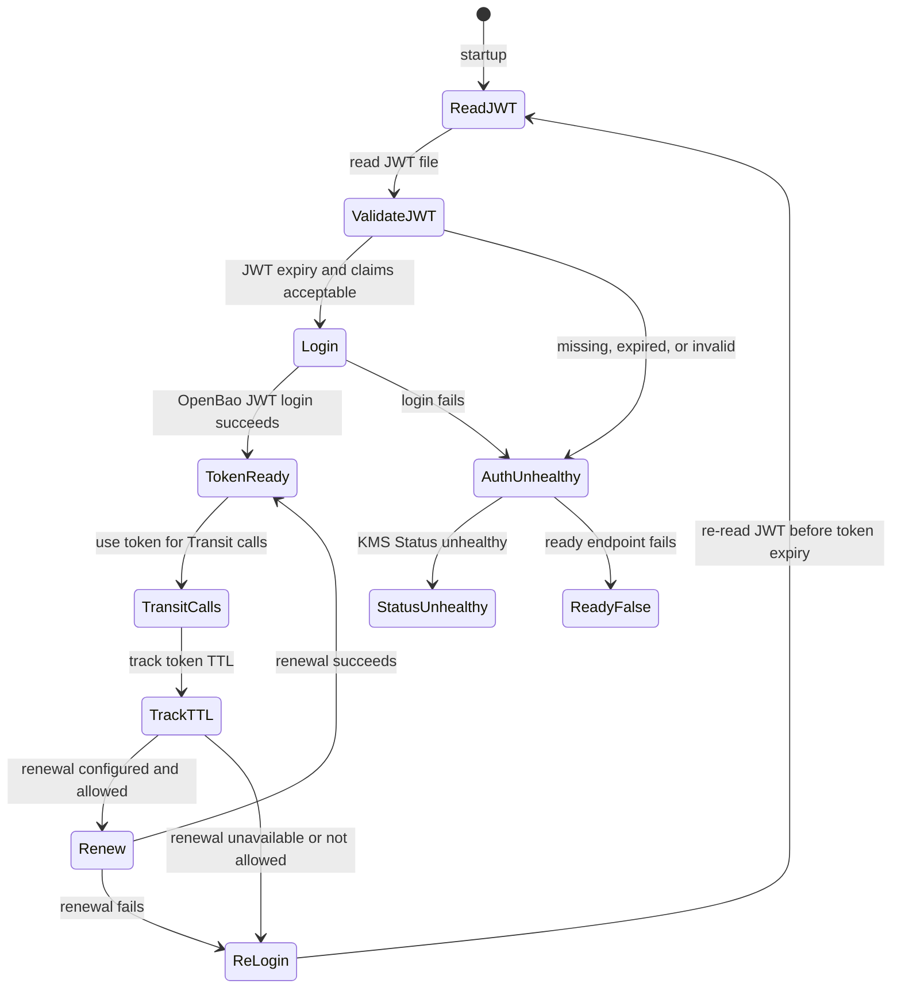

Required config shape:

```yaml
auth:
  method: jwt
  mountPath: auth/k8s-workload-a-jwt
  role: openbao-kms-control-plane
  jwtFile: /var/lib/openbao-kms/identity.jwt
  minJwtRemainingTtl: 2m
  clockSkewLeeway: 30s
  loginBeforeTokenExpiry: 5m
  tokenStorage: memory
```

### 9.3 JWT source options

| Option | Recommendation | Analysis |
| --- | --- | --- |
| External or management-plane JWT issuer | Preferred | Provides strongest bootstrap independence. OpenBao validates via OIDC discovery, JWKS, or pinned public keys. Recovery can proceed even when the protected API server is down. |
| Kubernetes-issued service account JWT from protected cluster | Supported with caution | Kubernetes service account JWTs contain issuer, subject, audience, and expiry claims, and can be validated offline through discovery, but offline validation does not prove that bound objects still exist. Renewal may depend on kubelet/API behavior. |
| Long-lived static JWT or token on disk | Emergency or constrained environments only | Operationally robust but weaker security. Should not be the default. Use response wrapping for initial distribution where practical. |

### 9.4 Recommended OpenBao JWT role constraints

The role should require:

* bound_issuer
* bound_audiences
* bound_subject or strong bound_claims
* short OpenBao token TTL
* limited max TTL
* no default policy
* one dedicated Transit policy
* clock skew leeway sized to the environment

OpenBao JWT roles require at least one bound value such as audience, subject, or claims. They also support token TTL, max TTL, token policies, and disabling the default policy.

### 9.5 JWT and token renewal considerations

| Issue | Design response |
| --- | --- |
| Clock skew | Validate nbf, iat, and exp with configurable leeway. Alert on host clock drift. |
| JWT expiry | Refuse startup if JWT remaining TTL is below minJwtRemainingTtl. Re-read JWT before re-login. |
| JWKS rotation | Support OIDC discovery/JWKS cache behavior. Provide recovery mode with pinned public keys if discovery is unavailable. |
| Issuer rotation | Treat issuer change as planned migration. Configure overlapping trust only during a bounded window. |
| OpenBao token expiry | Re-login before expiry by default. Token renewal may be supported if policy permits auth/token/renew-self. |
| Revoked JWT | Accept that pure JWT auth cannot detect revocation until expiry. Mitigate with short JWT TTL where renewal is reliable, or use external issuer revocation controls. |
| API server down | Avoid TokenReview dependency. External issuer is preferred. |

### 9.6 Response wrapping

Response wrapping is not part of the hot path. It can be useful for initial delivery of a fallback static credential, emergency recovery material, or one-time bootstrap secret. OpenBao response wrapping stores a response behind a single-use wrapping token with a TTL, which can help detect mishandling during handoff.

---

## 10. OpenBao Transit key and policy design

### 10.1 Key ownership

The Transit key must be created and managed outside the plugin by:

* platform automation,
* OpenTofu/Terraform,
* an OpenBao operator,
* an administrative workflow,
* or a management-plane controller.

The plugin should not have permission to create, delete, rotate, export, back up, or restore the key.

### 10.2 Recommended Transit key profile

```yaml
transitKeyProfile:
  type: aes256-gcm96
  derived: false
  convergent_encryption: false
  exportable: false
  allow_plaintext_backup: false
  deletion_allowed: false
  auto_rotate_period: 0
  disable_upsert: true
```

Recommended interpretation:

| Setting | Recommendation | Rationale |
| --- | --- | --- |
| type | aes256-gcm96 | Default compatibility choice. |
| derived | false | Avoid treating derivation context as the primary cluster isolation boundary. |
| convergent_encryption | false | Kubernetes encryption-at-rest does not need deterministic ciphertext. |
| exportable | false | Key export increases blast radius. Exportability cannot be disabled after creation if enabled. |
| allow_plaintext_backup | false | Plaintext backup increases blast radius and cannot be disabled after creation if enabled. |
| deletion_allowed | false | Key deletion can make data unrecoverable. |
| auto_rotate_period | 0 for MVP | Manual/platform-driven rotation is easier to coordinate with Kubernetes storage migration. |
| disable_upsert | true | Prevent typo-driven accidental key creation. |

disable_upsert is configured at the Transit mount level. If the Transit mount is shared with other applications, enabling it may affect those clients. A dedicated Transit mount for Kubernetes KMS keys is therefore recommended. OpenBao documents that encrypt requests can create keys on create unless upsert is disabled, and that update requests fail if the key does not exist.

### 10.3 Optional xchacha20-poly1305

xchacha20-poly1305 may be offered as an optional non-FIPS hardened mode for environments that prefer XChaCha20-Poly1305 and have validated OpenBao and compliance implications. It should not replace aes256-gcm96 as the default because AES-GCM is the conservative compatibility choice and more likely to align with regulated environments.

### 10.4 Recommended policy

The plugin token should have only the capabilities needed for Transit encrypt, decrypt, and key metadata read.

```hcl
path "transit/encrypt/k8s-workload-a-etcd" {
  capabilities = ["update"]
}
path "transit/decrypt/k8s-workload-a-etcd" {
  capabilities = ["update"]
}
path "transit/keys/k8s-workload-a-etcd" {
  capabilities = ["read"]
}
```

Do not grant:

```hcl
path "transit/keys/k8s-workload-a-etcd/rotate" {
  capabilities = ["update"]
}
path "transit/export/*" {
  capabilities = ["read"]
}
path "transit/backup/*" {
  capabilities = ["read"]
}
path "transit/keys/k8s-workload-a-etcd" {
  capabilities = ["delete"]
}
```

OpenBao policies are path-based and deny by default. Capabilities must be explicitly granted.

If token renewal is used and the role disables the default policy, add only the required self-token paths:

```hcl
path "auth/token/lookup-self" {
  capabilities = ["read"]
}
path "auth/token/renew-self" {
  capabilities = ["update"]
}
```

If the default mode is re-login instead of token renewal, these self-token capabilities can be omitted.

### 10.5 Features to use

| Feature | Use in this design |
| --- | --- |
| key_version | Required on encrypt. |
| associated_data | Required v0.1 AAD binding for supported AEAD key types. |
| min_encryption_version | Useful rotation guard. |
| min_decryption_version | Dangerous if raised too early; only after full migration and verification. |
| disable_upsert | Recommended. |
| batch_input | Included v0.1 performance feature, disabled by default until benchmarked. |
| rewrap | Operational tool outside the Kubernetes KMS hot path. |

### 10.6 Features to avoid

| Feature | Reason |
| --- | --- |
| Transit datakey generation | Kubernetes KMS v2 already defines the API server/plugin envelope interaction. Datakey generation would complicate semantics without clear benefit. |
| Convergent encryption | Deterministic ciphertext is not needed and can reveal equality relationships. |
| Derived keys as primary cluster isolation | Increases complexity and makes context management security-critical. Prefer one key per cluster/trust domain. |
| Plugin-managed key rotation | Rotation must be coordinated with Kubernetes key_id observation and resource migration. |

---

## 11. KMS v2 protocol design

### 11.1 Status

Status returns:

```go
type CachedStatus struct {
    Version string
    Healthz string
    KeyID string
    UpdatedAt time.Time
    OpenBaoReachable bool
    AuthValid bool
    TransitKeyUsable bool
}
```

Rules:

* Status must not call OpenBao on every request.
* Status.key_id is the active cached KeySnapshot.KubernetesKeyID.
* If cached state is older than statusMaxStaleness, return unhealthy.
* If OpenBao auth, Transit metadata, or readiness probes fail, return unhealthy.
* Status.key_id must not flip-flop.
* During rotation, promote a new key ID only after stable observation.

Kubernetes treats the key ID from Status as authoritative, and an encrypt response whose key ID differs from the current status key ID is discarded.

### 11.2 Background probes

Background probes run independently of KMS requests.

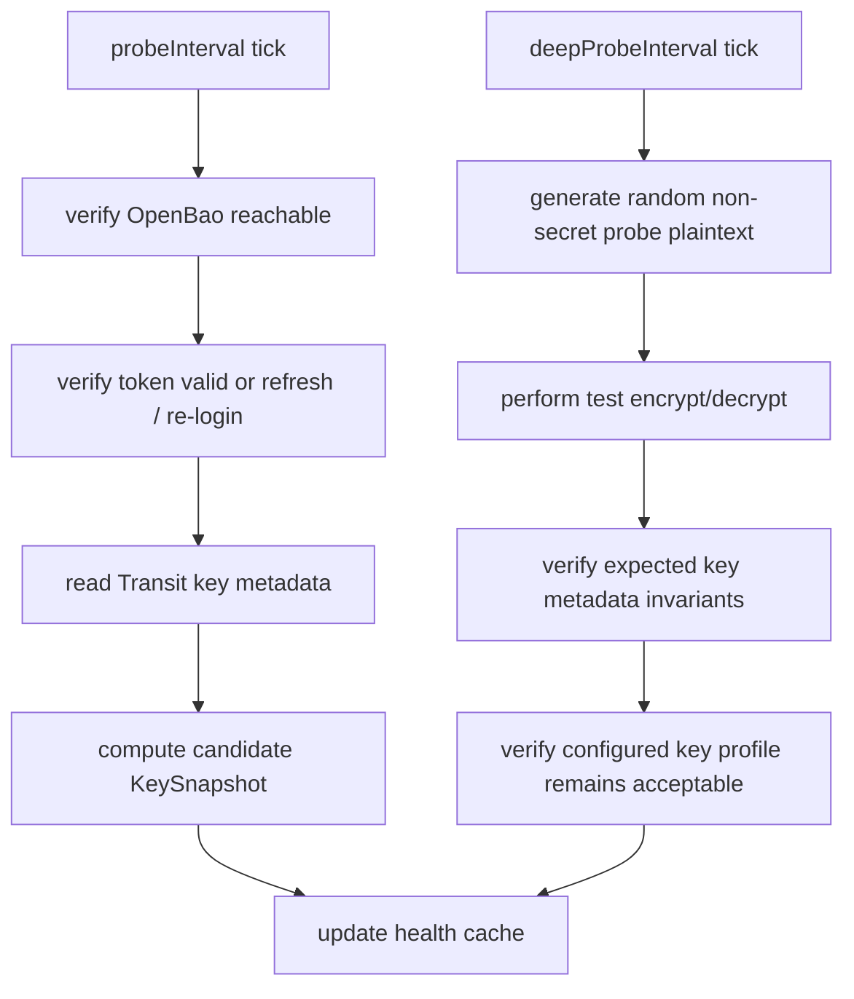

The deep probe must use non-secret random data and must not log ciphertext by default.

### 11.3 Encrypt

Pseudocode:

```go
func Encrypt(ctx context.Context, req *kmsv2.EncryptRequest) (*kmsv2.EncryptResponse, error) {
    snapshot := keyRegistry.Active()
    if snapshot == nil || snapshot.State != "Active" {
        return nil, errUnhealthy
    }
    annotations := annotationsFor(snapshot)
    aad := aadBuilder.Build(snapshot, annotations)
    ct, err := transit.Encrypt(ctx, TransitEncryptRequest{
        KeyName: keyName,
        Plaintext: req.Plaintext,
        KeyVersion: snapshot.TransitVersion,
        AssociatedData: aad,
    })
    if err != nil {
        return nil, classify(err)
    }
    if len(ct) == 0 || len(ct) >= maxKMSV2CiphertextSize {
        return nil, errInvalidCiphertext
    }
    return &kmsv2.EncryptResponse{
        Ciphertext: ct,
        KeyId: snapshot.KubernetesKeyID,
        Annotations: annotations,
    }, nil
}
```

Hard requirements:

* Use explicit Transit key_version.
* Return the same key_id currently returned by Status.
* Add KMS v2 annotations if AAD is enabled.
* Never log plaintext.
* Never log full ciphertext by default.
* Bound OpenBao call timeout.
* Do not read key metadata after encrypt to determine the response key ID.

The explicit key_version requirement avoids a race where the Transit key rotates between encrypt and a subsequent metadata lookup.

### 11.4 Decrypt

Pseudocode:

```go
func Decrypt(ctx context.Context, req *kmsv2.DecryptRequest) (*kmsv2.DecryptResponse, error) {
    keyID := req.KeyId
    if !keyIDFormat.Valid(keyID) {
        return nil, errUnknownKeyID
    }
    snapshot := keyRegistry.Lookup(keyID)
    if snapshot == nil {
        return nil, errUnknownKeyID
    }
    parsedAnnotations, err := annotationValidator.Parse(req.Annotations)
    if err != nil {
        return nil, errInvalidAnnotations
    }
    if err := annotationValidator.Check(snapshot, parsedAnnotations); err != nil {
        return nil, errAnnotationMismatch
    }
    aad := aadBuilder.Reconstruct(snapshot, parsedAnnotations)
    pt, err := transit.Decrypt(ctx, TransitDecryptRequest{
        KeyName: keyName,
        Ciphertext: req.Ciphertext,
        AssociatedData: aad,
    })
    if err != nil {
        return nil, classify(err)
    }
    return &kmsv2.DecryptResponse{Plaintext: pt}, nil
}
```

Hard requirements:

* Reject unknown key_id.
* Reject malformed key_id.
* Reject missing or malformed required annotations.
* Reject AAD mismatch.
* Do not silently try all possible keys.
* Do not decrypt using a Transit key that does not match the key registry.
* Do not log plaintext.
* Bound retry behavior to avoid amplifying API server startup storms.

Kubernetes KMS v2 documentation states that the plugin must verify the key_id during decrypt.

### 11.5 Decrypt micro-batching

Transit supports batch_input for encrypt/decrypt. This is included in v0.1 behind an explicit disabled-by-default setting because it can help during API server startup decrypt storms, but it adds complexity:

* request queueing,
* per-request deadlines,
* cancellation behavior,
* preserving order,
* metrics,
* fairness,
* failure fan-out.

Default:

```yaml
performance:
  decryptMicroBatching:
    enabled: false
    maxBatchSize: 32
    maxWait: 2ms
```

Micro-batching should remain disabled unless benchmarks show it improves startup behavior without violating latency targets.

---

## 12. Key ID and annotation design

### 12.1 Key ID properties

Kubernetes key_id must be:

* opaque,
* deterministic from stable non-secret inputs,
* scoped to provider, cluster, OpenBao instance, Transit mount, Transit key lineage, and Transit key version,
* non-secret,
* safe to log,
* never reused,
* stable across plugin restarts,
* changed when the active Transit key version changes,
* not a raw Transit key name,
* not a raw Transit mount path,
* not a raw OpenBao namespace,
* not a simple integer.

Kubernetes documentation states that key_id is public, may be logged, must remain stable, must not flip-flop, and must not be reused.

### 12.2 Recommended derivation

Conceptual derivation:

```text
key_id = "obk2." + base64url(sha256(
  "openbao-kubernetes-kms/key-id/v1" || 0x00 ||
  provider_name || 0x00 ||
  cluster_id || 0x00 ||
  openbao_instance_id || 0x00 ||
  transit_mount_id || 0x00 ||
  transit_key_lineage_id || 0x00 ||
  transit_key_version || 0x00 ||
  transit_version_created_at_unix || 0x00 ||
  key_epoch
))
```

Recommended input meanings:

| Input | Source | Notes |
| --- | --- | --- |
| provider_name | Plugin config | Must match Kubernetes EncryptionConfiguration provider name. |
| cluster_id | Plugin config | Stable cluster/trust-domain identifier. |
| openbao_instance_id | Plugin config | Stable identifier for the OpenBao trust domain. |
| transit_mount_id | Plugin config | Prefer configured stable ID over raw mount path. |
| transit_key_lineage_id | Platform-generated at key creation | Changes if key is deleted and recreated. |
| transit_key_version | Transit metadata | Active version used for encryption. |
| transit_version_created_at_unix | Transit metadata | Helps distinguish restored/recreated lineages. |
| key_epoch | Optional config | Manual emergency discriminator. |

### 12.3 Mount accessor vs configured mount ID

Using an OpenBao mount accessor may appear attractive, but it can disclose topology and may change during remount or restore operations. This design prefers a configured stable mount ID, generated and managed by platform automation.

If a mount accessor is used:

* hash it before inclusion,
* never expose it directly,
* treat remount/accessor changes as planned migrations,
* document disaster recovery behavior.

### 12.4 Key lineage and key recreation

A Transit key name alone is insufficient. If a key is deleted and recreated with the same name, raw key_name:v3 style IDs can collide or mislead operators.

The platform should create a transit_key_lineage_id when the Transit key is created and store it in configuration or external metadata. The plugin should refuse to operate if the configured lineage does not match expected administrative metadata where such metadata is available.

### 12.5 KMS v2 annotations

Annotations must be non-secret and fully qualified.

Recommended annotations:

```yaml
kms.openbao.org/provider: "openbao-transit"
kms.openbao.org/key-id-hash: "<base64url-sha256-key-id>"
kms.openbao.org/transit-key-version: "2"
kms.openbao.org/transit-mount-hash: "<base64url-sha256-mount-id>"
kms.openbao.org/transit-key-hash: "<base64url-sha256-key-lineage-or-name>"
kms.openbao.org/plugin-version: "v0.1.0"
kms.openbao.org/aad-version: "v1"
```

Annotations are plaintext metadata stored in etcd, so they must not contain secrets, tokens, raw key names, raw mount paths, full OpenBao namespaces, or internal topology details. Kubernetes KMS v2 annotation metadata is stored with the encrypted object and must use fully qualified keys.

### 12.6 OpenBao request IDs

OpenBao request IDs can be useful for correlating plugin logs and OpenBao audit logs. They should not be stored in KMS annotations by default because they add noise, increase metadata size, and may expose operational correlation details.

Recommended behavior:

* Log OpenBao request IDs in plugin logs only when available and safe.
* Do not include request IDs in annotations by default.
* Provide debug-only correlation mode for controlled incident response.

---

## 13. Associated data / AAD design

### 13.1 Purpose

Transit associated_data binds ciphertext to non-secret metadata for AEAD ciphers. Decrypt succeeds only when the same associated data is supplied. OpenBao Transit encrypt and decrypt APIs support associated_data for compatible key types.

For this plugin, AAD protects against accidental or malicious replay of Transit ciphertext across providers, clusters, keys, or key versions where the same OpenBao key might otherwise be misused.

### 13.2 Recommended AAD envelope

Canonical JSON before base64 encoding:

```json
{
  "aad_version": "v1",
  "purpose": "kubernetes-etcd-kms-v2",
  "provider": "openbao-transit",
  "provider_name": "openbao-kms-workload-a",
  "cluster_id_hash": "base64url-sha256(cluster-id)",
  "openbao_instance_hash": "base64url-sha256(openbao-instance-id)",
  "transit_mount_hash": "base64url-sha256(transit-mount-id)",
  "transit_key_hash": "base64url-sha256(transit-key-lineage-id)",
  "key_id_hash": "base64url-sha256(kubernetes-key-id)",
  "key_version": "3"
}
```

Rules:

* Use canonical serialization.
* Do not include secrets.
* Do not include raw OpenBao paths unless explicitly allowed in debug mode.
* Include enough annotation metadata to reconstruct exactly the same AAD during decrypt.
* Reject decrypt if annotations and reconstructed snapshot disagree.
* Treat missing AAD annotations as an error unless compatibility mode is explicitly configured.

### 13.3 Compatibility mode

A compatibility mode may be needed if AAD is introduced after initial deployment.

Modes:

| Mode | Behavior |
| --- | --- |
| aad.required | Default for new deployments. Reject decrypt without valid AAD annotations. |
| aad.optional-read | Encrypt with AAD; decrypt old objects without AAD if key ID belongs to a configured pre-AAD epoch. |
| aad.disabled | No associated data. Not recommended except for compatibility testing. |

Compatibility mode must be time-bounded and observable.

---

## 14. Rotation design

### 14.1 Rotation principles

Rotation is driven by OpenBao Transit key versions and Kubernetes KMS v2 key_id.

The plugin should not rotate the Transit key by default. Rotation is a platform operation, and Kubernetes data migration is an operator-controlled operation.

Kubernetes recommends rotating KEKs at least every 90 days and explains that KMS v2 uses key_id changes to determine when data may be stale.

### 14.2 State machine

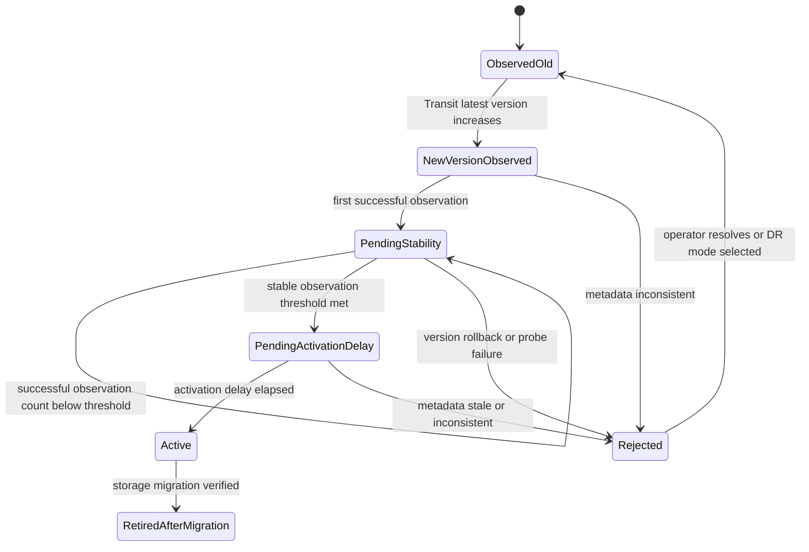

Proposed flow:

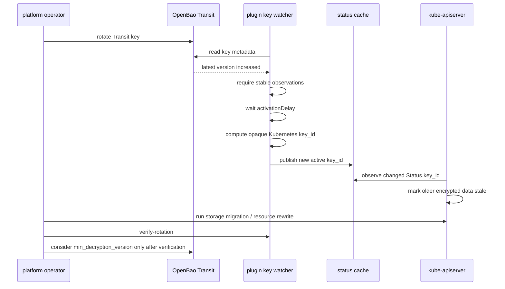

### 14.3 Avoiding key ID flip-flop

The plugin must avoid flip-flopping between key IDs. Recommended controls:

* Require stable observation count.
* Require activation delay.
* Reject apparent version rollback unless disaster recovery mode is explicitly enabled.
* Keep old snapshots in the registry for decrypt.
* Do not promote a key while OpenBao metadata is stale or inconsistent.
* Do not promote if Transit metadata read fails.
* Do not promote based on an encrypt response.

### 14.4 min_encryption_version

min_encryption_version can be used as a guard after rotation to prevent accidental encryption with older versions. It should be managed by platform automation, not the plugin.

### 14.5 min_decryption_version

min_decryption_version is dangerous. Raising it too early can make existing Kubernetes data undecryptable. It should only be raised after:

* all configured resources have been rewritten,
* old key_id references are no longer observed,
* backups are aligned,
* disaster recovery drills have passed,
* OpenBao and etcd backup retention implications are understood.

### 14.6 Transit rewrap

Transit rewrap can upgrade Transit ciphertexts without exposing plaintext to the caller. For Kubernetes KMS v2, rewrap should remain outside the hot path because Kubernetes owns stale-data detection through key_id and resource rewrites. Rewrap may be useful for non-Kubernetes Transit consumers, but it should not replace Kubernetes storage migration.

---

## 15. Configuration model

### 15.1 Full example

```yaml
configVersion: v1alpha1
server:
  socketPath: /run/openbao-kms/kms.sock
  socketMode: "0660"
  socketGroup: kube-apiserver
  metricsAddress: "127.0.0.1:8081"
  healthAddress: "127.0.0.1:8082"
  adminAddress: ""
  unsafeDebugEndpoints: false
openbao:
  address: https://bao.example.internal:8200
  namespace: ""
  caCertFile: /etc/openbao-kms/tls/ca.crt
  tlsServerName: bao.example.internal
  timeout: 2s
  instanceId: bao-prod-a
auth:
  method: jwt
  mountPath: auth/k8s-workload-a-jwt
  role: openbao-kms-control-plane
  jwtFile: /var/lib/openbao-kms/identity.jwt
  minJwtRemainingTtl: 2m
  clockSkewLeeway: 30s
  loginBeforeTokenExpiry: 5m
  tokenStorage: memory
transit:
  mountPath: transit
  keyName: k8s-workload-a-etcd
  keyIdScope:
    providerName: openbao-kms-workload-a
    clusterId: workload-a
    transitMountId: transit-prod-primary
    keyLineageId: "01HXEXAMPLEKEYLINEAGEID"
  useAssociatedData: true
status:
  probeInterval: 30s
  deepProbeInterval: 5m
  statusMaxStaleness: 2m
state:
  path: /var/lib/openbao-kms/state/key-registry.json
rotation:
  mode: observed
  activationDelay: 2m
  requireStableObservationCount: 3
  rejectVersionRollback: true
performance:
  decryptMicroBatching:
    enabled: false
    maxBatchSize: 32
    maxWait: 2ms
logging:
  level: info
  format: json
  redactOpenBaoPaths: true
  logOpenBaoRequestIDs: true
  debugCorrelation:
    enabled: false
    ttl: 15m
    incidentId: ""
```

### 15.2 Configuration validation

Startup must fail closed if:

* config file permissions are unsafe,
* socket directory permissions are unsafe,
* JWT file is unreadable,
* JWT is expired or too close to expiry,
* TLS CA file is missing,
* OpenBao address is invalid,
* provider name is empty,
* cluster ID is empty,
* key lineage ID is empty,
* Transit mount/key names are empty,
* AAD is enabled but required scope inputs are missing,
* socketMode is broader than policy allows,
* socketPath is not under an approved runtime directory.

### 15.3 Configuration immutability

These fields must be treated as identity-bearing and should not be changed after encryption begins without a migration plan:

* transit.keyIdScope.providerName
* transit.keyIdScope.clusterId
* openbao.instanceId
* transit.keyIdScope.transitMountId
* transit.keyIdScope.keyLineageId
* transit.keyName
* transit.mountPath
* Kubernetes EncryptionConfiguration provider name

---

## 16. Operational model

### 16.1 Startup sequence

Recommended systemd sequence:

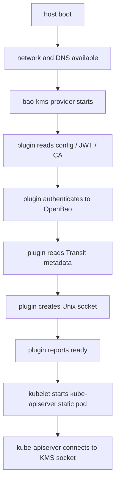

Recommended static pod sequence:

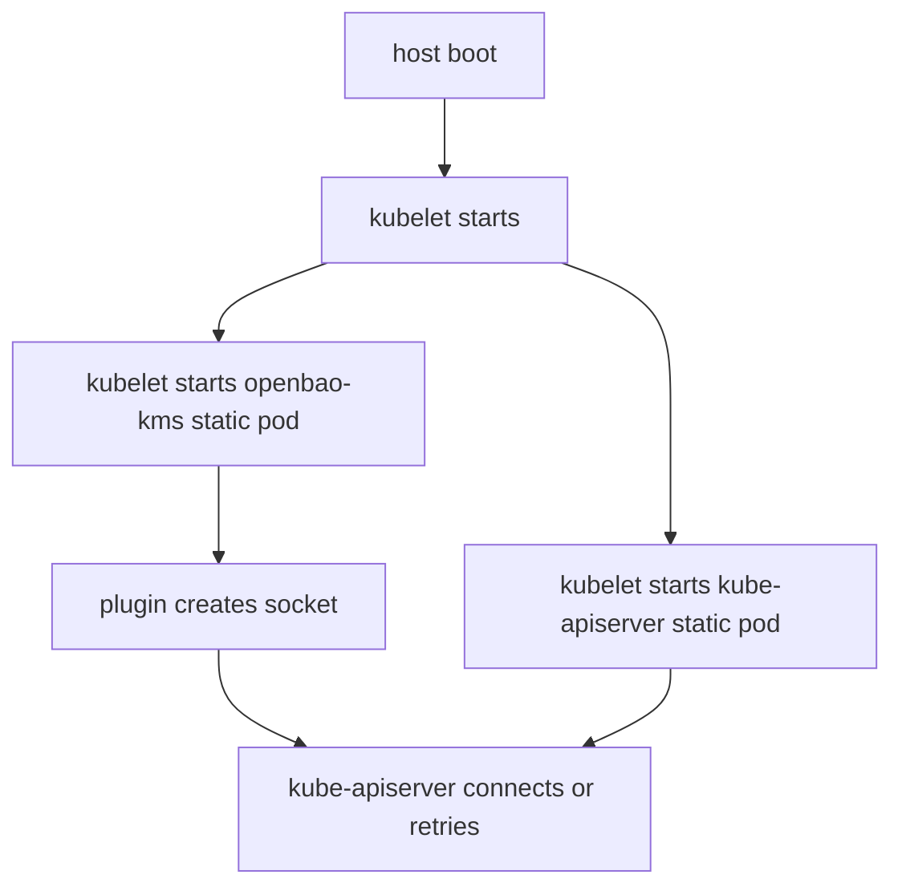

Static pod ordering must be tested because kubelet does not provide a strong dependency graph between static pods.

### 16.2 Socket handling

Recommended socket:

```text
/run/openbao-kms/kms.sock
```

Requirements:

* Parent directory must exist.
* Parent directory should be owned by openbao-kms:openbao-kms or root with controlled group.
* Directory mode should be 0750 or stricter.
* Socket mode should be 0660.
* Socket group should allow kube-apiserver access.
* Do not use abstract Unix sockets by default.
* If path exists, verify it is a Unix socket.
* If it is a socket, attempt a connection to determine if it is live.
* Remove only verified dead stale sockets.
* If path is a regular file, symlink, directory, or unknown type, fail closed.
* Do not follow symlinks.
* Increment openbao_kms_socket_restarts_total when a stale socket is safely removed.

Kubernetes supports Unix domain sockets for KMS providers and cautions that abstract sockets have no access control, so this design uses filesystem sockets with permissions.

### 16.3 OpenBao outage behavior

If OpenBao is unavailable:

* Status becomes unhealthy after staleness threshold.
* /ready fails.
* Encrypt and decrypt fail closed.
* The plugin should use bounded retries with jitter.
* The plugin should avoid retry storms during API server startup.
* The plugin should expose circuit breaker state.

The plugin must not silently fall back to plaintext or identity behavior. Kubernetes provider fallback is controlled by the API server encryption configuration, not by the plugin.

### 16.4 Multi-control-plane operation

Each control-plane node runs its own local plugin instance.

All instances must share:

* same provider name,
* same cluster ID,
* same OpenBao instance ID,
* same Transit mount ID,
* same Transit key lineage ID,
* same Transit key,
* same AAD policy,
* same key ID derivation algorithm.

Instances may have different JWTs and OpenBao client tokens.

Promotion of a new Transit key version must be stable across all control-plane nodes. If one node promotes early and another does not, API server behavior can become inconsistent. The activationDelay and stable observation count reduce this risk, but operational monitoring must still check for key ID convergence.

---

## 17. Observability

### 17.1 Metrics

Prometheus metrics:

```text
openbao_kms_grpc_requests_total{method,status}
openbao_kms_grpc_duration_seconds{method}
openbao_kms_openbao_requests_total{operation,status}
openbao_kms_openbao_duration_seconds{operation}
openbao_kms_status_key_id_hash{hash}
openbao_kms_key_version
openbao_kms_token_ttl_seconds
openbao_kms_auth_renewal_total{status}
openbao_kms_auth_login_total{status}
openbao_kms_circuit_breaker_state
openbao_kms_decrypt_batch_size
openbao_kms_socket_restarts_total
openbao_kms_status_cache_age_seconds
openbao_kms_transit_metadata_observation_total{status}
openbao_kms_rotation_state{state}
openbao_kms_aad_validation_errors_total{reason}
openbao_kms_decrypt_key_id_errors_total{reason}
```

Metric guidance:

* Do not label with raw key IDs.
* Do not label with raw OpenBao paths.
* Do not label with user-controlled UIDs if cardinality can grow unbounded.
* Hash key IDs before exporting.
* Keep status labels bounded.

### 17.2 Logs

Use JSON logs.

Recommended fields:

```json
{
  "ts": "2026-05-08T12:00:00Z",
  "level": "info",
  "operation": "kms.decrypt",
  "status": "ok",
  "duration_ms": 4.2,
  "key_id_hash": "uK...",
  "transit_key_version": 3,
  "openbao_request_duration_ms": 3.1,
  "openbao_request_id": "optional-redacted",
  "error_class": ""
}
```

Never log:

* plaintext,
* JWT,
* OpenBao token,
* full ciphertext,
* raw Transit key material,
* raw OpenBao mount paths by default,
* raw key names by default,
* full annotation maps if they include future operator-defined values.

### 17.3 Health endpoints

```text
/live
  process alive
  gRPC server initialized
  socket listener initialized
/ready
  OpenBao reachable
  auth valid
  Transit metadata fresh
  active key snapshot available
  cached KMS Status fresh
/metrics
  Prometheus metrics
```

The API server’s canonical health signal remains KMS v2 Status; HTTP health endpoints are for node-local operations, monitoring, and diagnostics.

---

## 18. CLI tooling

### 18.1 Commands

```sh
bao-kms-provider serve \
  --config /etc/openbao-kms/config.yaml
bao-kms-provider doctor \
  --config /etc/openbao-kms/config.yaml \
  --encryption-config /etc/kubernetes/encryption-config.yaml
bao-kms-provider verify-key \
  --config /etc/openbao-kms/config.yaml
bao-kms-provider benchmark \
  --config /etc/openbao-kms/config.yaml
bao-kms-provider rotation-plan \
  --config /etc/openbao-kms/config.yaml
bao-kms-provider verify-rotation \
  --config /etc/openbao-kms/config.yaml
```

### 18.2 doctor

doctor should check:

| Check | Required behavior |
| --- | --- |
| OpenBao reachable | HTTPS connection succeeds with configured CA and SNI. |
| TLS valid | Certificate chain and server name validate. |
| JWT file readable | File exists, permissions safe, content parseable. |
| JWT expiry | Not expired and not within minJwtRemainingTtl. |
| JWT claims | Issuer, audience, subject, and configured claims match expectations where locally checkable. |
| JWT login | OpenBao JWT login succeeds. |
| Token policy | Token can read Transit metadata and perform encrypt/decrypt. |
| Transit key exists | Metadata read succeeds. |
| Key type | Matches allowed key types. |
| Key export | exportable=false unless explicitly allowed. |
| Plaintext backup | allow_plaintext_backup=false unless explicitly allowed. |
| Key deletion | deletion_allowed=false. |
| Upsert | Transit mount has disable_upsert=true where configured. |
| Encryption/decryption | Test encrypt/decrypt of random non-secret probe data succeeds. |
| Key ID generation | Deterministic across repeated runs. |
| Status/encrypt consistency | Local in-process test verifies Status.key_id == EncryptResponse.key_id. |
| Socket path | Directory exists, safe permissions, no unsafe stale path. |
| EncryptionConfiguration | Points to socket, API version is KMS v2, provider name matches. |
| Fallback | Warn if identity fallback remains enabled after migration. |

OpenBao exposes capability-check APIs that can be useful for doctor to determine token capabilities on configured paths.

### 18.3 verify-key

Verifies Transit key metadata:

* key exists,
* key type allowed,
* derived/convergent settings match policy,
* deletion disabled,
* export disabled,
* plaintext backup disabled,
* latest version is usable,
* min_encryption_version does not block latest,
* min_decryption_version does not block known required historical versions.

### 18.4 benchmark

Measures:

* Transit encrypt latency,
* Transit decrypt latency,
* local KMS gRPC latency,
* API server-style decrypt storm behavior,
* token renewal/re-login latency,
* optional micro-batching impact.

Benchmark output must not contain plaintext, tokens, or raw ciphertext.

### 18.5 rotation-plan

Produces:

* current active Transit version,
* current Kubernetes key ID hash,
* latest observed Transit version,
* whether new version is pending,
* estimated promotion time,
* required storage migration commands,
* current min_encryption_version and min_decryption_version,
* warnings about backup alignment.

### 18.6 verify-rotation

Checks whether old key IDs are still present.

Implementation options:

* parse API server encryption migration status if available,
* scan Kubernetes resources through the API server and inspect encrypted metadata where possible,
* inspect etcd data only in controlled administrative environments,
* compare observed KMS key ID hashes from plugin metrics and logs.

This command cannot prove absence of old ciphertext if it cannot inspect all encrypted resource types and backups. It should report confidence level and limitations.

---

## 19. Security analysis and threat model

### 19.1 Assets

| Asset | Sensitivity |
| --- | --- |
| Kubernetes resource plaintext | High |
| KMS v2 plaintext input/output | High |
| OpenBao Transit key material | Critical |
| OpenBao client token | High |
| JWT identity file | High |
| Plugin config | Medium to high |
| KMS socket | High local control-plane access |
| Key IDs and annotations | Non-secret but security-relevant |
| OpenBao audit logs | Sensitive metadata |

### 19.2 Threats and controls

| Threat | Control |
| --- | --- |
| etcd snapshot theft | Kubernetes resource payloads are encrypted before persistence. |
| Control-plane node filesystem compromise | Restrictive config/JWT/socket permissions, systemd sandboxing, read-only static pod mounts where possible. Residual risk remains high. |
| OpenBao token theft | Short token TTL, memory-only storage, no token logs, narrow policy. |
| JWT theft | Short JWT TTL where feasible, file permissions, external issuer, claim binding. |
| Malicious or compromised plugin | Defense is limited; plugin sees KMS plaintext material. Use signed binaries/images, host hardening, reproducible builds, attestation where possible. |
| Malicious OpenBao admin | Non-exportable keys and policy separation reduce but do not eliminate risk; OpenBao admins with destructive authority can still affect availability. |
| Network MITM | TLS verification, pinned CA, SNI, optional mTLS. |
| Key deletion or destructive rotation | deletion_allowed=false, no delete/rotate permission for plugin, backup and recovery controls. |
| Ciphertext replay across clusters | AAD binds ciphertext to provider, cluster, key lineage, and key version. |
| Downgrade to plaintext provider | Monitor EncryptionConfiguration, remove identity fallback after migration, alert on config drift. |
| Logs/metrics leakage | Redaction, no plaintext/token/full ciphertext logging, bounded metrics labels. |
| OpenBao outage | Cached status staleness, readiness failure, fail closed, operational alerts. |

### 19.3 Security properties

The design provides:

* confidentiality against offline etcd snapshot readers who do not have access to OpenBao Transit decrypt capability,
* stronger rotation correctness than raw latest-version lookup,
* metadata binding through required v0.1 AAD,
* auditable OpenBao Transit use,
* limited OpenBao token permissions,
* Kubernetes API circular dependency reduction through JWT auth.

The design does not provide:

* protection from a fully compromised kube-apiserver process,
* protection from a malicious plugin binary,
* protection from an attacker with Transit decrypt permission,
* protection from loss of Transit key material,
* protection from plaintext exposure during legitimate API server operation,
* automatic recovery from destructive OpenBao administrative actions.

---

## 20. Failure-mode analysis

| Failure mode | Cause | Impact | Detection | Mitigation | Recovery action | Blocks API server startup? | Permanent data loss risk? |
| --- | --- | --- | --- | --- | --- | --- | --- |
| Plugin unavailable | Service not installed, crash, disabled | API server cannot reach KMS | systemd/kubelet status, socket missing, KMS unhealthy | restart policy, health checks | Start plugin, fix config | Yes | No |
| Socket unavailable | Directory missing, listener failed | API server cannot call KMS | API server logs, /live failure | pre-create runtime dir, safe socket setup | Fix path/permissions, restart plugin | Yes | No |
| OpenBao unavailable | Network, DNS, LB, outage | Encrypt/decrypt fail | readiness, metrics, OpenBao request errors | HA OpenBao, local routing, retries | Restore OpenBao reachability | Yes for encrypted data | No |
| OpenBao sealed | Manual seal, restart not unsealed | Transit unavailable | OpenBao health, plugin readiness | auto-unseal, alerting | Unseal or restore OpenBao | Yes | No unless key unavailable permanently |
| OpenBao inside same protected cluster | Circular dependency | KMS unavailable before API server | bootstrap failure | external management plane | Start OpenBao independently or restore external service | Yes | Possible if unrecoverable |
| JWT expired and API server down | Protected cluster issued JWT and cannot renew | OpenBao login fails | auth metrics, JWT expiry check | external issuer, sufficient TTL, file refresh | Replace JWT from external issuer or restore API enough to issue token | Yes | No |
| Kubelet/container runtime unavailable for static pod | Host boot failure | Plugin static pod cannot start | kubelet/CRI logs | systemd mode, local image cache | Fix kubelet/CRI or run plugin as host service | Yes | No |
| systemd ordering wrong | Plugin starts after API server | API server fails or retries | boot logs | Before=kubelet.service where appropriate, tested units | Correct unit dependencies | Yes | No |
| Transit key deleted | Destructive admin action | Old ciphertext undecryptable | metadata read fails, decrypt failures | deletion_allowed=false, no delete permission | Restore OpenBao backup with key material | Yes | Yes if no valid backup |
| Transit key soft-deleted | Key archived/disabled | Encrypt/decrypt fail | metadata state, decrypt errors | change control | Restore key if possible | Yes | No if restored |
| Transit key recreated same name | Key lineage lost | Old data undecryptable; key ID collision risk | lineage mismatch, decrypt failures | key lineage ID, delete protection | Restore original key; do not accept new lineage | Yes | Yes if original key lost |
| min_decryption_version raised too early | Operator error | Old ciphertext undecryptable | decrypt failures for old key IDs | verify migration first | Lower setting if key versions still exist | Yes | Possible |
| Key backup missing | Disaster restore lacks Transit key versions | Data undecryptable | DR test failure | coordinated OpenBao backups | Restore from valid backup | Yes | Yes |
| Audit backend pressure | OpenBao audit device slow or failing | Transit latency/errors | OpenBao metrics, plugin latency | HA audit sinks, capacity | Repair audit backend | Possible | No |
| OpenBao leader failover | HA event | transient errors/latency | OpenBao status, plugin retries | HA tuning, bounded retries | Wait/fix cluster | Possible | No |
| TLS certificate expired | Cert not renewed | Plugin cannot connect | TLS errors | cert monitoring | Renew cert, reload plugin | Yes | No |
| DNS/LB misrouting | Wrong backend or stale DNS | Auth/transit errors | TLS/SNI errors, metadata mismatch | pinned CA/SNI, instance ID checks | Fix DNS/LB | Yes | No |
| JWT file missing | Provisioning error | Login impossible | startup validation | file checks, config management | Restore JWT file | Yes | No |
| JWT wrong audience | Issuer/config mismatch | Login denied | auth error | bound audience tests | Issue correct JWT or fix role | Yes | No |
| JWT wrong subject/claims | Role mismatch | Login denied | auth error | claim binding docs | Issue correct JWT or fix role | Yes | No |
| Issuer changed | OIDC/JWT issuer rotation | Login denied | auth logs | planned overlap | Update OpenBao config and JWT source | Yes | No |
| JWKS rotated | New signing key unknown | Login denied | JWT auth errors | JWKS monitoring, overlapping keys | Refresh JWKS/OpenBao config | Yes | No |
| OpenBao cannot reach JWKS/OIDC discovery | Network failure | Login denied or cache expiry | auth errors | pinned public keys for recovery | Restore discovery or configure keys | Possible | No |
| Clock skew | Host/OpenBao/issuer clocks differ | JWT invalid | auth errors, NTP alerts | NTP/chrony, leeway | Fix clocks | Yes | No |
| Revoked JWT still cryptographically valid | JWT auth lacks TokenReview | Token may be accepted until expiry | hard to detect | short TTL, external issuer controls | Rotate JWT/signing keys if needed | No immediate | No |
| Status.key_id differs from encrypt response | Race or bug | API server discards encrypt result, marks unhealthy | API server logs, plugin metrics | snapshot consistency | Fix bug, restart with stable registry | Possible | No |
| Key ID flip-flops | unstable rotation observation | stale marking oscillates | metrics/logs key hash changes | stable count, activation delay | pin active key, fix watcher | Possible | No |
| Unknown key_id on decrypt | Config/provider changed, old data | Decrypt rejected | decrypt key ID errors | preserve key history | Restore old config or registry | Yes for affected data | Possible |
| Missing/malformed annotations | Old object, bug, corruption | Decrypt rejected when AAD required | AAD validation metrics | compatibility mode for known epochs | Enable bounded compatibility or migrate | Yes for affected data | No if compatible recovery possible |
| AAD mismatch | Wrong cluster/key/provider metadata | Decrypt rejected | AAD error | stable config, validation | Restore matching config | Yes for affected data | Possible |
| API server decrypt storm | Startup with many encrypted objects | Latency, timeouts | duration metrics, API server logs | OpenBao capacity, local routing, optional batching | Scale OpenBao, tune timeout, reduce retries | Yes if severe | No |
| Stale socket | Crash left socket path | Startup failure or wrong listener | socket check | safe stale cleanup | Remove verified dead socket | Yes | No |
| Wrong socket permissions | kube-apiserver cannot connect | KMS unavailable | API server permission errors | mode/group validation | Fix group/mode | Yes | No |
| SELinux/AppArmor block | host policy denies socket/file | KMS unavailable | audit logs | policy profiles, tests | Adjust policy | Yes | No |
| Config file permissions unsafe | world-readable/writable | secret/topology exposure or tamper | startup validation | fail closed | Fix permissions | Yes | No |
| Plugin crash loop | bug, bad config, OpenBao error path | KMS unavailable | service logs | supervisor, tests | fix config/bug | Yes | No |
| Image unavailable for static pod | pull failure, air gap | plugin not started | kubelet events/logs | preloaded image, IfNotPresent/Never | load image | Yes | No |
| Package upgrade restarts systemd plugin | maintenance event | transient KMS outage | service logs | controlled rollout | restart one node at a time | Possible | No |
| Identity fallback left enabled permanently | migration incomplete | plaintext writes possible if provider order changes or KMS unavailable with identity first | config audit | remove after migration | rewrite and remove fallback | No | Confidentiality loss |
| Identity fallback removed too early | old plaintext or misordered data | reads may fail depending provider set | API errors | verify migration first | restore fallback temporarily and migrate | Possible | No |
| Only some resources encrypted | config scope incomplete | unprotected resources in etcd | encryption config review | explicit resource list | update config, rewrite | No | Confidentiality loss |
| Existing resources not rewritten | encryption only applies on write | old data remains under old provider/plaintext | audit/migration checks | storage migration | rewrite resources | No | Confidentiality loss |
| Mixed plaintext/encrypted backups | backups taken across migration | inconsistent confidentiality | backup audit | backup labeling | handle according to sensitivity | No | Confidentiality loss |
| Provider name changed | EncryptionConfiguration drift | old encrypted data may not match provider | API server errors | immutable provider name | restore old name or configure migration | Yes for affected data | Possible |

---

## 21. Disaster recovery

### 21.1 Core recovery principle

OpenBao Transit key material and Kubernetes etcd data must be recoverable as a compatible pair.

Losing Transit key material, deleting a key, recreating a key with the same name, or making old versions undecryptable can make encrypted Kubernetes data unrecoverable. OpenBao documentation warns that key deletion makes decrypting ciphertext impossible.

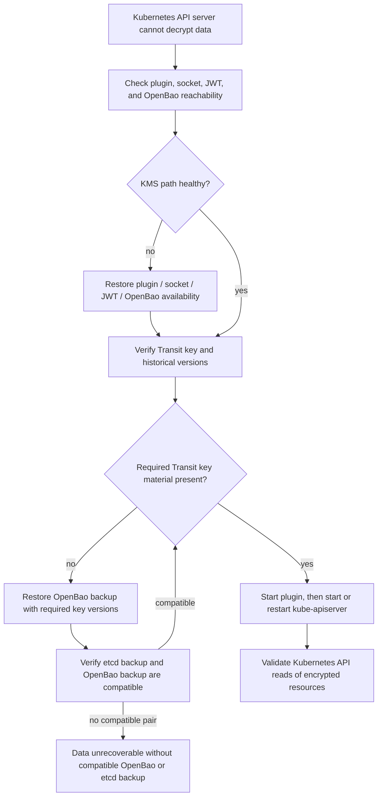

### 21.2 Restoring OpenBao from backup

Recovery steps:

1. Restore OpenBao to a point that contains the required Transit key and all required historical versions.
2. Verify OpenBao unsealed and healthy.
3. Verify JWT auth method and role configuration.
4. Verify plugin policy.
5. Run bao-kms-provider verify-key.
6. Run a controlled test decrypt if probe ciphertexts are available.
7. Start plugin.
8. Start or restart API server.
9. Validate Kubernetes API reads of encrypted resources.

If OpenBao is restored to a state before a Transit key rotation but etcd contains data encrypted after that rotation, decrypt can fail. If etcd is restored to an earlier point but OpenBao is restored to a later compatible point, decrypt usually remains possible if old key versions are retained.

### 21.3 Restoring etcd and OpenBao together

Recommended DR practice:

* Take etcd and OpenBao backups with timestamps and retention metadata.
* Record active Kubernetes key_id, Transit key version, and OpenBao backup ID.
* Preserve historical Transit versions at least as long as any etcd backup can reference them.
* Test restore combinations.

Do not raise min_decryption_version for versions that may still be needed by retained etcd backups.

### 21.4 Transit key loss

If Transit key material is lost and no valid backup exists:

* Existing KMS-encrypted Kubernetes data cannot be decrypted.
* Identity fallback cannot decrypt existing KMS ciphertext.
* Recreating a Transit key with the same name does not recover old data.
* The only recovery is restoring a backup containing the original key material or restoring etcd to a state that does not require the lost key.

### 21.5 Plugin config loss

If plugin config is lost:

1. Restore config from configuration management.
2. Verify provider name, cluster ID, OpenBao instance ID, Transit mount ID, and key lineage ID are unchanged.
3. Run doctor.
4. Start plugin.

Changing identity-bearing fields can cause AAD or key ID mismatches.

### 21.6 JWT issuer loss

If the JWT issuer is unavailable:

* Existing OpenBao tokens may continue until expiry.
* Re-login fails after token expiry.
* If the issuer is external, restore issuer or switch OpenBao JWT auth to pinned public keys if the JWTs can still be issued.
* If the issuer is the protected Kubernetes API server and the API server is down, recovery may require an emergency static JWT or restoring enough API server function to issue a token.

Emergency static JWT use should be time-limited, logged, and removed after recovery.

### 21.7 Control-plane node replacement

Replacement steps:

1. Install plugin binary or static pod image.
2. Restore `/etc/openbao-kms/config.yaml`.
3. Restore CA bundle.
4. Provision JWT file.
5. Create `/run/openbao-kms` with safe permissions.
6. Ensure kube-apiserver can access socket group.
7. Run doctor.
8. Start plugin before API server.
9. Confirm Status.key_id matches existing control-plane nodes.

### 21.8 Single-node control plane

Single-node control planes have higher bootstrap risk:

* no alternate API server,
* no alternate plugin instance,
* no control-plane quorum,
* more likely to require host-level recovery.

Systemd mode is generally preferable for single-node clusters because it avoids requiring kubelet and the container runtime to start the plugin.

### 21.9 Multi-node control plane

Multi-node clusters should:

* rotate plugin restarts one node at a time,
* compare active key ID hashes across nodes,
* ensure all API servers see the same Status.key_id,
* avoid simultaneous plugin upgrades,
* avoid simultaneous JWT expiry across all nodes.

### 21.10 API server cannot start because KMS is unavailable

Recovery order:

1. Do not delete encrypted etcd data.
2. Inspect API server logs to confirm KMS failure.
3. Restore plugin/socket/OpenBao/JWT first.
4. Run doctor locally on the control-plane node.
5. Start plugin and verify KMS Status.
6. Restart API server.
7. If OpenBao key material is missing, restore OpenBao backup.
8. If no key backup exists, restore a compatible etcd/OpenBao backup pair.

Temporarily adding or reordering identity can help only for plaintext objects or future writes. It does not decrypt data already encrypted with KMS.

### 21.11 Emergency decryption and migration

Emergency workflows are risky.

Acceptable emergency actions:

* restore KMS service and perform normal Kubernetes reads,
* temporarily re-add identity fallback only to read plaintext objects or complete migration,
* use Kubernetes storage migration after KMS is healthy,
* restore backups in an isolated environment to recover data.

Unsafe actions:

* raising min_decryption_version during an incident,
* recreating Transit keys with the same name,
* changing provider name to “fix” errors,
* disabling AAD validation globally without understanding old object epochs,
* logging plaintext during debugging.

---

## 22. Testing and validation strategy

### 22.1 Unit tests

| Package | Tests |
| --- | --- |
| internal/keyregistry | key ID determinism, no reuse, rotation state machine, rollback rejection |
| internal/aad | canonical serialization, annotation validation, mismatch rejection |
| internal/kmsv2 | Status/encrypt consistency, decrypt unknown key ID rejection, annotation errors |
| internal/transit | request formation, explicit key version, AAD, error classification |
| internal/auth/jwt | JWT parsing, expiry thresholds, claim checks, file reload |
| internal/socket | safe socket creation, stale socket handling, symlink rejection |
| internal/config | unsafe permissions, immutable identity fields, invalid values |
| internal/metrics | bounded labels, no raw key IDs |
| internal/doctor | configuration and OpenBao validation behavior |

### 22.2 Integration tests

Run against OpenBao test instances:

* Transit key create/read/encrypt/decrypt.
* disable_upsert behavior.
* AAD encrypt/decrypt success and mismatch failure.
* explicit key_version behavior.
* rotation observation.
* min_encryption_version guard.
* min_decryption_version failure.
* JWT auth login.
* JWKS rotation.
* OpenBao HA failover.
* sealed/unsealed transitions.
* TLS certificate validation failure.

### 22.3 Kubernetes conformance-style tests

Test against exact-pinned supported Kubernetes releases:

* v1.34.x for v0.1,
* newer lines only after explicit release-gate expansion.

Test cases:

* KMS v2 Status accepted.
* EncryptResponse.key_id matches Status.key_id.
* annotations round-trip.
* decrypt validates key_id.
* API server startup with encrypted secrets.
* rotation changes Status.key_id.
* resource rewrite clears stale key IDs.
* plugin outage causes expected API server behavior.
* identity fallback enable/remove migration path.

### 22.4 Failure-mode tests

Required tests:

* plugin unavailable,
* socket missing,
* stale socket,
* wrong socket permissions,
* OpenBao unavailable,
* OpenBao sealed,
* JWT expired,
* wrong JWT audience,
* wrong JWT subject,
* JWKS unavailable,
* Transit key missing,
* Transit key soft-deleted,
* min_decryption_version raised too early,
* API server decrypt storm,
* AAD mismatch,
* unknown key ID,
* key ID flip-flop prevention,
* static pod image unavailable,
* systemd restart during API server startup.

### 22.5 kind/kubeadm e2e proposal

A feasible e2e layout:

kind or kubeadm control-plane node
  - kube-apiserver configured with KMS v2 EncryptionConfiguration
  - plugin exposed on hostPath-mounted Unix socket
  - OpenBao running outside the protected API server dependency path
  - test suite creates and rewrites Secrets/ConfigMaps
  - verifies etcd data is encrypted
  - rotates Transit key
  - verifies new key_id and migration behavior

Limitations:

* kind may not faithfully represent host-level systemd ordering.
* containerized control planes may hide filesystem and SELinux/AppArmor issues.
* decrypt storm behavior may differ from production API server startup.
* HA OpenBao failover is better tested in VM or bare-metal CI.

### 22.6 Production-readiness gates

Before declaring production readiness:

* exact-pinned Kubernetes version matrix passes.
* OpenBao HA/failover tests pass.
* disaster recovery restore drill passes.
* rotation drill passes.
* systemd and static pod deployment tests pass.
* load tests meet latency SLOs or documented limits.
* security review signs off on threat model and policies.
* documentation includes bootstrap and break-glass procedures.
* release artifacts are signed and reproducible or provenance-attested.

---

## 23. MVP scope and roadmap

### 23.1 v0.1 MVP

v0.1 includes:

* KMS v2 only.
* OpenBao Transit encrypt/decrypt.
* Explicit key_version on encrypt.
* Opaque key_id generation.
* Decrypt key_id validation.
* KMS v2 annotations.
* Optional AAD.
* JWT auth from file.
* In-memory OpenBao token storage.
* Cached Status.
* Background OpenBao probes.
* Decrypt micro-batching implementation with disabled-by-default config.
* Static pod example.
* systemd example.
* Prometheus metrics.
* JSON logs.
* doctor command.
* verify-key command.
* kind/kubeadm e2e test.

### 23.2 v0.2

v0.2 includes:

* Certificate auth as alternative.
* rotation-plan command.
* verify-rotation command.
* OpenTofu module.
* OpenBao policy generator.
* OpenBao HA/failover test suite.
* Better packaging for systemd and static pod installs.
* Release signing and provenance.

### 23.3 v0.3

v0.3 includes:

* Adaptive decrypt batching and concurrency tuning.
* OpenBao Operator integration.
* Conformance report.
* Distro-specific docs for kubeadm, RKE2, Talos, OKD if practical.
* Advanced audit-log correlation.
* Multi-control-plane key convergence dashboard.

---

## 24. Resolved decisions and open questions

| Question | Current position |
| --- | --- |
| Should AAD be mandatory from v0.1? | Resolved: AAD is required for v0.1 deployments. Future compatibility modes remain explicit migration features. |
| Should the plugin persist a key registry on disk? | Resolved: use a hybrid model. Key IDs are derived from config plus Transit metadata, with a non-secret local registry for observed/promoted snapshots and rotation decisions. |
| What is the best openbao_instance_id source? | Prefer configured stable ID. Do not depend on unstable infrastructure names. |
| Should Transit mount accessor be used? | Prefer configured mount ID. Accessor may be useful but must be hashed and migration-documented. |
| How should verify-rotation inspect old key IDs? | Kubernetes API inspection may not expose enough detail; etcd inspection is powerful but sensitive. Needs implementation research. |
| Is decrypt micro-batching worth the complexity? | Included behind disabled-by-default config; default enablement remains benchmark-dependent against realistic API server startup loads. |
| Should JWT token renewal or re-login be the default? | Re-login is simpler and exercises JWT file refresh; renewal may reduce login load. Support both, default to re-login unless tests show otherwise. |
| Can OpenBao safely run in the same cluster? | Not recommended for protecting that cluster’s own API server. A carefully isolated management cluster is preferable. |
| Should KMS v1 be supported at all? | Not in the core binary. If needed, provide a separate legacy artifact. |
| How should OpenBao namespaces be handled? | Support as configuration, but avoid exposing namespace names in key IDs or annotations. |

---

## 25. Appendices

### Appendix A: sample OpenBao policy

```hcl
# Least-privilege policy for the KMS provider hot path.
path "transit/encrypt/k8s-workload-a-etcd" {
  capabilities = ["update"]
}
path "transit/decrypt/k8s-workload-a-etcd" {
  capabilities = ["update"]
}
path "transit/keys/k8s-workload-a-etcd" {
  capabilities = ["read"]
}
# Optional only if token renewal is enabled and the JWT role disables default policy.
path "auth/token/lookup-self" {
  capabilities = ["read"]
}
path "auth/token/renew-self" {
  capabilities = ["update"]
}
```

Do not grant rotate, delete, export, backup, or broad Transit wildcard access.

---

### Appendix B: sample JWT auth role

Example using OIDC discovery:

```sh
bao auth enable -path=k8s-workload-a-jwt jwt
bao write auth/k8s-workload-a-jwt/config \
  oidc_discovery_url="https://issuer.example.internal" \
  bound_issuer="https://issuer.example.internal"
bao write auth/k8s-workload-a-jwt/role/openbao-kms-control-plane \
  role_type="jwt" \
  user_claim="sub" \
  bound_audiences='["bao-kms-provider"]' \
  bound_subject="system:openbao-kms:workload-a:control-plane" \
  token_policies='["openbao-kms-workload-a"]' \
  token_ttl="10m" \
  token_max_ttl="30m" \
  token_no_default_policy="true" \
  clock_skew_leeway="60s" \
  expiration_leeway="30s"
```

Example using pinned public keys for recovery or isolated environments:

```sh
bao write auth/k8s-workload-a-jwt/config \
  jwt_validation_pubkeys=@/etc/openbao/jwt-issuer.pub \
  bound_issuer="https://issuer.example.internal"
```

OpenBao JWT auth requires one of OIDC discovery, JWKS URL, or local validation public keys.

---

### Appendix C: sample Transit key config

```sh
bao secrets enable -path=transit transit
# Recommended for a dedicated Transit mount used by Kubernetes KMS.
bao write transit/config/keys disable_upsert=true
bao write transit/keys/k8s-workload-a-etcd \
  type="aes256-gcm96" \
  derived="false" \
  convergent_encryption="false" \
  exportable="false" \
  allow_plaintext_backup="false"
bao write transit/keys/k8s-workload-a-etcd/config \
  deletion_allowed="false" \
  min_encryption_version="0" \
  min_decryption_version="1" \
  auto_rotate_period="0"
```

Exact CLI syntax should be verified against the selected OpenBao CLI and server version during implementation.

---

### Appendix D: sample plugin config

```yaml
server:
  socketPath: /run/openbao-kms/kms.sock
  socketMode: "0660"
  socketGroup: kube-apiserver
  metricsAddress: "127.0.0.1:8081"
  healthAddress: "127.0.0.1:8082"
  adminAddress: ""
  unsafeDebugEndpoints: false
openbao:
  address: https://bao.example.internal:8200
  namespace: ""
  caCertFile: /etc/openbao-kms/tls/ca.crt
  tlsServerName: bao.example.internal
  timeout: 2s
  instanceId: bao-prod-a
auth:
  method: jwt
  mountPath: auth/k8s-workload-a-jwt
  role: openbao-kms-control-plane
  jwtFile: /var/lib/openbao-kms/identity.jwt
  minJwtRemainingTtl: 2m
  clockSkewLeeway: 30s
  loginBeforeTokenExpiry: 5m
  tokenStorage: memory
transit:
  mountPath: transit
  keyName: k8s-workload-a-etcd
  keyIdScope:
    providerName: openbao-kms-workload-a
    clusterId: workload-a
    transitMountId: transit-prod-primary
    keyLineageId: "01HXEXAMPLEKEYLINEAGEID"
  useAssociatedData: true
status:
  probeInterval: 30s
  deepProbeInterval: 5m
  statusMaxStaleness: 2m
state:
  path: /var/lib/openbao-kms/state/key-registry.json
rotation:
  mode: observed
  activationDelay: 2m
  requireStableObservationCount: 3
  rejectVersionRollback: true
performance:
  decryptMicroBatching:
    enabled: false
    maxBatchSize: 32
    maxWait: 2ms
logging:
  level: info
  format: json
  redactOpenBaoPaths: true
  logOpenBaoRequestIDs: true
  debugCorrelation:
    enabled: false
    ttl: 15m
    incidentId: ""
```

---

### Appendix E: sample Kubernetes EncryptionConfiguration

Initial migration configuration with identity fallback:

```yaml
apiVersion: apiserver.config.k8s.io/v1
kind: EncryptionConfiguration
resources:
- resources:
  - secrets
  - configmaps
  providers:
  - kms:
      apiVersion: v2
      name: openbao-kms-workload-a
      endpoint: unix:///run/openbao-kms/kms.sock
      timeout: 3s
  - identity: {}
```

After migration and verification:

```yaml
apiVersion: apiserver.config.k8s.io/v1
kind: EncryptionConfiguration
resources:
- resources:
  - secrets
  - configmaps
  providers:
  - kms:
      apiVersion: v2
      name: openbao-kms-workload-a
      endpoint: unix:///run/openbao-kms/kms.sock
      timeout: 3s
```

Kubernetes documentation provides KMS v2 examples using apiVersion: v2, a provider name, and a Unix socket endpoint.

---

### Appendix F: sample hardened systemd unit

```ini
[Unit]
Description=OpenBao Kubernetes KMS v2 Provider
Documentation=man:bao-kms-provider(8)
Wants=network-online.target
After=network-online.target
Before=kubelet.service
ConditionPathExists=/etc/openbao-kms/config.yaml
ConditionPathExists=/var/lib/openbao-kms/identity.jwt
ConditionPathIsDirectory=/run/openbao-kms
[Service]
Type=exec
User=openbao-kms
Group=openbao-kms
SupplementaryGroups=openbao-kms-socket
ExecStart=/usr/local/bin/bao-kms-provider serve --config /etc/openbao-kms/config.yaml
Restart=always
RestartSec=5s
StartLimitIntervalSec=60
StartLimitBurst=10
StateDirectory=openbao-kms
StateDirectoryMode=0750
ConfigurationDirectory=openbao-kms
UMask=0027
NoNewPrivileges=true
ProtectSystem=strict
ProtectHome=true
PrivateTmp=true
PrivateDevices=true
ProtectKernelTunables=true
ProtectKernelModules=true
ProtectControlGroups=true
RestrictSUIDSGID=true
LockPersonality=true
MemoryDenyWriteExecute=true
RestrictRealtime=true
SystemCallArchitectures=native
CapabilityBoundingSet=
AmbientCapabilities=
ReadOnlyPaths=/etc/openbao-kms
ReadWritePaths=/run/openbao-kms /var/lib/openbao-kms/state
RestrictAddressFamilies=AF_UNIX AF_INET AF_INET6
[Install]
WantedBy=multi-user.target
```

Caveats:

* Before=kubelet.service is appropriate only when the API server is managed through kubelet/static pods and the operator wants the KMS plugin available before kubelet starts the API server.
* Some distributions require additional systemd permissions or SELinux/AppArmor policy.
* network-online.target does not guarantee OpenBao is reachable.
* Upgrades should be controlled and rolled one control-plane node at a time.

---

### Appendix G: sample static pod manifest

```yaml
apiVersion: v1
kind: Pod
metadata:
  name: bao-kms-provider
  namespace: kube-system
  labels:
    app.kubernetes.io/name: bao-kms-provider
    app.kubernetes.io/component: kms-provider
spec:
  hostNetwork: true
  priorityClassName: system-node-critical
  automountServiceAccountToken: false
  securityContext:
    runAsNonRoot: true
    runAsUser: 65532
    runAsGroup: 65532
    supplementalGroups:
    - 1234
    seccompProfile:
      type: RuntimeDefault
  containers:
  - name: bao-kms-provider
    image: ghcr.io/dc-tec/bao-kms-provider@sha256:0000000000000000000000000000000000000000000000000000000000000000
    imagePullPolicy: IfNotPresent
    args:
    - serve
    - --config=/etc/openbao-kms/config.yaml
    ports:
    - name: metrics
      containerPort: 8081
      protocol: TCP
    - name: health
      containerPort: 8082
      protocol: TCP
    securityContext:
      allowPrivilegeEscalation: false
      readOnlyRootFilesystem: true
      capabilities:
        drop:
        - ALL
    volumeMounts:
    - name: config
      mountPath: /etc/openbao-kms/config.yaml
      readOnly: true
    - name: tls
      mountPath: /etc/openbao-kms/tls
      readOnly: true
    - name: jwt
      mountPath: /var/lib/openbao-kms/identity.jwt
      readOnly: true
    - name: run
      mountPath: /run/openbao-kms
    - name: state
      mountPath: /var/lib/openbao-kms/state
    livenessProbe:
      httpGet:
        host: 127.0.0.1
        path: /live
        port: 8082
      initialDelaySeconds: 5
      periodSeconds: 10
    readinessProbe:
      httpGet:
        host: 127.0.0.1
        path: /ready
        port: 8082
      initialDelaySeconds: 5
      periodSeconds: 10
  volumes:
  - name: config
    hostPath:
      path: /etc/openbao-kms/config.yaml
      type: File
  - name: tls
    hostPath:
      path: /etc/openbao-kms/tls
      type: Directory
  - name: jwt
    hostPath:
      path: /var/lib/openbao-kms/identity.jwt
      type: File
  - name: run
    hostPath:
      path: /run/openbao-kms
      type: Directory
  - name: state
    hostPath:
      path: /var/lib/openbao-kms/state
      type: Directory
```

Static pod caveats:

* Do not reference ConfigMaps, Secrets, or ServiceAccounts.
* Preload the image for air-gapped or bootstrap-sensitive nodes.
* Validate hostPath ownership and group permissions before API server startup.
* hostNetwork: true reduces CNI bootstrap dependency.
* Readiness probes are useful for local visibility but do not replace KMS v2 Status.
* Static pod security context must be tested against the required socket group ownership model.
