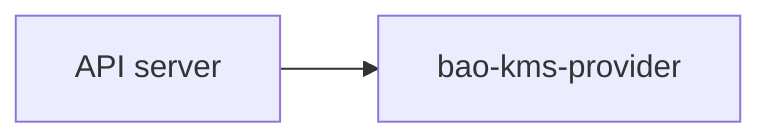

# Docs Site

The published documentation is a Hugo site built from the Markdown files under
`docs/` and the site assets under `website/`. For writing guidance, see
[Docs Style Guide](/development/docs-style-guide/).

## Source Layout

```text
docs/
  getting-started/    first-success path for operators
  deployment/         systemd, static-pod, identity, observability
  operations/         rotation, upgrade, recovery, troubleshooting
  reference/          CLI, config, protocol, metrics, compatibility
  security/           threat model, hardening, auth, decrypt validation
  architecture/       design rationale and tradeoffs
  development/        contributor and maintainer documentation
website/
  content/            homepage, search, and error pages
  layouts/            Hugo templates
  assets/             CSS and JavaScript sources
  static/             brand assets, fonts, vendored Mermaid
hugo.toml             site configuration and module mounts
```

The live docs should describe the current project. Older plans and design notes
remain available through repository history.

## Hugo Mounts

`hugo.toml` mounts each docs section into Hugo's `content/` tree. This keeps the
documentation source in `docs/` while letting Hugo render normal sections.

Example:

```toml
[[module.mounts]]
  source = "website/content"
  target = "content"

[[module.mounts]]
  source = "docs/getting-started"
  target = "content/getting-started"
```

To add a new top-level docs section:

1. Create `docs/<section>/_index.md` with front matter.
2. Add a mount entry in `hugo.toml`.
3. Link the section from `website/layouts/index.html` if it should appear on
   the homepage.

## Local Builds

The Makefile runs a pinned Hugo version through `go run`, so a global Hugo
install is not required.

```sh
make docs-deps    # install pinned Hugo into GOBIN once
make docs-build   # build into public/
make docs-serve   # serve locally on http://localhost:1313/
```

The Hugo version is pinned with `HUGO_VERSION` in the Makefile. Update that pin
when a layout, shortcode, or build behavior depends on a newer Hugo release.

## Checks

Run both docs checks before merging documentation changes:

```sh
make docs-check
make docs-build
```

`make docs-check` scans `docs/` and `README.md` for configured text and
typography issues. `make docs-build` renders the site and should finish without
warnings.

## Templates

`website/layouts/` contains the Hugo templates used by the site:

```text
website/layouts/
  index.html
  _default/baseof.html
  _default/list.html
  _default/single.html
  _default/error.html
  _markup/render-link.html
  _markup/render-codeblock-mermaid.html
  partials/
  search/single.html
```

The homepage workflow is defined in `website/layouts/index.html`. When the
operator path changes, update the homepage and the matching section pages
together.

## Mermaid

Mermaid diagrams render from fenced markdown blocks:

````markdown

````

The renderer is `website/layouts/_markup/render-codeblock-mermaid.html`, with
initialization in `website/assets/js/mermaid-init.js`. Mermaid itself is
vendored at `website/static/vendor/mermaid/mermaid.min.js`, so the published
site does not depend on a CDN.

## Publishing

GitHub Pages serves the generated site from the `gh-pages` branch. The
`Docs Pages` workflow runs on pushes to `main`, builds the site with the same
`make docs-check` and `make docs-build` targets used locally, and publishes the
rendered `public/` directory to `gh-pages`.

Configure the repository Pages source as:

```text
Deploy from a branch
Branch: gh-pages
Folder: / (root)
```

The workflow creates `gh-pages` on first publish. Later publishes update that
branch with normal commits.

Local builds write rendered output to `public/`. That directory is generated
and gitignored.
