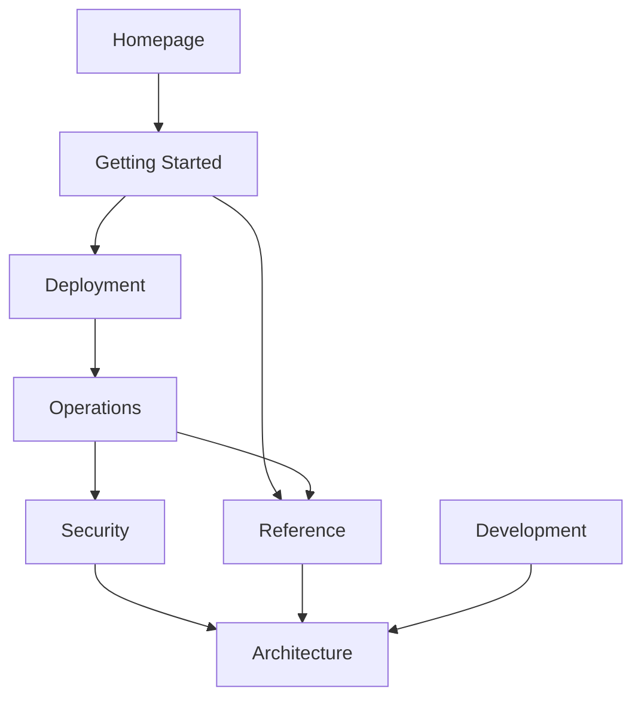

# Docs Style Guide

The published documentation should read like a coherent operator and maintainer system rather than a pile of pages. This guide collects the rules that every contributor follows when writing or rewriting a page under `docs/`.

## Voice And Prose Rules

- Keep copy direct, operational, and testable. State what the system does, what an operator does, and what success looks like.
- Do not use em-dashes (the `U+2014` character). Use commas, parentheses, periods, or restructure the sentence.
- Do not use the antithesis pattern that signals AI-generated prose: "not X, but Y", "isn't merely X, it's Y", "more than X, it's Y". If a sentence relies on a clever contrast, rewrite it as two plain sentences.
- Avoid hollow openers: "However", "It is important to note", "In essence", "Simply put".
- Avoid "simply", "just", "easily", "obviously". They mislead operators about real cost.
- Use Title Case for headings, matching the existing reference docs.
- Use OpenBao terminology for this project. Mention Vault only when naming related work or upstream compatibility context; do not describe this provider as a Vault provider.
- Use the binary name `bao-kms-provider` everywhere in prose. Earlier or longer name variants must not appear in docs; the GitHub repository URL is the only allowed exception and lives in `hugo.toml` rather than in any page.
- Match the tone of the maintained reference pages: short paragraphs, dense factual content, no marketing voice.

## Section Shapes

Each top-level section enforces a different page shape. Pages must fit the shape of their section.

- `getting-started/`: tutorial. Sequential numbered steps, one happy path, explicit success criteria. No branching or alternatives.
- `deployment/`: model choice plus applied steps. The choice page compares options; the per-model pages document the chosen model in full.
- `operations/`: how-to. Task-focused, conditional steps allowed, assumes the reader has already deployed the provider.
- `reference/`: lookup. Exhaustive, neutral, looked up rather than read top-to-bottom. No narrative.
- `security/`: trust framing. Threat boundaries, authentication, hardening, decrypt validation. Not a workflow.
- `architecture/`: explanation. Discursive, why-oriented, may go deep. Maintainer-facing.
- `development/`: contributor reference. Local workflow, CI, release process, docs system itself.

A page that mixes shapes belongs in two different sections. Split it.

## IA Map



## Repository Contracts

- Every Markdown page under `docs/<section>/` must be reachable from the section's `_index.md` (either via `browse` or as a direct child page Hugo auto-discovers).
- Public pages under `docs/<section>/` are the maintained documentation source. Update them directly when behavior, release policy, compatibility, deployment, or operations change.
- Historical ADRs and planning notes are available through repository history. Public docs link to current reference, architecture, or development pages instead of old planning artifacts.
- Internal links use absolute paths from the site root, for example `/operations/rotation/` rather than relative or `.md` paths.
- Generated reference pages, when added, keep the generated-note contract at the top of the file.
- Front matter on every page includes `title`, `description`, and `weight`. Section landings include a `browse` array listing the intended page order.

## Linking Rules

- Cross-link to the canonical home of a fact rather than restating the fact in a second page.
- When a topic spans sections, the explanation lives in one page and the neighbor section links to it. Operations runbooks link to reference behavior; security pages link to reference for exact contracts.
- Section landings include a "Use Another Section If" block that routes readers who landed in the wrong section.

## Visual Rules

- Use Mermaid where sequence, routing, or boundary matters.
- Keep each page responsible for one job. If a page reaches three top-level sections that each address a different operator question, it should be split.
- Use short sections and explicit headings rather than dense prose walls.

## Verification

Before merging a docs change, run:

```bash
make docs-build
make docs-check
```

`make docs-build` runs the full Hugo build and must complete without warnings. `make docs-check` enforces forbidden-string and em-dash gates against the live docs tree.
