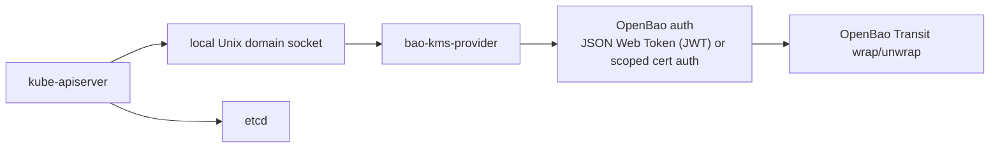

Read this page once per cluster. At the end, you know whether the provider fits
your platform, and you have picked a deployment model and a credential source.

## What the provider does

`bao-kms-provider` is a Kubernetes KMS v2 provider. It runs on every
control-plane host, listens on a local Unix socket, and uses OpenBao Transit
over HTTPS to wrap and unwrap the data encryption keys that `kube-apiserver`
uses for the resources listed in its `EncryptionConfiguration`.

The provider does not encrypt raw etcd disk blocks or snapshots, application
volumes, node filesystems, container layers, or API traffic. See
[Threat model](/docs/security/threat-model/) for threats outside this scope.

The provider sits on the API server boot path. If the provider, its credential,
OpenBao, or the Transit key is unavailable, the API server might be unable to
decrypt stored resources. Treat it as control-plane critical infrastructure.

## Check the tested scope

Check your Kubernetes and OpenBao versions against the tested matrix in
[Reference: Compatibility](/docs/reference/compatibility/). The provider uses
Transit `aes256-gcm96` keys and runs on Linux control-plane nodes.

The release line does not include:

- KMS v1, convergent encryption, or Transit datakey generation,
- creating, rotating, exporting, or backing up Transit keys from the provider,
- a DaemonSet or Helm chart that runs the provider inside the protected cluster,
- production use while the release line remains preview.

## Choose a deployment model

The provider runs on every control-plane node as a systemd service or as a
kubelet static pod. Both are tested.

| | systemd | Static pod |
|---|---|---|
| Boot path depends on | systemd and host files | kubelet, container runtime, the preloaded image, and host files |
| Runs as | Host user `openbao-kms` | UID and GID `65532` plus the host socket group GID |
| Upgrade and rollback | Package or tarball | Image digest in the manifest |

Use **systemd** when configuration management or OS images own the host. It
has the fewest boot-path dependencies, so prefer it for single-node control
planes.

Use a **static pod** when the control plane is kubeadm-style, `kube-apiserver`
already runs as a static pod on containerd, and you can preload the provider
image on every node.

In both models, the API server can start before the provider is ready and must
retry its KMS connection. A DaemonSet in the protected cluster is unsupported,
because it needs the API server that needs the provider.

## Choose a credential source

The provider exchanges a JWT for a short-lived OpenBao token. Each node must
renew that JWT while the protected Kubernetes API is down, so the issuer, its
storage, DNS, routing, and TLS trust must work independently of the cluster.

| Source | Use when | Values example |
|---|---|---|
| Host JWT file (`file`) | Your platform already runs a host identity agent that writes and renews a JWT file on each node. | `deploy/config/init-values-file.yaml` |
| Native OAuth client credentials (`oauth2`) | An independent issuer returns signed JWT access tokens for a client ID and secret. The provider requests tokens itself. | `deploy/config/init-values-oauth2.yaml` |

For the host agent requirements, see
[Configure: OpenBao auth and policy](/docs/configure/openbao-auth/#host-jwt-agent).
For OAuth, see [OAuth 2.0 client credentials](/docs/configure/oauth2/) and
[Provision a Keycloak client](/docs/configure/keycloak/).

Do not use a ServiceAccount token issued only by the protected cluster as the
recovery credential. See [Security: Auth model](/docs/security/auth-model/).

Continue with [Download the release](/docs/get-started/download/).
