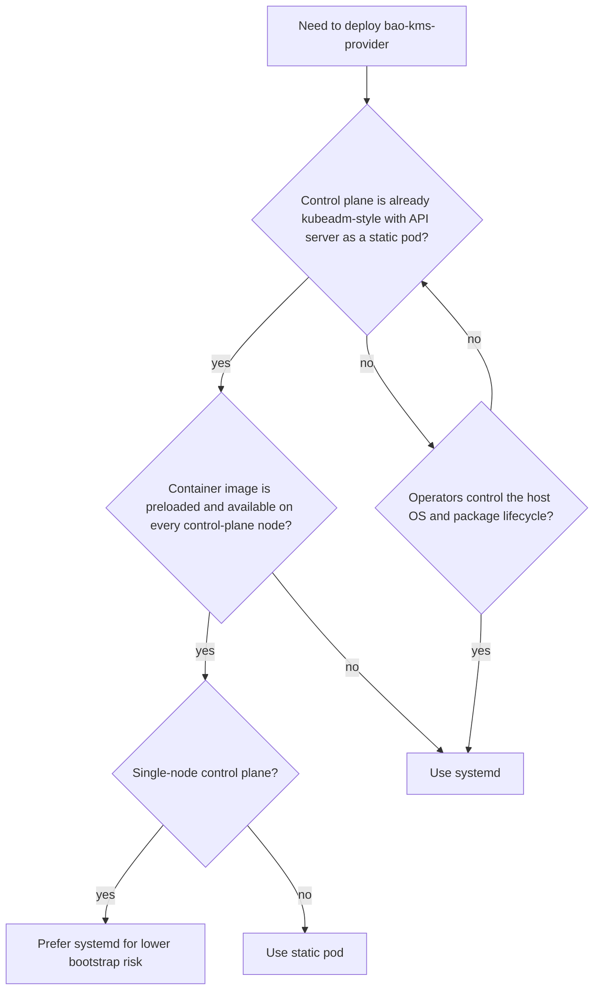

The provider runs on every control-plane node, either as a hardened systemd
service or as a kubelet static pod. Both are tested. Choose systemd when you
manage the host operating system; choose a static pod when your control plane
is kubeadm-style and you can preload the provider image on every node.

## Compare the models

| | systemd | Static pod |
|---|---|---|
| Managed by | systemd | kubelet |
| Boot path depends on | systemd and host files | kubelet, container runtime, local image, and host files |
| Starts | Process execution is ordered before kubelet when both units start together; readiness is not ordered | Alongside the API server, without ordering |
| Hardening | systemd sandbox directives | Pod `securityContext` and a distroless non-root image |
| Identity | Host user `openbao-kms` | UID and GID `65532` plus the host socket group GID |
| Upgrade and rollback | Package or tarball | Image digest in the manifest |
| Recovery needs | The binary on the host | The image preloaded on the host |

## Recommendation

Use **systemd** when configuration management or OS images own the host, the
package can be installed before kubelet starts, and the container runtime
should not be a precondition for decrypting cluster data. It has the fewest
boot-path dependencies, so prefer it for single-node control planes.

Use a **static pod** when every control-plane component already runs as a
static pod, the provider image is preloaded on every node, and you manage the
provider manifest and its hostPath files with the same discipline as the API
server manifest.

## Boot-path risks

Both models put the provider on the API server boot path, with different
failure points:

- **systemd:** process-start ordering does not make kubelet wait for provider
  readiness; the API server must retry while the provider bootstraps.
  `network-online.target` does not prove OpenBao is reachable. A sandbox
  restriction or restart can interrupt the KMS path.
- **Static pod:** a broken kubelet, container runtime, or image pull stops the
  provider; the API server can start before the socket exists and must retry;
  host networking is needed to reach OpenBao before the CNI is up; socket
  ownership must be checked on the host because the container UID means
  nothing there.

A DaemonSet in the protected cluster is not supported: it needs the API server
that needs the provider. A DaemonSet is fine for a different cluster, such as
a management cluster, or for diagnostics outside the boot path.

