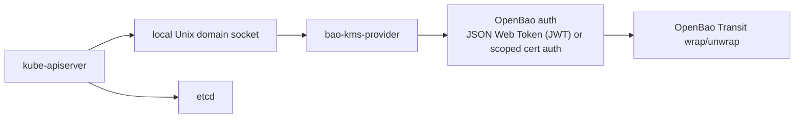

`bao-kms-provider` is a Kubernetes Key Management Service (KMS) v2 provider
plugin. It terminates the KMS v2 gRPC protocol on a local Unix domain socket
and uses OpenBao Transit over HTTPS to wrap and unwrap Kubernetes storage keys.
Kubernetes uses the provider to envelope-encrypt selected API resources before
those objects are persisted to etcd.

## Component picture

The provider sits on each control-plane host between `kube-apiserver` and OpenBao Transit:

The provider runs on the same host as the Kubernetes API server. The tested
preview deployment models are node-local systemd and static pod. The provider
does not depend on the protected Kubernetes API server to operate.

## What it encrypts

The provider participates in Kubernetes envelope encryption for selected API
resources at the storage layer. The API server reads its
`EncryptionConfiguration` and identifies which resources require encryption.
It then asks the provider to wrap the data encryption key (DEK) used to seal
each object before writing the ciphertext to etcd.

The provider does not encrypt:

- raw etcd disk blocks or etcd snapshots,
- application Persistent Volumes or PersistentVolumeClaims,
- node filesystems or container layers,
- arbitrary Kubernetes API traffic.

For threats outside this scope, see [Threat model](/docs/security/threat-model/).

## Why this provider exists

OpenBao Transit can encrypt and decrypt caller-supplied data. OpenBao itself
does not implement the Kubernetes KMS gRPC protocol. The Kubernetes API server
expects a local KMS provider plugin reachable over a Unix domain socket; it
does not call OpenBao Transit directly. `bao-kms-provider` adapts the two
protocols and adds Kubernetes-specific correctness rules for `key_id`
stability, additional authenticated data (AAD) binding, decrypt validation,
and rotation.

The provider sits in the Kubernetes API server boot path. Kubernetes documents
that startup can drive thousands of decrypt operations against the KMS
provider plugin. If the provider, its socket, the auth credential, the OpenBao
service, or the Transit key is unavailable, the API server may be unable to
decrypt previously encrypted resources. Treat the provider as control-plane
critical infrastructure.

## Tested preview scope

The current release line is tested with Kubernetes `1.34` and `1.35` and
OpenBao `2.6.0`, using Transit `aes256-gcm96` keys. Other Kubernetes `1.29+`
clusters with KMS v2 might work but are outside the tested matrix. KMS v1 is
not implemented. See [Reference: Compatibility](/docs/reference/compatibility/)
for the full matrix and upgrade rules.

The provider authenticates to OpenBao with a JSON Web Token (JWT) by default.
PKCS#11 certificate auth is a separate, opt-in build; see
[Security: Auth model](/docs/security/auth-model/).

## Out of scope

The current release line does not include:

- Encrypting raw etcd disk blocks, node filesystems, or application volumes.
- Creating, rotating, exporting, deleting, or backing up Transit keys from the provider.
- Using OpenBao Transit datakey generation for the primary encrypt path.
- Convergent encryption.
- Legacy KMS v1.
- A DaemonSet deployment running inside the protected cluster.
- A Helm chart that installs the provider into the protected cluster.
- Provider-side decrypt micro-batching.
- Production use while the release line remains preview.
