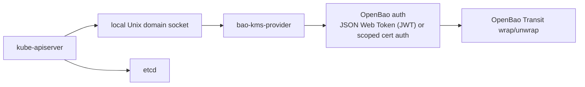

# Overview

`bao-kms-provider` is a Kubernetes Key Management Service (KMS) v2 provider
plugin. It terminates the KMS v2 gRPC protocol on a local Unix domain socket
and uses OpenBao Transit over HTTPS to wrap and unwrap Kubernetes storage keys.
Kubernetes uses the provider to envelope-encrypt selected API resources before
those objects are persisted to etcd.

## Component Picture

The provider sits on each control-plane host between `kube-apiserver` and OpenBao Transit:

The provider runs on the same host as the Kubernetes API server. The tested
preview deployment models are node-local systemd and static pod. The provider
does not depend on the protected Kubernetes API server to operate.

## What It Encrypts

The provider participates in Kubernetes envelope encryption for selected API
resources at the storage layer. The API server reads its
`EncryptionConfiguration` and identifies which resources require encryption.
It then asks the provider to wrap the data encryption key (DEK) used to seal
each object before writing the ciphertext to etcd.

The provider does not encrypt:

- raw etcd disk blocks or etcd snapshots,
- application Persistent Volumes or PersistentVolumeClaims,
- node filesystems or container layers,
- arbitrary Kubernetes API traffic.

For threats outside this scope, see [Threat Model](/security/threat-model/).

## Why This Provider Exists

OpenBao Transit can encrypt and decrypt caller-supplied data. OpenBao itself
does not implement the Kubernetes KMS gRPC protocol. The Kubernetes API server
expects a local KMS provider plugin reachable over a Unix domain socket; it
does not call OpenBao Transit directly. `bao-kms-provider` adapts the two
protocols and adds Kubernetes-specific correctness rules for `key_id`
stability, additional authenticated data (AAD) binding, decrypt validation,
and rotation.

The provider sits in the Kubernetes API server boot path. Kubernetes documents
that startup can drive thousands of decrypt operations against the KMS
provider plugin. If the provider, its socket, the auth credential, the OpenBao
service, or the Transit key is unavailable, the API server may be unable to
decrypt previously encrypted resources. Treat the provider as control-plane
critical infrastructure.

## Tested Preview Scope

The current preview validation targets are Kubernetes `1.34` and `1.35`, each
with exact Kind node-image pins recorded in `.ci/versions.yaml`. Kubernetes
`1.36` is the intended next validation line once a digest-pinned Kind node image
is available. Kubernetes `1.29+` KMS v2 clusters may work, but unlisted versions
are not part of the tested preview matrix. KMS v2 is
the only supported Kubernetes KMS API; KMS v1 is not implemented.

The current OpenBao validation target is OpenBao `2.6.0` with the Transit
secrets engine using `aes256-gcm96` keys. See
[Compatibility](/reference/compatibility/) for the full supported version
envelope and upgrade rules for this matrix.

## Defaults And Boundaries

The current release line is intentionally narrow:

- Kubernetes KMS v2 only. KMS v1 is not implemented.
- JWT authentication to OpenBao by default.
- PKCS#11 certificate auth only when the selected release includes matching
  opt-in artifacts and marks that path as tested.
- SPIFFE/SPIRE certificate-source configuration is not supported in preview.
- OpenBao tokens stored in process memory only.
- Transit associated data required for encrypt and decrypt.
- Deterministic, opaque Kubernetes `key_id` values derived from configured identity scope and Transit metadata.
- Local registry state at `/var/lib/openbao-kms/state/key-registry.json`.
- Provider socket at `/run/openbao-kms/kms.sock` with mode `0660`.
- Metrics on `127.0.0.1:8081` and health on `127.0.0.1:8082`.
- Direct decrypt path without provider-side micro-batching.
- systemd and static-pod deployment models.

## Recommended Deployment Defaults

Use these defaults unless your platform has a documented reason to diverge:

- Use one named Transit key per Kubernetes cluster or trust domain.
- Use `aes256-gcm96` Transit keys for the supported path.
- Keep Transit key export, plaintext backup, and deletion disabled.
- Keep Transit key creation and rotation outside the provider, through platform automation or an OpenBao administrator workflow.
- Generate and store a non-secret key lineage ID when each Transit key is created.
- Prefer systemd when you control the host operating-system lifecycle.
- Use static pods for kubeadm-style control planes only when image preload, hostPath preparation, and node-local provider identity are operationally controlled.
- Pin binaries, packages, images, checksums, and verified release artifacts. Do not use floating `latest` inputs.

Current performance validation keeps the simpler direct decrypt path. See
[Development: Performance Evidence](/development/benchmark-results/) for the
captured results.

## Out Of Scope

The current release line does not include:

- Encrypting raw etcd disk blocks, node filesystems, or application volumes.
- Creating, rotating, exporting, deleting, or backing up Transit keys from the provider.
- Using OpenBao Transit datakey generation for the primary encrypt path.
- Convergent encryption.
- Legacy KMS v1.
- A DaemonSet deployment running inside the protected cluster.
- A Helm chart that installs the provider into the protected cluster.
- Provider-side decrypt micro-batching.
- Production use while the release line remains preview.

## Read Next

1. [OpenBao Setup](/getting-started/openbao-setup/) to provision the Transit mount, key, policy, and provider authentication.
2. [Install](/getting-started/install/) to fetch a verified provider binary.
3. [Deployment: Choosing A Model](/deployment/choosing-a-model/) to run the provider on every control-plane node.
4. [Kubernetes Encryption Config](/getting-started/kubernetes-encryption-config/) to write the `EncryptionConfiguration` consumed by the API server.
5. [First Encrypt](/getting-started/first-encrypt/) to verify the path end-to-end.
