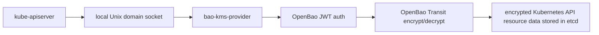

# Overview

`bao-kms-provider` is a Kubernetes KMS v2 provider plugin. It terminates the KMS v2 gRPC protocol on a local Unix domain socket and forwards encrypt and decrypt calls to an OpenBao Transit secrets engine over HTTPS. Kubernetes uses the plugin to envelope-encrypt selected API resources before they are persisted to etcd.

## Component Picture

The provider sits between `kube-apiserver` and OpenBao Transit:

The plugin runs on the same host as the Kubernetes API server, reached over a local Unix domain socket. Both supported deployment models (systemd unit and static pod) keep the provider on the same host. The plugin does not depend on the Kubernetes API to operate.

## What It Encrypts

The provider participates in Kubernetes envelope encryption for selected API resources at the storage layer. The Kubernetes API server reads its `EncryptionConfiguration`, identifies which API resources are subject to encryption, and asks the provider to wrap the data encryption key (DEK) used to seal each object before the ciphertext is written to etcd.

The provider does not encrypt:

- raw etcd disk blocks or etcd snapshots,
- application Persistent Volumes or PersistentVolumeClaims,
- node filesystems or container layers,
- arbitrary Kubernetes API traffic.

For threats outside this scope, see [Threat Model](/security/threat-model/).

## Why This Plugin Exists

OpenBao Transit can encrypt and decrypt caller-supplied data. OpenBao itself does not implement the Kubernetes KMS gRPC protocol. The Kubernetes API server expects a local KMS provider plugin reachable over a Unix domain socket; it does not call OpenBao Transit directly. `bao-kms-provider` adapts the two protocols and adds the Kubernetes-specific correctness rules around `key_id` stability, AAD binding, decrypt validation, and rotation behavior.

The plugin sits in the Kubernetes API server boot path. Kubernetes documents that startup can drive thousands of decrypt operations against the KMS plugin. If the plugin, its socket, the JWT credential, the OpenBao service, or the Transit key is unavailable, the API server may be unable to decrypt previously encrypted resources. Treat the provider as control-plane critical infrastructure.

## Supported Versions

The v0.1 validation target is the Kubernetes 1.34 release line. CI tracks upstream `1.34.7` as the latest patch and pins the initial Kind lane to `1.34.3` by node image digest. KMS v2 is the only supported Kubernetes KMS API; KMS v1 is not implemented.

The OpenBao validation target for v0.1 is OpenBao `2.5.3` with the Transit secrets engine using `aes256-gcm96` keys. See [Compatibility](/reference/compatibility/) for the full supported version envelope and the upgrade discipline applied to this matrix.

## Recommended Defaults

The v0.1 implementation defaults reflect the design choices documented in [Architecture](/architecture/overview/):

- KMS v2 only.
- aes256-gcm96 Transit keys.
- One named Transit key per Kubernetes cluster or trust domain.
- Transit key creation and rotation outside the plugin (platform automation, OpenBao operator, or admin workflow).
- Transit key export, plaintext backup, and deletion disabled.
- Transit AAD enabled.
- Authentication token kept in memory only.
- Provider socket at `/run/openbao-kms/kms.sock`.
- systemd or static-pod runtime, with both styles supported.

## Out Of Scope For v0.1

The v0.1 release does not include:

- Encrypting raw etcd disk blocks, node filesystems, or application volumes.
- Creating, rotating, exporting, deleting, or backing up Transit keys from the plugin.
- Using OpenBao Transit datakey generation for the primary encrypt path.
- Convergent encryption.
- Legacy KMS v1.
- A DaemonSet deployment running inside the protected cluster.
- Production-readiness claims that require conformance, HA, recovery, and load testing beyond the v0.1 release gates.

## Read Next

1. [OpenBao Setup](/getting-started/openbao-setup/) to provision the Transit mount, key, policy, and JWT authentication.
2. [Install](/getting-started/install/) to fetch a verified provider binary.
3. [Kubernetes Encryption Config](/getting-started/kubernetes-encryption-config/) to write the `EncryptionConfiguration` consumed by the API server.
4. [First Encrypt](/getting-started/first-encrypt/) to verify the path end-to-end.
