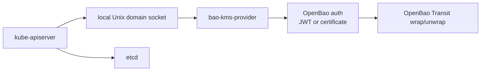

# Overview

`bao-kms-provider` is a Kubernetes KMS v2 provider plugin. It terminates the KMS v2 gRPC protocol on a local Unix domain socket and uses OpenBao Transit over HTTPS to wrap and unwrap Kubernetes storage keys. Kubernetes uses the plugin to envelope-encrypt selected API resources before those objects are persisted to etcd.

## Component Picture

The provider sits on each control-plane host between `kube-apiserver` and OpenBao Transit:

The plugin runs on the same host as the Kubernetes API server. Both supported deployment models (systemd unit and static pod) keep the provider node-local. The plugin does not depend on the protected Kubernetes API server to operate.

## What It Encrypts

The provider participates in Kubernetes envelope encryption for selected API resources at the storage layer. The Kubernetes API server reads its `EncryptionConfiguration`, identifies which API resources are subject to encryption, and asks the provider to wrap the data encryption key (DEK) used to seal each object before the ciphertext is written to etcd.

The provider does not encrypt:

- raw etcd disk blocks or etcd snapshots,
- application Persistent Volumes or PersistentVolumeClaims,
- node filesystems or container layers,
- arbitrary Kubernetes API traffic.

For threats outside this scope, see [Threat Model](/security/threat-model/).

## Why This Plugin Exists

OpenBao Transit can encrypt and decrypt caller-supplied data. OpenBao itself does not implement the Kubernetes KMS gRPC protocol. The Kubernetes API server expects a local KMS provider plugin reachable over a Unix domain socket; it does not call OpenBao Transit directly. `bao-kms-provider` adapts the two protocols and adds the Kubernetes-specific correctness rules around `key_id` stability, AAD binding, decrypt validation, and rotation behavior.

The plugin sits in the Kubernetes API server boot path. Kubernetes documents that startup can drive thousands of decrypt operations against the KMS plugin. If the plugin, its socket, the auth credential, the OpenBao service, or the Transit key is unavailable, the API server may be unable to decrypt previously encrypted resources. Treat the provider as control-plane critical infrastructure.

## Supported Versions

The current validation target is the Kubernetes 1.34 release line. CI records the tracked upstream patch and pins the initial Kind lane to `1.34.3` by node image digest in `.ci/versions.yaml`. KMS v2 is the only supported Kubernetes KMS API; KMS v1 is not implemented.

The current OpenBao validation target is OpenBao `2.5.3` with the Transit secrets engine using `aes256-gcm96` keys. See [Compatibility](/reference/compatibility/) for the full supported version envelope and the upgrade discipline applied to this matrix.

## Implementation Defaults

The implementation is intentionally narrow. These are implementation defaults and enforced boundaries:

- Kubernetes KMS v2 only. KMS v1 is not implemented.
- JWT authentication to OpenBao by default, with build-tagged certificate auth variants for PKCS#11 and SPIFFE-backed identities.
- OpenBao tokens stored in process memory only.
- Transit associated data required for encrypt and decrypt.
- Deterministic, opaque Kubernetes `key_id` values derived from configured identity scope and Transit metadata.
- Local registry state at `/var/lib/openbao-kms/state/key-registry.json`.
- Provider socket at `/run/openbao-kms/kms.sock` with mode `0660`.
- Metrics on `127.0.0.1:8081` and health on `127.0.0.1:8082`.
- Direct decrypt path without provider-side micro-batching.
- systemd and static-pod deployment models supported.

## Recommended Deployment Defaults

Use these defaults unless your platform has a documented reason to diverge:

- Use one named Transit key per Kubernetes cluster or trust domain.
- Use `aes256-gcm96` Transit keys for the supported path.
- Keep Transit key export, plaintext backup, and deletion disabled.
- Keep Transit key creation and rotation outside the plugin, through platform automation or an OpenBao administrator workflow.
- Generate and store a non-secret key lineage ID when each Transit key is created.
- Prefer systemd when you control the host operating-system lifecycle.
- Use static pods for kubeadm-style control planes only when image preload, hostPath preparation, and node-local provider identity are operationally controlled.
- Pin binaries, packages, images, checksums, and release evidence. Do not use floating `latest` inputs.

The 10,000 and 50,000 Secret cold-start validation runs did not show provider/OpenBao decrypt fan-out proportional to Kubernetes object count. Based on current evidence, the provider keeps the simpler direct decrypt path. See [Development: Performance Evidence](/development/benchmark-results/) for the captured results.

## Out Of Scope

The current release line does not include:

- Encrypting raw etcd disk blocks, node filesystems, or application volumes.
- Creating, rotating, exporting, deleting, or backing up Transit keys from the plugin.
- Using OpenBao Transit datakey generation for the primary encrypt path.
- Convergent encryption.
- Legacy KMS v1.
- A DaemonSet deployment running inside the protected cluster.
- A Helm chart that installs the provider into the protected cluster.
- Provider-side decrypt micro-batching.
- Production-ready support claims before release evidence covers the required exact-version, HA, recovery, upgrade, and supply-chain gates.

## Read Next

1. [OpenBao Setup](/getting-started/openbao-setup/) to provision the Transit mount, key, policy, and provider authentication.
2. [Install](/getting-started/install/) to fetch a verified provider binary.
3. [Kubernetes Encryption Config](/getting-started/kubernetes-encryption-config/) to write the `EncryptionConfiguration` consumed by the API server.
4. [First Encrypt](/getting-started/first-encrypt/) to verify the path end-to-end.
