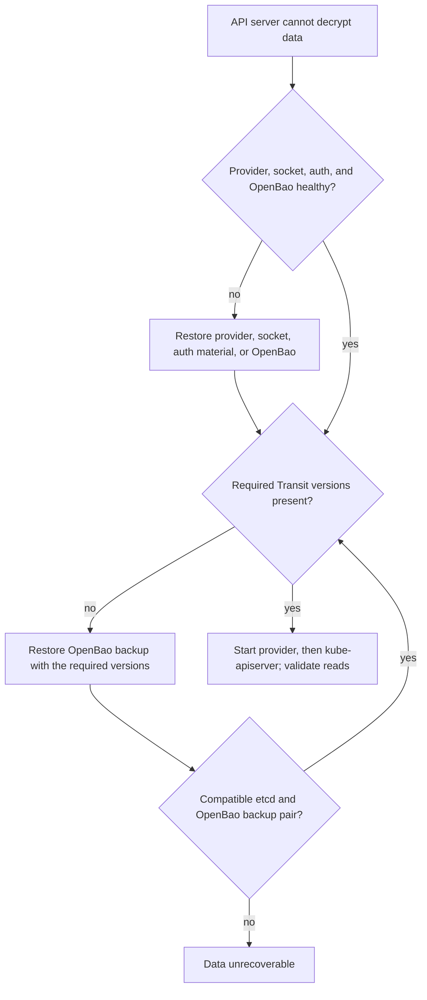

Kubernetes data encrypted through the provider is readable only while OpenBao
still holds every Transit key version that encrypted it. Back up and restore
OpenBao and etcd as a compatible pair. An `identity` fallback never decrypts
existing KMS ciphertext, and a Transit key recreated with the same name is a
new key, not a recovery.

## Back up

Back up together, and keep for as long as any etcd backup can need them:

- etcd snapshots and OpenBao storage snapshots, including Transit key versions
  with their original creation timestamps,
- provider configuration, the local registry state file and its adjacent
  checkpoint, and the CA bundle,
- OpenBao auth configuration and policies,
- deployment manifests or systemd units.

Record with every backup set the identity values from
[Generate installation files](/docs/get-started/plan-values/), the active Transit key
version, the active `key_id` hash, and the provider version.

Never raise OpenBao `min_decryption_version` above a version that a retained
etcd backup might still need.

## Local registry state

Restore only state supported by the installed release. Preview.3 rejects
unbound state from earlier previews; recovery is not a way to upgrade that
state. Preserve the original installation and use its matching artifacts.
See [Compatibility](/docs/reference/compatibility/#preview3-fresh-installation-boundary).

The provider can create its registry state on first start only for an
unrotated Transit key (`latest_version` 1). After any rotation, a node without
its state file and checkpoint fails closed; restore both from backup or copy
them from a healthy peer with identical identity values. The preview line has
no supported `recover-state` command, and a state file must never be written by
hand. The same applies when adopting an existing Transit key at version `2` or
later: `doctor`, `verify-key`, `rotation-plan`, and `verify-rotation` report why
bootstrap is denied.

The checkpoint lets the provider reject a missing, older, or mismatched state
file. It does not stop a host administrator who replaces both files. Keep the
state directory non-group-writable and non-world-writable, back up the two
files together, and compare state generation and `key_id` hash across nodes.

## During an incident

- Never delete encrypted etcd data while you investigate.
- Never raise `min_decryption_version`, recreate a Transit key, change the
  provider name or other identity values, or bypass AAD to clear errors.
- Never log plaintext while debugging.
- Restore the KMS path, meaning provider, socket, auth material, and OpenBao,
  before you restart API servers.
- On multi-node control planes, recover one node at a time and keep a known-good
  API server running where possible. Single-node control planes have no
  fallback, so rehearse their recovery.

Re-adding an `identity` fallback is acceptable only to read plaintext objects
or finish a migration.



## API server cannot start

1. Read the API server log for KMS connection or decrypt errors.
2. Restore the provider, socket, OpenBao, and auth material.
3. Run `doctor`, with `--encryption-config` when the file is available:

   ```sh
   bao-kms-provider doctor \
     --config /etc/openbao-kms/config.yaml \
     --encryption-config /etc/kubernetes/openbao-kms/encryption-config.yaml
   ```

4. Start the provider, confirm `/ready`, then restart the API server.
5. If Transit key versions are missing, [restore OpenBao](#restore-openbao). If
   no backup holds them, restore a compatible etcd and OpenBao pair.

## Restore OpenBao

1. Restore OpenBao to a point that holds the Transit key and every version etcd
   needs, then confirm it is unsealed and healthy.
2. Confirm the JWT auth role and the provider policy.
3. Check the provider's view:

   ```sh
   bao-kms-provider verify-key --config /etc/openbao-kms/config.yaml
   bao-kms-provider doctor --config /etc/openbao-kms/config.yaml
   ```

   Both exit with status `0` without a `[fail]` check.
4. Start the provider, restart `kube-apiserver`, and validate reads of
   encrypted resources.

Restoring OpenBao to a point before a rotation breaks data written after that
rotation. Restoring OpenBao to a later point than etcd usually works, because
older versions stay available.

## Restore etcd and OpenBao together

1. Choose an etcd backup and an OpenBao backup from a compatible time window.
2. Restore OpenBao first, and confirm the versions the etcd snapshot needs
   exist, are decryptable, and keep their original creation timestamps.
3. Restore etcd.
4. Start the provider, then the API server, and validate reads.

## Replace a control-plane node

1. Install the provider package, or preload the image digest and restore the
   static pod manifest.
2. Restore `/etc/openbao-kms/config.yaml`, the CA bundle, and the auth
   material, and recreate `/run/openbao-kms` with the modes from
   [Security: Linux identity model](/docs/security/linux-identity-model/).
   For static pods, confirm the socket GID matches `supplementalGroups` and
   `server.socketGroup`.
3. Restore the registry state file and checkpoint; see
   [Local registry state](#local-registry-state).
4. Run `doctor`, start the provider before the API server, and confirm its
   `key_id` hash matches the other nodes.

## Restore lost provider configuration

1. Restore the configuration from configuration management, and confirm every
   identity-bearing value matches the recorded set. A changed value causes
   `key_id` and AAD mismatches.
2. Restore the registry state and checkpoint, the CA bundle, and the auth
   material.
3. Run `doctor`, start the provider, and confirm its `key_id` hash matches the
   other nodes or the backup record.

## Recover from auth issuer loss

If the JWT issuer, certificate authority, or PKCS#11 token is unavailable,
existing OpenBao tokens work until they expire. After that, login fails, and
API server startup fails once decryption needs a fresh token. Restore the
issuer, issue a replacement JWT through an emergency process, switch OpenBao
JWT auth to pinned public keys, or use a time-limited emergency identity with
an audit trail. Do not depend on a ServiceAccount token from the protected
cluster.

## Transit key recreated with the same name

Old ciphertext fails to decrypt and the lineage ID no longer matches OpenBao.
Stop the provider, restore the original key from an OpenBao backup, restore the
original lineage ID in the configuration, run `verify-key`, then start the
provider and restart the API server. Never accept the recreated key for data
encrypted under the original.

## Transit key loss

Without an OpenBao backup that holds the original key material, KMS-encrypted
Kubernetes data is lost. Neither an `identity` fallback nor a recreated key
recovers it. The only options are restoring such an OpenBao backup, or
restoring etcd to a point that never used the lost key.
