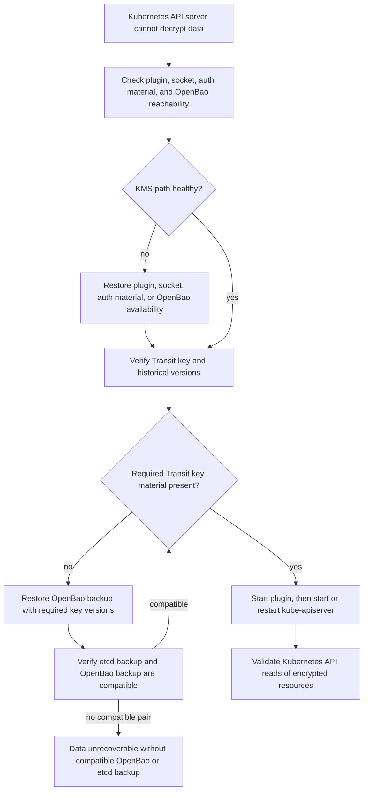

# Disaster Recovery

OpenBao Transit key material and Kubernetes etcd data must be recoverable as a compatible pair.

If etcd contains objects encrypted with a Transit key version that no longer exists or is no longer decryptable, Kubernetes may be unable to read those objects. Adding `identity` fallback to the API server `EncryptionConfiguration` does not decrypt existing KMS ciphertext.

For the design view of the failure modes addressed by this runbook, see [Architecture: Failure Modes](/architecture/failure-modes/).

The recovery posture is conservative:

- preserve encrypted etcd data while investigating,
- restore OpenBao Transit key material before changing Kubernetes encryption configuration,
- keep identity-bearing provider fields unchanged,
- use `doctor` and `verify-key` to prove the KMS path before restarting API servers,
- restore OpenBao and etcd from a compatible backup pair when key versions or ciphertext epochs no longer line up.

## Recovery Decision Flow



## Backup Requirements

Back up:

- etcd snapshots,
- OpenBao storage snapshots,
- Transit key metadata and versions through OpenBao backup,
- plugin configuration,
- local key registry state and its adjacent checkpoint,
- key lineage IDs,
- OpenBao auth configuration,
- OpenBao policies,
- CA bundles,
- deployment manifests or systemd units.

Record with every backup set:

- Kubernetes cluster ID,
- provider name,
- OpenBao instance ID,
- Transit mount ID,
- Transit key lineage ID,
- active Transit key version,
- active Kubernetes `key_id` hash,
- plugin version.

Preserve historical Transit versions for at least as long as any retained etcd backup can reference them. Do not raise OpenBao `min_decryption_version` for versions that may still be needed by retained etcd backups.

## Restore OpenBao

1. Restore OpenBao to a point that contains the required Transit key and all required historical versions.
2. Verify OpenBao is unsealed and healthy.
3. Verify the OpenBao auth method and role configuration.
4. Verify the plugin policy.
5. Run the `verify-key` check below.
6. Run the `doctor` check below.
7. Start the plugin.
8. Start or restart `kube-apiserver`.
9. Validate reads of encrypted Kubernetes resources.

Use the active provider configuration for both checks:

```sh
bao-kms-provider verify-key --config /etc/openbao-kms/config.yaml
bao-kms-provider doctor --config /etc/openbao-kms/config.yaml
```

If OpenBao is restored to a point before a Transit rotation but etcd contains data encrypted after that rotation, decrypt can fail. If etcd is restored to an earlier point and OpenBao is restored to a later compatible point, decrypt usually remains possible while old key versions are retained.

## Restore etcd And OpenBao Together

Preferred procedure when both stores must be restored:

1. Select an etcd backup and an OpenBao backup from a compatible time window.
2. Restore OpenBao first.
3. Verify the Transit key versions required by the etcd snapshot exist and are decryptable.
4. Restore etcd.
5. Start the plugin.
6. Start the API server.
7. Validate Kubernetes API reads.

## Transit Key Loss

If Transit key material is lost and no valid backup exists:

- existing KMS-encrypted Kubernetes data cannot be decrypted,
- `identity` fallback cannot recover it,
- recreating the Transit key with the same name does not recover it,
- the only viable recovery is restoring an OpenBao backup with the original key material, or restoring etcd to a state that does not require the lost key.

Do not delete encrypted etcd data while investigating.

## Key Recreated With Same Name

Symptoms:

- Transit metadata exists,
- decrypt fails for old ciphertext,
- the key lineage ID no longer matches the value in plugin configuration,
- old Kubernetes objects fail to read.

Recovery:

1. Stop the plugin.
2. Restore the original OpenBao key material from backup.
3. Restore the original key lineage configuration.
4. Run `bao-kms-provider verify-key --config /etc/openbao-kms/config.yaml`.
5. Start the plugin.
6. Restart the API server.

Do not accept a recreated key as compatible with data encrypted under the previous key.

## Plugin Config Loss

1. Restore configuration from configuration management.
2. Verify the identity-bearing fields match the previous values; see [Configuration: Identity-Bearing Fields](/reference/configuration/#identity-bearing-fields).
3. Restore the local key registry state and its checkpoint when available.
4. Restore the CA bundle and selected auth material.
5. Run `bao-kms-provider doctor --config /etc/openbao-kms/config.yaml`.
6. Start the plugin.
7. Confirm the Status `key_id` hash matches other control-plane nodes or recorded backup metadata.

Changing provider name, cluster ID, OpenBao instance ID, OpenBao namespace, Transit mount ID, key lineage ID, mount path, or key name causes `key_id` and AAD mismatches.

## Auth Issuer Loss

If the configured JWT issuer, certificate authority, PKCS#11 token, or SPIFFE control plane is unavailable:

- existing OpenBao tokens continue until expiry,
- re-login fails after token expiry,
- API server startup can fail once decrypt requires a fresh token.

Recovery options:

- restore the external issuer,
- issue a valid replacement JWT through an emergency process,
- restore the certificate authority, PKCS#11 token, or SPIFFE control plane,
- configure OpenBao JWT auth with pinned public keys if appropriate,
- use a time-limited emergency identity with a strong audit trail.

Avoid relying only on a Kubernetes ServiceAccount token from the protected cluster for recovery.

## Control-Plane Node Replacement

1. Install the plugin binary or preload the static pod image.
2. Restore `/etc/openbao-kms/config.yaml`.
3. Restore the local key registry state and checkpoint from the replaced node when available.
4. Restore the CA bundle.
5. Provision the selected auth material.
6. Create `/run/openbao-kms` with safe permissions.
7. Ensure `kube-apiserver` can access the socket through the `openbao-kms-socket` group.
8. Run `bao-kms-provider doctor --config /etc/openbao-kms/config.yaml`.
9. Start the plugin before the API server.
10. Confirm the Status `key_id` hash matches existing nodes.

If both local registry files are unavailable, normal startup auto-bootstraps
only when OpenBao still reports initial Transit metadata (`latest_version` 1)
that can decrypt version 1. A replacement node after any Transit rotation must
restore the registry state and checkpoint, or use an operator-controlled
recovery flow with complete version metadata and cross-node `key_id` evidence.
Otherwise startup fails closed before the API server is allowed to rely on a
new active `key_id`.

For systemd deployments, restore the package, unit, users, groups, and `tmpfiles.d` runtime directory entry. For static-pod deployments, preload the provider image digest, restore the manifest, and ensure the numeric `openbao-kms-socket` GID matches `supplementalGroups` and `server.socketGroup`.

## API Server Cannot Start

Recovery order when the API server fails to start because the KMS path is unhealthy:

1. Do not delete encrypted etcd data.
2. Inspect API server logs for KMS connection or decrypt errors.
3. Restore the plugin, socket, OpenBao, and auth material first.
4. Run `bao-kms-provider doctor --config /etc/openbao-kms/config.yaml` locally. Include `--encryption-config /etc/kubernetes/encryption-config.yaml` when the API server encryption config is available.
5. Start the plugin and verify KMS Status.
6. Restart the API server.
7. If OpenBao key material is missing, restore the OpenBao backup.
8. If no key backup exists, restore a compatible etcd and OpenBao backup pair.

Do not try to fix KMS ciphertext by changing the provider name or recreating Transit keys. Adding or reordering `identity` in the configuration only helps for plaintext objects or future writes; it does not decrypt data already encrypted with KMS.

## Single-Node Control Plane

Single-node clusters have higher recovery risk because there is no alternate API server or plugin instance. Prefer systemd mode, local image availability, and tested host-level recovery steps.

## Multi-Node Control Plane

Recover one node at a time:

- keep at least one known-good API server running when possible,
- compare active `key_id` hashes across nodes,
- avoid simultaneous plugin upgrades,
- avoid simultaneous auth credential expiry,
- avoid cluster-wide `min_decryption_version` changes during recovery.

## Emergency Actions

Acceptable during an incident:

- restore the KMS path and perform normal Kubernetes reads,
- temporarily re-add `identity` fallback to read plaintext objects or complete migration,
- use Kubernetes storage migration after the KMS path is healthy,
- restore backups in an isolated environment to recover data.

Unsafe under any circumstance:

- raising `min_decryption_version` during an incident,
- recreating Transit keys with the same name,
- changing the provider name to clear errors,
- attempting to bypass AAD as a recovery shortcut,
- logging plaintext during debugging.
