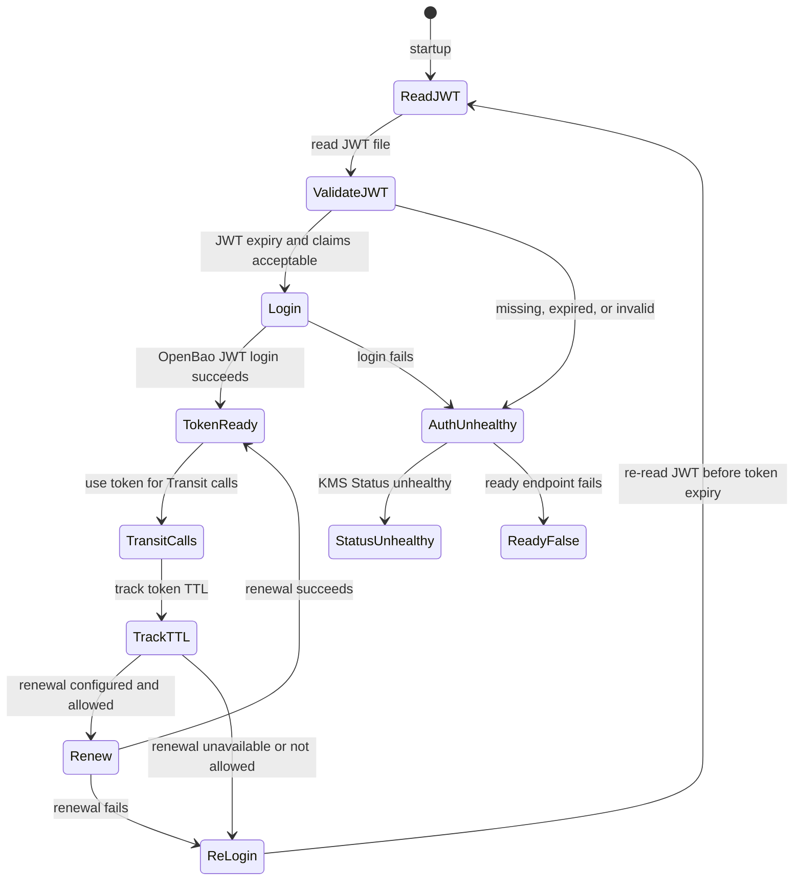

# Auth Model

This page describes how `bao-kms-provider` authenticates to OpenBao. For the operator commands that provision JWT auth on the OpenBao side see [OpenBao Setup: Step 5](/getting-started/openbao-setup/#step-5-enable-jwt-auth). For the configuration field reference see [Configuration: Auth Timing](/reference/configuration/#auth-timing).

## Rationale: JWT Auth Without TokenReview

OpenBao JWT auth is preferred over OpenBao Kubernetes auth for this plugin.

OpenBao's JWT and OIDC auth method verifies JWTs cryptographically using configured local keys, JWKS, or OIDC discovery. It does not call Kubernetes TokenReview. OpenBao Kubernetes auth does call TokenReview. The tradeoff is that revoked JWTs remain valid until expiry when only cryptographic validation is used.

That tradeoff is acceptable and preferable here because Kubernetes TokenReview would require the protected API server to be healthy. During API server bootstrap or disaster recovery, that creates a circular dependency the provider is meant to break.

## Plugin Authentication Lifecycle



The configuration shape that drives this lifecycle is in [Configuration](/reference/configuration/):

```yaml
auth:
  method: jwt
  mountPath: auth/k8s-workload-a-jwt
  role: openbao-kms-control-plane
  jwtFile: /var/lib/openbao-kms/identity.jwt
  minJwtRemainingTtl: 2m
  clockSkewLeeway: 30s
  loginBeforeTokenExpiry: 5m
  tokenRenewalIncrement: 1h
  loginTimeout: 0s
  expectedIssuer: ""
  expectedAudience: []
  expectedSubject: ""
  tokenStorage: memory
```

The provider keeps the OpenBao client token in memory only. The JWT file is re-read before re-login, so the on-disk credential can be rotated without restarting the process when the issuer and role bindings remain compatible.

## JWT Source Options

| Option | Recommendation | Analysis |
|---|---|---|
| External or management-plane JWT issuer | Preferred | Strongest bootstrap independence. OpenBao validates through OIDC discovery, JWKS, or pinned public keys. Recovery can proceed when the protected API server is down. |
| Kubernetes-issued ServiceAccount JWT from the protected cluster | Usable with recovery guardrails | Kubernetes ServiceAccount JWTs carry issuer, subject, audience, and expiry claims and validate offline through discovery. Offline validation does not prove that bound objects still exist. Renewal may depend on kubelet and API server behavior, so this must not be the only recovery credential. |
| Long-lived static JWT on disk | Emergency or constrained environments only | Operationally robust, weaker security. Use response wrapping for initial distribution where practical. Do not store OpenBao client tokens on disk. |

## Recommended Role Constraints

The OpenBao JWT role should require:

- `bound_issuer`,
- `bound_audiences`,
- `bound_subject` or strong `bound_claims`,
- a short OpenBao token TTL,
- a limited maximum TTL,
- no default policy,
- one dedicated Transit policy,
- a clock-skew leeway sized to the environment.

OpenBao JWT roles require at least one bound value such as audience, subject, or claims. The role configuration also controls token TTL, max TTL, attached policies, and the default-policy switch.

Set `auth.expectedIssuer`, `auth.expectedAudience`, and `auth.expectedSubject` in the provider configuration when those claims are stable. These local checks catch misissued or misplaced JWT files before an OpenBao login attempt.

The portable OpenBao/provider e2e lanes exercise bound issuer, audience, and
subject rejection plus pinned public-key rollover. JWKS/OIDC discovery rotation
is issuer-environment specific and should be validated during issuer
integration.

## JWT And Token Renewal Considerations

| Issue | Design response |
|---|---|
| Clock skew | Validate `nbf`, `iat`, and `exp` with configurable leeway. Alert on host clock drift. |
| JWT expiry | Refuse startup when JWT remaining TTL is below `minJwtRemainingTtl`. Re-read the JWT file before re-login. |
| JWKS rotation | Support OIDC discovery and JWKS cache behavior. Provide recovery mode with pinned public keys when discovery is unavailable. |
| Issuer rotation | Treat issuer change as planned migration. Configure overlapping trust only during a bounded window. |
| OpenBao token expiry | Re-login before expiry by default. Token renewal is supported when the role allows `auth/token/renew-self`. |
| Revoked JWT | Pure JWT auth cannot detect revocation until expiry. Mitigate with short JWT TTL where renewal is reliable, or use external issuer revocation controls. |
| API server down | Avoid TokenReview dependency. External issuer is preferred. |

## Response Wrapping

Response wrapping is not part of the provider runtime path. It is useful for initial delivery of a fallback static credential, for emergency recovery material, or for one-time bootstrap secret handoff. OpenBao response wrapping stores a response behind a single-use wrapping token with a TTL, which can detect mishandling during the handoff.

## What This Auth Model Protects

The auth model defends against:

- Kubernetes API circular dependency during bootstrap and disaster recovery,
- token theft on disk because tokens are kept in memory only,
- broad-scope authentication because the role binds issuer, audience, subject, and claims,
- cross-environment credential reuse because each cluster or trust domain has a dedicated role.

It does not defend against:

- a JWT issuer compromise that issues valid replacement JWTs,
- a malicious plugin binary that exfiltrates tokens it sees in memory,
- OpenBao administrative actions that revoke or modify the role,
- a compromised host that can read the JWT file directly.
