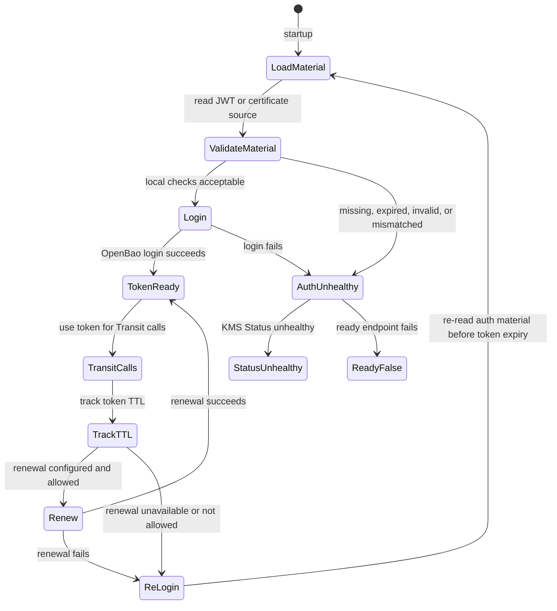

# Auth Model

This page describes how `bao-kms-provider` authenticates to OpenBao. For the operator commands that provision OpenBao auth see [OpenBao Setup: Step 5](/getting-started/openbao-setup/#step-5-configure-auth). For the configuration field reference see [Configuration: Auth Timing](/reference/configuration/#auth-timing).

## Supported Auth Methods

| Method | Status | Use when |
|---|---|---|
| `jwt` | Default build and release path | A file-backed JWT issuer can be validated by OpenBao without calling the protected Kubernetes API server. |
| `cert` with `pkcs11` source | Build-tagged with `certauth_pkcs11` | The deployment has a hardware or software token that can hold the private key outside the filesystem. |
| `cert` with `spiffe` source | Not user-configurable | SPIFFE source wiring remains in tree for local verification and upstream OpenBao alignment work. It is not a supported configuration until the supported OpenBao version can derive cert-auth identity aliases from URI SANs. |

OpenBao Kubernetes auth is intentionally not a provider auth method for this plugin. It calls Kubernetes TokenReview, which depends on the API server the KMS plugin may be required to unlock during bootstrap or disaster recovery.

OpenBao JWT auth verifies JWTs cryptographically using local keys, JWKS, or OIDC discovery. OpenBao cert auth verifies the TLS client certificate chain and configured role constraints. Both avoid TokenReview on the protected cluster.

## Plugin Authentication Lifecycle



JWT configuration:

```yaml
auth:
  method: jwt
  loginBeforeTokenExpiry: 5m
  tokenRenewalIncrement: 1h
  loginTimeout: 0s
  jwt:
    mountPath: auth/k8s-workload-a-jwt
    role: openbao-kms-control-plane
    jwtFile: /var/lib/openbao-kms/identity.jwt
    minRemainingTtl: 2m
    clockSkewLeeway: 30s
    expectedIssuer: ""
    expectedAudience: []
    expectedSubject: ""
```

Certificate configuration:

```yaml
auth:
  method: cert
  loginBeforeTokenExpiry: 5m
  tokenRenewalIncrement: 1h
  loginTimeout: 0s
  cert:
    mountPath: auth/k8s-workload-a-cert
    name: openbao-kms-control-plane
    minRemainingTtl: 24h
    clockSkewLeeway: 30s
    source: pkcs11
    pkcs11:
      certificateFile: /etc/openbao-kms/client/client-chain.pem
      modulePath: /usr/lib/softhsm/libsofthsm2.so
      tokenLabel: openbao-kms
      keyLabel: openbao-kms-client
      pinFile: /etc/openbao-kms/pkcs11/pin
      maxSessions: 4
```

The provider keeps the OpenBao client token in memory only. File-backed JWTs and certificate chains are re-read before re-login.

## JWT Source Options

| Option | Recommendation | Analysis |
|---|---|---|
| External or management-plane JWT issuer | Preferred | Strongest bootstrap independence. OpenBao validates through OIDC discovery, JWKS, or pinned public keys. Recovery can proceed when the protected API server is down. |
| Kubernetes-issued ServiceAccount JWT from the protected cluster | Usable with recovery guardrails | Kubernetes ServiceAccount JWTs carry issuer, subject, audience, and expiry claims and validate offline through discovery. Offline validation does not prove that bound objects still exist. Renewal may depend on kubelet and API server behavior, so this must not be the only recovery credential. |
| Long-lived static JWT on disk | Emergency or constrained environments only | Operationally robust, weaker security. Use response wrapping for initial distribution where practical. Do not store OpenBao client tokens on disk. |

## Certificate Source Options

| Source | Local validation | Operational notes |
|---|---|---|
| PKCS#11 | Certificate file safety, certificate lifetime, client-auth usage, weak signature rejection, and signer public key match. | The private key remains behind the PKCS#11 module. The PIN file must be local, regular, absolute, and tightly permissioned. CI exercises this path with SoftHSM, OpenBao cert auth, and Transit. |
| SPIFFE | X.509 SVID lifetime, client-auth usage, weak signature rejection, expected SPIFFE ID, and trust domain. | Wiring is present for local verification, and CI exercises the source with real SPIRE Workload API SVIDs. It is not a supported user configuration yet. |

The provider does not accept a PEM private key file as a certificate source.

## Recommended JWT Role Constraints

The OpenBao JWT role should require:

- `bound_issuer`,
- `bound_audiences`,
- `bound_subject` or strong `bound_claims`,
- a short OpenBao token TTL,
- a limited maximum TTL,
- no default policy,
- one dedicated Transit policy,
- a clock-skew leeway sized to the environment.

OpenBao JWT roles require at least one bound value such as audience, subject, or claims. The role configuration also controls token TTL, max TTL, attached policies, and the default-policy switch.

Set `auth.jwt.expectedIssuer`, `auth.jwt.expectedAudience`, and `auth.jwt.expectedSubject` in the provider configuration when those claims are stable. These local checks catch misissued or misplaced JWT files before an OpenBao login attempt.

The portable OpenBao/provider e2e lanes exercise bound issuer, audience, and
subject rejection plus pinned public-key rollover. JWKS/OIDC discovery rotation
is issuer-environment specific and should be validated during issuer
integration.

## Recommended Cert Role Constraints

The OpenBao cert role should require:

- one dedicated certificate auth mount for the provider trust boundary,
- `allowed_uri_sans` pinned to the expected SPIFFE ID when SPIFFE is used,
- `allowed_common_names`, `allowed_dns_sans`, or `required_extensions` only when they are stable and meaningful for the issuing CA,
- short OpenBao token TTL,
- limited token max TTL,
- no default policy,
- one dedicated Transit policy.

The OpenBao listener used by the provider must request TLS client certificates. In OpenBao listener terms, keep TLS enabled and do not set `tls_disable_client_certs=true`. Do not set `disable_binding=true` on the cert auth method, because renewal should remain bound to the certificate identity used at login. If OCSP is enabled for the role, keep `ocsp_fail_open=false`.

Stock SPIRE X.509 SVIDs are SPIFFE URI SAN identities and do not include a Common
Name by default. OpenBao `2.5.3` cert auth can enforce `allowed_uri_sans`, but
it cannot derive the identity alias from a URI SAN. For that reason,
`auth.cert.source: spiffe` is rejected by provider configuration validation
until the supported OpenBao version includes compatible cert-auth alias
behavior.

## Token Renewal Considerations

| Issue | Design response |
|---|---|
| Clock skew | Validate `nbf`, `iat`, and `exp` with configurable leeway. Alert on host clock drift. |
| JWT expiry | Refuse startup when JWT remaining TTL is below `auth.jwt.minRemainingTtl`. Re-read the JWT file before re-login. |
| Certificate expiry | Refuse login when the certificate remaining TTL is below `auth.cert.minRemainingTtl`. Track certificate TTL through metrics. |
| JWKS rotation | Support OIDC discovery and JWKS cache behavior. Provide recovery mode with pinned public keys when discovery is unavailable. |
| Issuer rotation | Treat issuer change as planned migration. Configure overlapping trust only during a bounded window. |
| OpenBao token expiry | Re-login before expiry by default. Token renewal is supported when the role allows `auth/token/renew-self`. |
| Revoked JWT | Pure JWT auth cannot detect revocation until expiry. Mitigate with short JWT TTL where renewal is reliable, or use external issuer revocation controls. |
| Revoked certificate | Use OpenBao CRL or OCSP configuration for the cert auth mount. Prefer fail-closed OCSP behavior. |
| API server down | Avoid TokenReview dependency. External JWT issuer, PKCS#11, or SPIFFE Workload API availability should not depend on the protected API server. |

## Response Wrapping

Response wrapping is not part of the provider runtime path. It is useful for initial delivery of a fallback static credential, for emergency recovery material, or for one-time bootstrap secret handoff. OpenBao response wrapping stores a response behind a single-use wrapping token with a TTL, which can detect mishandling during the handoff.

## What This Auth Model Protects

The auth model defends against:

- Kubernetes API circular dependency during bootstrap and disaster recovery,
- token theft on disk because tokens are kept in memory only,
- broad-scope authentication because the role binds issuer, audience, subject, and claims,
- certificate identity drift because local SPIFFE and certificate checks run before OpenBao login,
- cross-environment credential reuse because each cluster, certificate identity, or trust domain has a dedicated role.

It does not defend against:

- a JWT issuer compromise that issues valid replacement JWTs,
- a certificate authority or SPIFFE control-plane compromise that issues valid replacement certificates,
- a malicious plugin binary that exfiltrates tokens it sees in memory,
- OpenBao administrative actions that revoke or modify the role,
- a compromised host that can read JWT files, certificate chains, PIN files, SPIFFE sockets, or process memory directly.

## Source References

- [OpenBao JWT/OIDC auth API](https://openbao.org/api-docs/auth/jwt/)
- [OpenBao TLS certificates auth method](https://openbao.org/docs/auth/cert/)
- [OpenBao TCP listener configuration](https://openbao.org/docs/configuration/listener/tcp/)
- [SPIFFE Workload API](https://spiffe.io/docs/latest/spiffe-specs/spiffe_workload_api/)
- [SPIFFE X.509-SVID](https://spiffe.io/docs/latest/spiffe-specs/x509-svid/)
