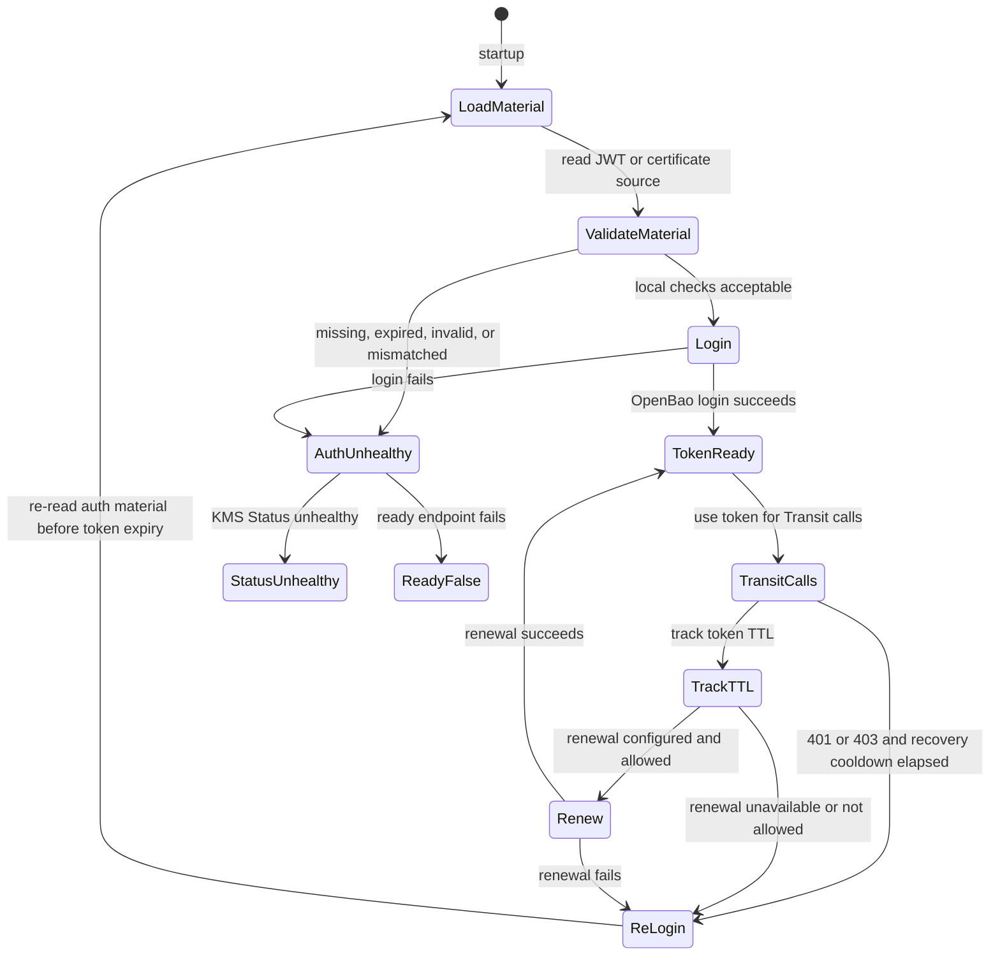

The provider logs in to OpenBao with a JSON Web Token (JWT) by default, or with
a client certificate from a PKCS#11 token in a separate opt-in build. For the
setup commands, see [Prepare OpenBao](/docs/get-started/openbao/#step-5-configure-jwt-auth)
and [Configure: OpenBao auth and policy](/docs/configure/openbao-auth/); for the
required controls, see [Hardening](/docs/security/hardening/#auth-material).

## Supported auth methods

| Method | Status | Use when |
|---|---|---|
| `jwt` | Default build and release path | A file-backed JWT issuer can be validated by OpenBao without calling the protected Kubernetes API server. |
| `cert` with `pkcs11` source | Opt-in preview when the selected release marks it as tested | The deployment has a PKCS#11 hardware or software token that can hold the private key outside the filesystem. |
| `cert` with `spiffe` source | Not user-configurable in preview | SPIFFE workload identity source wiring remains in tree for local verification, but it is not a supported preview configuration. |

OpenBao Kubernetes auth is deliberately not supported. It calls TokenReview on
the API server that might need the provider to start. [JWT auth](https://openbao.org/api-docs/auth/jwt/) validates tokens
with local keys, a JSON Web Key Set (JWKS), or OpenID Connect (OIDC) discovery,
and [cert auth](https://openbao.org/docs/auth/cert/) validates the client certificate chain; neither calls the
protected cluster. Support for each method per release is listed in
[Reference: Compatibility](/docs/reference/compatibility/).

## Provider authentication lifecycle

```mermaid
stateDiagram-v2
    [*] --> LoadMaterial: startup
    LoadMaterial --> ValidateMaterial: read JWT or certificate source
    ValidateMaterial --> Login: local checks acceptable
    ValidateMaterial --> AuthUnhealthy: missing, expired, invalid, or mismatched
    Login --> TokenReady: OpenBao login succeeds
    Login --> AuthUnhealthy: login fails
    TokenReady --> TransitCalls: use token for Transit calls
    TransitCalls --> TrackTTL: track token TTL
    TransitCalls --> ReLogin: 401 or 403 and recovery cooldown elapsed
    TrackTTL --> Renew: renewal configured and allowed
    TrackTTL --> ReLogin: renewal unavailable or not allowed
    Renew --> TokenReady: renewal succeeds
    Renew --> ReLogin: renewal fails
    ReLogin --> LoadMaterial: re-read auth material before token expiry
    AuthUnhealthy --> StatusUnhealthy: KMS Status unhealthy
    AuthUnhealthy --> ReadyFalse: ready endpoint fails
```

The provider keeps its OpenBao token in memory only, and re-reads the JWT or
certificate chain before every login.

When a request reaches the refresh-ahead threshold, the provider starts one
shared renewal or login. Requests keep using the current token while it is
valid; requests without a usable token wait for the shared attempt, and
canceling a request stops only its own wait. `auth.loginTimeout` sets the
deadline for renewal plus any fallback login, and provider shutdown cancels
that context. PKCS#11 pool waits also use this timeout. Native PKCS#11 calls
have a separate limit described in [Reference: Configuration](/docs/reference/configuration/#auth).

OpenBao can return `403` for a revoked token as well as a policy denial. On a
`401` or `403`, the provider replaces the rejected credential and retries the
request once; concurrent rejections share one login. Recovery starts at most
once every five seconds, even when the new token is denied too, and failed
logins back off exponentially. A late rejection or renewal for an old token
never replaces the current one, and no extra policy capability is needed. A
request denied again after recovery keeps its OpenBao error class, so a
persistent `403` means checking both the auth role and the Transit policy. For the configuration fields, see [Reference: Configuration](/docs/reference/configuration/#auth).

## JWT source options

| Option | Recommendation | Analysis |
|---|---|---|
| External or management-plane JWT issuer | Preferred | Strongest bootstrap independence. OpenBao validates through OIDC discovery, JWKS, or pinned public keys. Recovery can proceed when the protected API server is down. |
| Kubernetes-issued ServiceAccount JWT from the protected cluster | Usable with recovery guardrails | Kubernetes ServiceAccount JWTs carry issuer, subject, audience, and expiry claims and validate offline through discovery. Offline validation does not prove that bound objects still exist. Renewal may depend on kubelet and API server behavior, so this must not be the only recovery credential. |
| Long-lived static JWT on disk | Emergency or constrained environments only | Does not depend on a renewal service, but has weaker security. Use response wrapping for initial distribution where practical. Do not store OpenBao client tokens on disk. |

## Certificate source options

| Source | Local validation | Operational notes |
|---|---|---|
| PKCS#11 | Certificate file safety, certificate lifetime, client-auth usage, weak signature rejection, and signer public key match. | The private key remains behind the PKCS#11 module. The certificate file must contain only PEM `CERTIFICATE` blocks. The PIN file must be local, regular, absolute, tightly permissioned, and single-line. CI exercises this path with SoftHSM, OpenBao cert auth, and Transit. |
| SPIFFE | X.509 SPIFFE Verifiable Identity Document (SVID) lifetime, client-auth usage, weak signature rejection, expected SPIFFE ID, and trust domain. | Not a supported configuration; see [Role constraints](#role-constraints). |

## Role constraints

The required role bindings are listed in
[Hardening: Auth material](/docs/security/hardening/#auth-material). Two
details matter beyond that list. OpenBao JWT roles need at least one bound
audience, subject, or claim. The provider's `auth.jwt.expected*` settings
repeat the check locally, so a misplaced JWT file fails before any login
attempt.

`auth.cert.source: spiffe` is rejected by configuration validation: OpenBao
`2.6.0` cert auth can enforce `allowed_uri_sans` but cannot derive an identity
alias from a URI SAN, which stock SPIRE SVIDs rely on.

## Token renewal considerations

| Issue | Design response |
|---|---|
| Clock skew | Validate `nbf`, `iat`, and `exp` with configurable leeway. Alert on host clock drift. |
| JWT expiry | Refuse startup when JWT remaining TTL is below `auth.jwt.minRemainingTtl`. Re-read the JWT file before re-login. |
| Certificate expiry | Refuse login when the certificate remaining TTL is below `auth.cert.minRemainingTtl`. Track certificate TTL through metrics. |
| JWKS rotation | Support OIDC discovery and JWKS cache behavior. Provide recovery mode with pinned public keys when discovery is unavailable. |
| Issuer rotation | Treat issuer change as planned migration. Configure overlapping trust only during a bounded window. |
| OpenBao token expiry | Start a shared renewal or login before expiry and keep using the current token while it is valid. Renewal requires `auth/token/renew-self`. |
| OpenBao token revocation or backend restore | Log in again after a rejected request, within the recovery cooldown, without waiting for the token TTL. |
| Revoked JWT | Pure JWT auth cannot detect revocation until expiry. Mitigate with short JWT TTL where renewal is reliable, or use external issuer revocation controls. |
| Revoked certificate | Use OpenBao certificate revocation list (CRL) or OCSP configuration for the cert auth mount. Prefer fail-closed OCSP behavior. |
| API server down | Avoid TokenReview dependency. The external JWT issuer and PKCS#11 token must not depend on the protected API server. |

## Response wrapping

Response wrapping is not part of the runtime path. Use it for one-time
handoff of a fallback static credential or emergency recovery material.

## What this auth model protects

The auth model defends against:

- Kubernetes API circular dependency during bootstrap and disaster recovery,
- token theft on disk because tokens are kept in memory only,
- broad-scope authentication because the role binds issuer, audience, subject, and claims,
- certificate identity drift because local certificate checks run before OpenBao login,
- cross-environment credential reuse because each cluster, certificate identity, or trust domain has a dedicated role.

It does not defend against:

- a JWT issuer compromise that issues valid replacement JWTs,
- a certificate authority compromise that issues valid replacement certificates,
- a malicious provider binary that exfiltrates tokens it sees in memory,
- OpenBao administrative actions that revoke or modify the role,
- a compromised host that can read JWT files, certificate chains, PIN files, or process memory directly.
